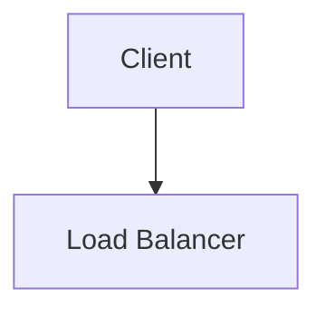

# CLAUDE.md

This file provides guidance to Claude Code (claude.ai/code) when working with code in this repository.

## Build & Development Commands

```bash
# Install dependencies
bundle install

# Run local development server
bundle exec jekyll serve
# Site available at http://localhost:4000/cses-analyses/

# Build static site (for production)
bundle exec jekyll build

# Fetch LeetCode contest problems (requires .leetcode_cookies)
python3 problem_soulutions/leetcode_contests/fetch_leetcode_contests.py
```

## Deployment

Pushes to `main` trigger GitHub Actions (`.github/workflows/jekyll.yml`) which builds and deploys to GitHub Pages automatically. No manual deploy step needed.

**Live Site:** https://phuongdinh1411.github.io/cses-analyses/

## Project Overview

Jekyll-based static site for competitive programming (CSES, LeetCode, Codeforces) and system design interview preparation. Uses a **custom layout** (`_layouts/simple.html`) with a sidebar navigation, syntax highlighting (Rouge), and Mermaid diagram support via CDN. The `remote_theme: mmistakes/minimal-mistakes` is declared but the custom `simple` layout overrides it for all pages.

## Architecture

```
problem_soulutions/              # CP problems by category (note: intentional typo in folder name)
├── {category}/summary.md        # Category overview with problem list
├── {category}/*_analysis.md     # Individual problem analyses
├── Blue/                        # Blue-level curriculum (19 sessions: arrays → MST)
├── Orange/                      # Orange-level curriculum (advanced: backtracking, segment trees, etc.)
├── dynamic_programming_at/      # AtCoder DP contest problems
└── leetcode_contests/           # LeetCode weekly/biweekly contest solutions
    ├── fetch_leetcode_contests.py  # Crawler script (needs .leetcode_cookies)
    └── LEETCODE_CONTEST_TEMPLATE.md

pattern/                         # Algorithm pattern guides (not served via nav, standalone references)
├── DP.md, Graph.md, Tree.md     # Comprehensive technique guides with examples
├── BinarySearch.md, LCA.md      # Each covers patterns, templates, and practice problems
├── PrefixSum.md, StackQueue.md
└── Backtracking.md

system_design/                   # System design interview guides
├── TEMPLATE.md                  # Template for new system designs
└── design-*.md                  # Individual designs (YouTube, Chat, Payment, etc.)

quick_reference/                 # Cheatsheets and study aids
├── study_guide.md, code_templates.md
├── advanced_algorithms.md, common_mistakes.md

_data/navigation.yml             # Sidebar navigation structure (MUST edit for new pages)
_layouts/simple.html             # Custom layout with all CSS/JS inline (sidebar + Mermaid)
_config.yml                      # Jekyll config (baseurl: /cses-analyses, markdown: kramdown/GFM)
```

## Content Patterns

### Adding CSES/CP Problem Solutions

1. Create `problem_soulutions/{category}/{problem_name}_analysis.md`
2. Front matter: `layout: simple`, `title`, `permalink: /problem_soulutions/{category}/{problem_name}`
3. Structure: Problem Overview table → Problem Statement → Brute Force → Key Insight → Optimal Solution → Complexity → Edge Cases
4. **Add entry to `_data/navigation.yml`** under the appropriate category

### Adding LeetCode Contest Solutions

1. Run crawler or copy from `LEETCODE_CONTEST_TEMPLATE.md`
2. Each problem gets a collapsible `<details markdown="1">` section with hints, approach, and Python solution
3. Use 2-space indentation in Python code blocks
4. Update both `_data/navigation.yml` and `problem_soulutions/leetcode_contests/index.md`

### Adding System Design Guides

1. Copy `system_design/TEMPLATE.md` to `system_design/design-{name}.md`
2. Follow interview-style format: "Interview context" transitions, "Why not X?" sections, trade-off tables, "Interviewer might ask" follow-ups
3. Add to navigation under System Design section

### Front Matter Required

```yaml
---
layout: simple
title: "Problem/Design Title"
permalink: /problem_soulutions/{category}/{problem_name}
---
```

### Mermaid Diagrams

Use fenced code blocks with `mermaid` language — the layout auto-converts them via Mermaid.js CDN:

````markdown

````

## Navigation

All content requires an entry in `_data/navigation.yml` to appear in the sidebar. Structure is 3 levels deep: main → children → children. All URLs must include `/cses-analyses/` prefix (the baseurl).
