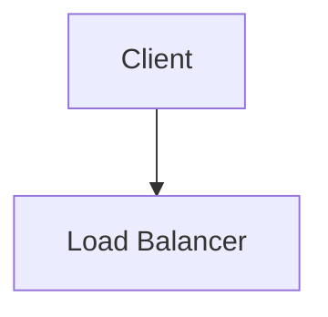

# CLAUDE.md

This file provides guidance to Claude Code (claude.ai/code) when working with code in this repository.

## Build & Development Commands

```bash
# Install dependencies
bundle install

# Run local development server
bundle exec jekyll serve
# Site available at http://localhost:4000/cses-analyses/

# Build static site (for production)
bundle exec jekyll build

# Fetch LeetCode contest problems (requires .leetcode_cookies)
python3 problem_soulutions/leetcode_contests/fetch_leetcode_contests.py

# React SPA (deployed to Vercel, separate from Jekyll)
cd react-app && npm install && npm run dev   # local dev
cd react-app && npm run build                # production build (Vercel runs this)

# ByteByteGo content pipeline (requires .bytebytego_cookies)
python3 crawl_bytebytego.py --cookies-file .bytebytego_cookies  # crawl lessons → bytebytego_content/
python3 download_bytebytego_images.py                            # fetch referenced images
python3 serve_bytebytego.py                                      # local viewer at http://localhost:8080
```

No test suite or linter is configured. Verification is via `jekyll build` / `npm run build` succeeding.

## Deployment

Pushes to `main` trigger GitHub Actions (`.github/workflows/jekyll.yml`) which builds and deploys to GitHub Pages automatically. No manual deploy step needed.

**Live Site:** https://phuongdinh1411.github.io/cses-analyses/

## Project Overview

Jekyll-based static site for competitive programming (CSES, LeetCode, Codeforces) and system design interview preparation. Uses a **custom layout** (`_layouts/simple.html`) with a sidebar navigation, syntax highlighting (Rouge), and Mermaid diagram support via CDN. The `remote_theme: mmistakes/minimal-mistakes` is declared but the custom `simple` layout overrides it for all pages.

## Architecture

```
problem_soulutions/              # CP problems by category (note: intentional typo in folder name)
├── {category}/summary.md        # Category overview with problem list
├── {category}/*_analysis.md     # Individual problem analyses
├── Blue/                        # Blue-level curriculum (19 sessions: arrays → MST)
├── Orange/                      # Orange-level curriculum (advanced: backtracking, segment trees, etc.)
├── dynamic_programming_at/      # AtCoder DP contest problems
└── leetcode_contests/           # LeetCode weekly/biweekly contest solutions
    ├── fetch_leetcode_contests.py  # Crawler script (needs .leetcode_cookies)
    └── LEETCODE_CONTEST_TEMPLATE.md

pattern/                         # Algorithm pattern guides (served in BOTH the Jekyll and React SPA sidebars)
├── DP.md, Graph.md, Tree.md     # Comprehensive technique guides with examples
├── BinarySearch.md, LCA.md      # Each covers patterns, templates, and practice problems
├── PrefixSum.md, StackQueue.md
├── SegmentTree.md, FenwickTree.md
└── Backtracking.md

react-app/                       # React SPA frontend (deployed to Vercel; separate from Jekyll/GitHub Pages)
├── src/data/navigation.ts       # Main SPA sidebar nav (MUST edit for new pages — parallel to _data/navigation.yml)
├── src/data/bytebytego-navigation.ts  # Separate nav tree for ByteByteGo course pages
├── src/hooks/useMarkdownLoader.ts  # Loads pattern/**/*.md; auto-maps URL from front-matter permalink
├── src/pages/ContentPage.tsx    # Renders a markdown page by permalink
├── src/pages/ByteByteGoIndex.tsx, ByteBytegoCourseIndex.tsx  # ByteByteGo browsing pages
└── src/pages/HomePage.tsx       # Landing cards (hardcoded pattern/design counts)

system_design/                   # High-level system design (HLD) interview guides
├── TEMPLATE.md                  # Template for new system designs
└── design-*.md                  # Individual designs (YouTube, Chat, Payment, etc.)

low_level_design/                # Low-level / object-oriented design (LLD) guides
├── index.md                     # LLD index
└── *.md                         # One per problem (parking-lot, elevator-system, lru-cache, ...)
                                 # permalink: /low_level_design/{name}

quick_reference/                 # Cheatsheets and study aids
├── study_guide.md, code_templates.md
├── advanced_algorithms.md, common_mistakes.md

bytebytego_content/              # Crawled ByteByteGo courses (gitignored inputs: .bytebytego_cookies)
crawl_bytebytego.py              # Crawler: MDX lessons → bytebytego_content/ (resumable, rate-limited)
download_bytebytego_images.py    # Downloads images referenced by crawled lessons
serve_bytebytego.py              # Standalone local HTTP viewer for crawled content
render_bytebytego.py             # Markdown → styled HTML rendering helpers
fetch_codeforces_examples.py     # Fetches Codeforces sample test cases

raw/                             # IMMUTABLE raw sources for the LLM wiki — never modify
wiki/                            # LLM-generated knowledge wiki (Karpathy llm-wiki pattern)
├── CLAUDE.md                    # Wiki's OWN schema/instructions — read it before touching wiki/
├── index.md, log.md, overview.md
└── dsa/ hld/ lld/ career/ cross-cutting/

_data/navigation.yml             # Jekyll sidebar navigation (MUST edit for new pages)
_layouts/simple.html             # Custom layout with all CSS/JS inline (sidebar + Mermaid)
_config.yml                      # Jekyll config (baseurl: /cses-analyses, markdown: kramdown/GFM)
vercel.json                      # Vercel SPA config (SPA rewrites, VITE_BASE_PATH=/)
```

## Content Patterns

### Adding CSES/CP Problem Solutions

1. Create `problem_soulutions/{category}/{problem_name}_analysis.md`
2. Front matter: `layout: simple`, `title`, `permalink: /problem_soulutions/{category}/{problem_name}`
3. Structure: Problem Overview table → Problem Statement → Brute Force → Key Insight → Optimal Solution → Complexity → Edge Cases
4. **Add entry to BOTH `_data/navigation.yml` and `react-app/src/data/navigation.ts`** under the appropriate category (see [Navigation](#navigation) — the two frontends have separate nav files)

### Adding LeetCode Contest Solutions

1. Run crawler or copy from `LEETCODE_CONTEST_TEMPLATE.md`
2. Each problem gets a collapsible `<details markdown="1">` section with hints, approach, and Python solution
3. Use 2-space indentation in Python code blocks
4. Update `_data/navigation.yml`, `react-app/src/data/navigation.ts`, and `problem_soulutions/leetcode_contests/index.md`

### Adding System Design Guides

1. Copy `system_design/TEMPLATE.md` to `system_design/design-{name}.md`
2. Follow interview-style format: "Interview context" transitions, "Why not X?" sections, trade-off tables, "Interviewer might ask" follow-ups
3. Add to navigation under System Design section

### Adding Low-Level Design (LLD) Guides

1. Create `low_level_design/{name}.md` with `permalink: /low_level_design/{name}`
2. Structure: Requirements → Class diagram (Mermaid/ASCII) → Key classes → Design patterns used → Code skeleton → Extensions
3. Add to BOTH nav files under the LLD section

### The `raw/` + `wiki/` LLM Wiki (separate subsystem)

`raw/` and `wiki/` implement a self-contained Karpathy-style LLM wiki, independent of the Jekyll/React site.
- **`raw/` is immutable** — read-only source material; never modify it.
- **`wiki/` is LLM-owned** and has its OWN `wiki/CLAUDE.md` schema defining page conventions, front matter, linking, and the ingest/query/lint/study operations. **Read `wiki/CLAUDE.md` before doing any wiki work** — the conventions there (not this file) govern `wiki/`.

### Front Matter Required

```yaml
---
layout: simple
title: "Problem/Design Title"
permalink: /problem_soulutions/{category}/{problem_name}
---
```

### Mermaid Diagrams

Use fenced code blocks with `mermaid` language — the layout auto-converts them via Mermaid.js CDN:

````markdown

```mermaid
graph TD
    A[Client] --> B[Load Balancer]
```
````

## Navigation

The site has **two independent frontends** over the same markdown content:

1. **Jekyll** (GitHub Pages) — sidebar built from `_data/navigation.yml`. 3 levels deep: main → children → children. All URLs include the `/cses-analyses/` baseurl prefix.
2. **React SPA** (Vercel, `react-app/`) — sidebar built from `react-app/src/data/navigation.ts`. URLs use NO baseurl prefix (base is `/`). Content routing is automatic: `useMarkdownLoader` globs `pattern/**/*.md` and maps each page by its front-matter `permalink`, so no loader edit is needed — but the nav list is hardcoded and MUST be edited by hand.

**When adding any page, edit BOTH nav files.** Editing only `_data/navigation.yml` leaves the Vercel SPA sidebar stale (the page still 404s there until `react-app` is rebuilt). A Vercel rebuild is triggered by a push to `main` (same as GitHub Pages). If a card count on `react-app/src/pages/HomePage.tsx` references the number of patterns/designs, bump it too. ByteByteGo course pages use a separate SPA nav tree (`react-app/src/data/bytebytego-navigation.ts`).
