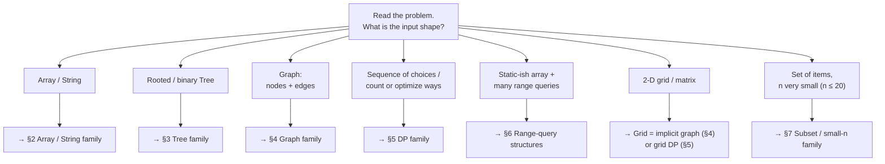
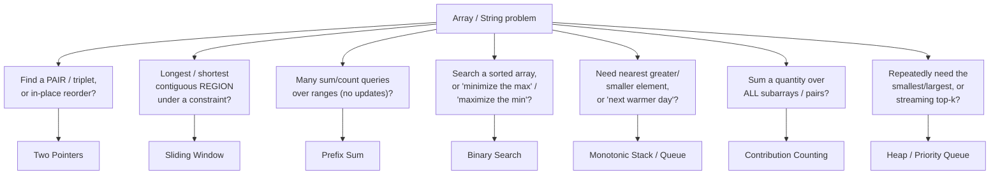
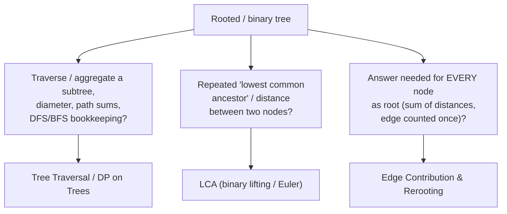
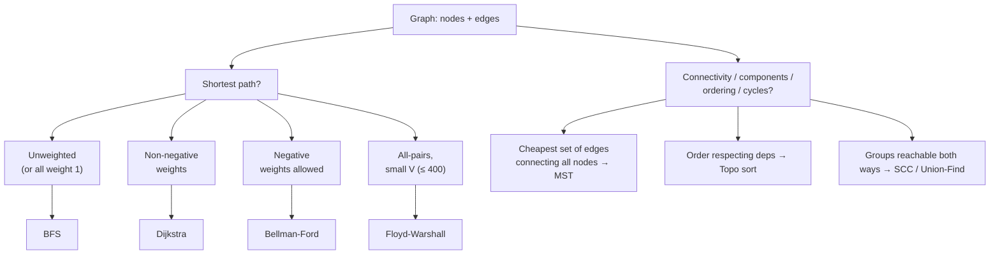
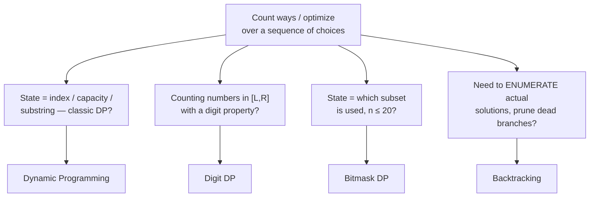
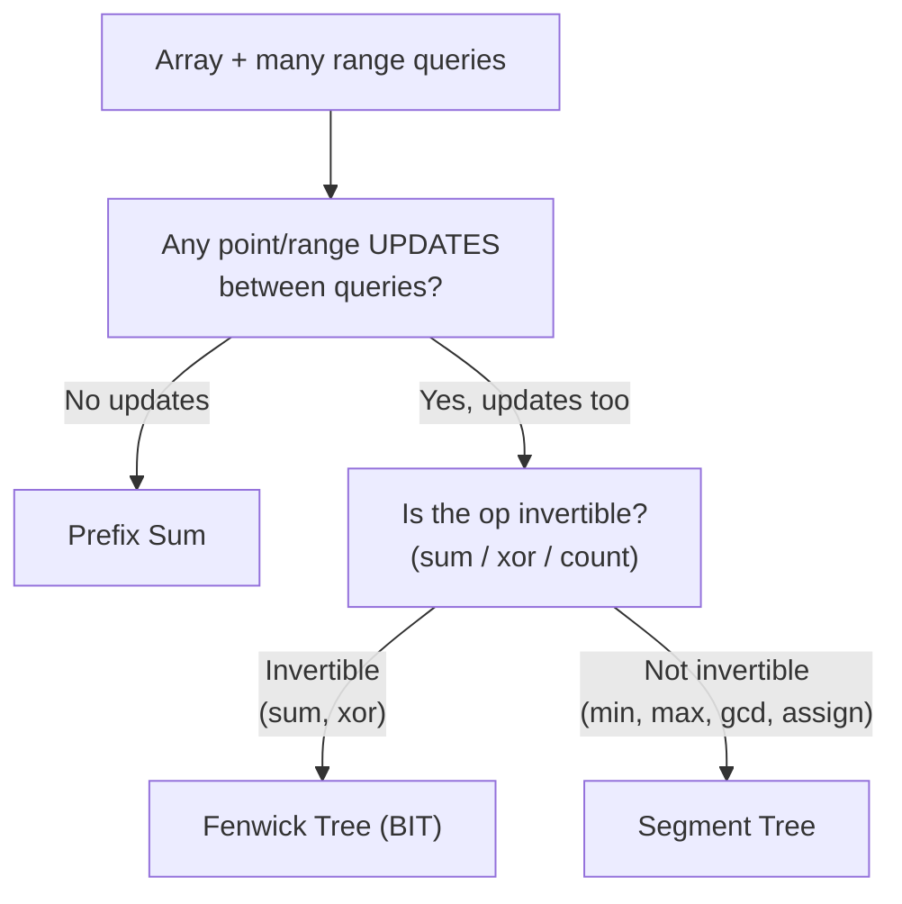
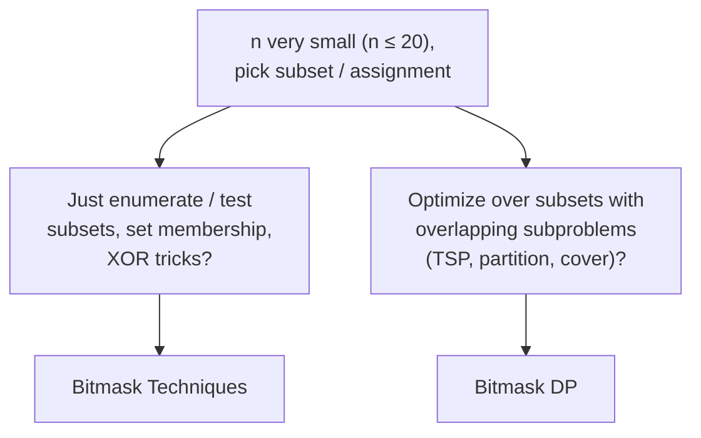

# Pattern Decision Map — Which Technique Do I Use?

You have 18 technique guides in this folder. This page is the **router** you read *before* them. Each guide answers "how does this technique work"; this page answers the earlier question: **"which one do I even reach for?"**

The core skill of a strong problem-solver is not memorizing algorithms — it is reading a fresh problem, spotting a few **surface cues** (the shape of the input, the exact thing being asked, the size of `n`), and mapping those cues to a technique family in seconds. This page makes that mapping explicit.

`★ Insight ─────────────────────────────────────`
- Selection is **cue-driven, not recall-driven**. Experts don't scan a mental list of 18 algorithms; they notice "sorted array + find a pair" and the answer arrives before they've named it. Train the cues, not the catalog.
- Two cues dominate: **input shape** (array / tree / graph / grid / set of choices) and **the ask** (find a pair / longest region / count ways / range query). Constraint size (`n`) is the tie-breaker when two techniques both fit.
- When two techniques both seem to fit, that's not failure — it's information. The tie-breaker table below exists because those confusions are *predictable*.
`─────────────────────────────────────────────────`

## How to use this map

1. **Read the problem once.** Note the input shape and what it asks for.
2. **Start at the master router** below — pick the branch matching the input shape.
3. **Drop into the family sub-map** it points to. Follow the yes/no cues to a leaf.
4. **Open the linked guide** in the table under that sub-map. The guide has the template, traces, and pitfalls.
5. **Stuck between two?** Check the [tie-breaker table](#8-tie-breakers-the-confusable-pairs). **Unsure about complexity budget?** Check the [constraint-size cheat sheet](#9-constraint-size-cheat-sheet).

---

## Table of Contents

1. [Master Router](#1-master-router)
2. [Array / String Family](#2-array--string-family)
3. [Tree Family](#3-tree-family)
4. [Graph Family](#4-graph-family)
5. [DP Family](#5-dp-family)
6. [Range-Query Structures](#6-range-query-structures)
7. [Subset / Small-n Family](#7-subset--small-n-family)
8. [Tie-Breakers: The Confusable Pairs](#8-tie-breakers-the-confusable-pairs)
9. [Constraint-Size Cheat Sheet](#9-constraint-size-cheat-sheet)
10. [Worked Routing Examples](#10-worked-routing-examples)
11. [Full Technique Index](#11-full-technique-index)

---

## 1. Master Router

Start here. The first question is always **"what shape is the input?"** — then a second cue narrows the family.

| Input shape / ask | Go to |
|-------------------|-------|
| Array or string, one pass, find a pair / window / running total | [§2 Array / String](#2-array--string-family) |
| Rooted or binary tree, ancestors / subtree aggregates | [§3 Tree](#3-tree-family) |
| Explicit nodes + edges, reachability / shortest path / connectivity | [§4 Graph](#4-graph-family) |
| "How many ways", "min/max cost of a sequence of decisions" | [§5 DP](#5-dp-family) |
| Fixed array, then thousands of `query(l,r)` and/or `update(i)` | [§6 Range structures](#6-range-query-structures) |
| 2-D grid: flood fill / shortest path in maze / connected regions | [§4 Graph](#4-graph-family) (grid is an implicit graph — each cell a node, neighbors = up/down/left/right) |
| 2-D grid: count paths / min path cost with movement rules | [§5 DP](#5-dp-family) (grid DP: `dp[r][c]` from top/left) |
| Pick a subset / assign items, `n ≤ 20` | [§7 Subset / small-n](#7-subset--small-n-family) |

---

## 2. Array / String Family

The workhorse family. The deciding cues: **is it sorted?**, **do I want a pair or a region?**, **do I need running totals?**

| You see... | Technique | Guide |
|------------|-----------|-------|
| Pair summing to target on **sorted** data; dedup / move-zeros in place; palindrome; 3Sum | Two Pointers | [Two Pointers](/pattern/two-pointers) |
| "Longest/shortest subarray where...", "at most k distinct", fixed-size window | Sliding Window | [Sliding Window](/pattern/sliding-window) |
| Repeated `sum(l..r)`, "subarray sums to k", running total, difference array | Prefix Sum | [Prefix Sum](/pattern/prefix-sum) |
| Sorted lookup; "smallest x such that feasible(x)"; minimize-the-max | Binary Search | [Binary Search](/pattern/binary-search) |
| Next greater element, stock span, largest rectangle, sliding-window max | Monotonic Stack / Queue | [Stack & Queue](/pattern/stack-queue) |
| "Sum of min over all subarrays", "total pairs where...", per-element contribution | Contribution Counting | [Contribution Counting](/pattern/contribution-counting) |
| "Top-k largest", "k closest", merge k sorted lists, running median, repeated extract-min | Heap / Priority Queue | [Heap / Priority Queue](/pattern/heap) |

---

## 3. Tree Family

Cue: the input is a **rooted tree** (or you can root it). The deciding question is what you aggregate — **paths up to ancestors**, **subtree totals**, or **the same total from every possible root**.

| You see... | Technique | Guide |
|------------|-----------|-------|
| Subtree sums, tree diameter, tree DP, DFS/BFS traversal order | Tree Patterns | [Tree Patterns](/pattern/tree) |
| Many `lca(u,v)` queries, distance in tree, kth ancestor | LCA | [LCA](/pattern/lca) |
| "Sum of distances from every node", each edge's contribution, reroot in O(n) | Edge Contribution / Rerooting | [Edge Contribution & Rerooting](/pattern/edge-contribution) |

---

## 4. Graph Family

Cue: explicit **nodes + edges**. Then split by the ask, and for shortest-path split further by **edge weights**.

All graph shortest-path, connectivity, MST, topological-sort, and SCC material lives in one guide:

| You see... | Sub-technique | Guide |
|------------|---------------|-------|
| Fewest edges / unweighted shortest path | BFS | [Graph Patterns](/pattern/graph) |
| Non-negative weights, single source | Dijkstra | [Graph Patterns](/pattern/graph) |
| Negative edges, detect negative cycle | Bellman-Ford | [Graph Patterns](/pattern/graph) |
| All-pairs shortest path, dense small graph | Floyd-Warshall | [Graph Patterns](/pattern/graph) |
| Cheapest connecting tree | Kruskal / Prim (MST) | [Graph Patterns](/pattern/graph) |
| Dependency ordering, DAG | Topological sort | [Graph Patterns](/pattern/graph) |
| Mutually reachable groups / connectivity queries | SCC / Union-Find | [Graph Patterns](/pattern/graph) |

---

## 5. DP Family

Cue: **"count the number of ways"**, or **"min/max cost of a sequence of decisions"**, and greedy demonstrably fails. Then split by *what the state is built from*.

| You see... | Technique | Guide |
|------------|-----------|-------|
| Overlapping subproblems, "ways to", knapsack, LIS, edit distance, interval DP | Dynamic Programming | [Dynamic Programming](/pattern/dp) |
| "How many integers in `[L,R]` with digit property", huge upper bound | Digit DP | [Digit DP](/pattern/digit-dp) |
| Assign/permute a small set, TSP, "state = used mask", `n ≤ 20` | Bitmask DP | [Bitmask DP — Subset Partition](/pattern/bitmask-dp-subset-partition) |
| List all permutations/combinations/board fillings, prune infeasible paths | Backtracking | [Backtracking](/pattern/backtracking) |
| Set-membership tricks, XOR, subset iteration (building block for the above) | Bitmask Techniques | [Bitmask Techniques](/pattern/bitmask) |

---

## 6. Range-Query Structures

Cue: a mostly-fixed array plus **many** `query(l,r)` and/or `update(i)`. The deciding question: **are there updates**, and **is the operation invertible?**

| You see... | Technique | Guide |
|------------|-----------|-------|
| Range sums, **no updates** after building | Prefix Sum | [Prefix Sum](/pattern/prefix-sum) |
| Range **sum/xor** with point updates; simplest code | Fenwick Tree (BIT) | [Fenwick Tree (BIT)](/pattern/fenwick-tree) |
| Range **min/max/gcd/assign**, lazy propagation, non-invertible ops | Segment Tree | [Segment Tree](/pattern/segment-tree) |

`★ Insight ─────────────────────────────────────`
- The Fenwick-vs-Segment fork is entirely about **invertibility**. Fenwick answers `query(l,r)` as `prefix(r) − prefix(l−1)` — subtraction *requires* an inverse, so it works for sum and xor but not min/max. Segment Tree stores each node's answer directly and never subtracts, so it handles any associative op at the cost of ~2× the code.
- No updates at all? Don't build a tree. Prefix Sum is O(1) per query after O(n) setup — strictly simpler, strictly faster.
`─────────────────────────────────────────────────`

---

## 7. Subset / Small-n Family

Cue: pick a **subset** or **assignment** of items, and `n` is suspiciously small (`n ≤ 20`, sometimes `≤ 24`). Small `n` is a *loud* signal that `2ⁿ` enumeration is intended.

| You see... | Technique | Guide |
|------------|-----------|-------|
| Represent a set as an int, iterate subsets, XOR / AND / popcount tricks | Bitmask Techniques | [Bitmask Techniques](/pattern/bitmask) |
| "Min cost to partition/assign", TSP, set cover, `dp[mask]` over `2ⁿ` states | Bitmask DP | [Bitmask DP — Subset Partition](/pattern/bitmask-dp-subset-partition) |

---

## 8. Tie-Breakers: The Confusable Pairs

When two techniques both seem to fit, these are the *predictable* confusions and the one question that resolves each.

| Confused between | Ask yourself | Then pick |
|------------------|--------------|-----------|
| **Two Pointers** vs **Sliding Window** | Do both pointers move *forward* and I care about the *region between* them? | Yes → Sliding Window. Pointers converge from ends / I want the *pair* → Two Pointers. |
| **Fenwick** vs **Segment Tree** | Is the operation invertible (sum, xor)? | Invertible → Fenwick (less code). Min/max/assign/lazy → Segment Tree. |
| **Prefix Sum** vs **Fenwick** | Are there updates between queries? | No updates → Prefix Sum. Updates → Fenwick. |
| **LCA (Euler tour)** vs **Heavy-Light / path structures** | Just ancestors/distance, or updating values *along paths*? | Ancestor/distance queries → LCA. Path updates/queries → segment tree on chains (Tree guide). |
| **Backtracking** vs **DP** | Do I need to *list actual solutions*, or just *count/optimize*? | Enumerate solutions → Backtracking. Count/optimize with overlapping subproblems → DP. |
| **Contribution Counting** vs **direct DP/scan** | Does each element contribute *independently* to the total? | Independent per-element contribution → Contribution Counting. Contributions interact / threshold → DP or two-pointer. |
| **Heap** vs **Sort** vs **BST** | Do I need the *top-k / streaming min* repeatedly, or the *whole thing sorted once*? | Repeated extract-min / running top-k → Heap. One-shot full order → Sort. Ordered + dynamic membership → balanced BST / ordered set. |

---

## 9. Constraint-Size Cheat Sheet

The `n` bound in the problem statement quietly announces the intended complexity. Read it backwards: pick the loosest algorithm whose cost fits ~10⁸ operations.

| `n` bound | Budget you can afford | Techniques it points to |
|-----------|-----------------------|-------------------------|
| `n ≤ 20` | `O(2ⁿ)` / `O(2ⁿ · n)` | Bitmask, Bitmask DP, Backtracking |
| `n ≤ 100` | `O(n³)`... `O(n⁴)` | Floyd-Warshall, interval DP, small matrix DP |
| `n ≤ 500` | `O(n³)` | Floyd-Warshall, DP with 3 nested states |
| `n ≤ 5000` | `O(n²)` | Classic 2-D DP, `O(n²)` graph algorithms |
| `n ≤ 10⁵` | `O(n log n)` | Sort, Binary Search, Dijkstra, Segment/Fenwick Tree, Sliding Window |
| `n ≤ 10⁶` | `O(n)` / `O(n log log n)` | Two Pointers, Prefix Sum, single-pass DP, sieve |
| `n ≤ 10¹⁸` | `O(log n)` / closed form | Binary search on answer, matrix exponentiation, Digit DP, math |

`★ Insight ─────────────────────────────────────`
- The size bound is the cheapest cue and often the most decisive. `n ≤ 20` is a near-certain flag for exponential/bitmask; `n ≤ 10¹⁸` rules out anything that even touches every element, forcing `O(log n)` or closed-form.
- Use it as a *sanity filter*: if your candidate technique is `O(n²)` but `n = 10⁶`, you've picked the wrong family — go back to the router.
`─────────────────────────────────────────────────`

---

## 10. Worked Routing Examples

The router only pays off if you can *run it* on a cold problem. Here are five, each showing the cue-spotting walk — shape, then the ask, then constraint size — from problem text to a landed technique. Practice narrating this out loud; that inner monologue *is* the skill.

**Example 1** — *"Given a sorted array, find two numbers that add up to a target."*
- Shape: array. Ask: find a **pair**. Extra cue: **sorted**.
- Router → §2 Array/String → "find a PAIR?" → **Two Pointers** (opposite ends; sortedness makes the sum respond monotonically).

**Example 2** — *"Longest substring with at most 2 distinct characters."*
- Shape: string. Ask: **longest contiguous region** under a constraint ("at most 2 distinct").
- Router → §2 → "longest/shortest REGION?" → **Sliding Window** (grow right, shrink left when the distinct-count breaks).

**Example 3** — *"Count islands in a grid of land/water cells."*
- Shape: **2-D grid**. Ask: connected regions.
- Router → grid branch → "connected regions" → **§4 Graph**, grid-as-implicit-graph → flood fill with BFS/DFS (each cell a node, 4 neighbors).

**Example 4** — *"Number of ways to make amount N from given coin denominations."*
- Shape: set of choices (which coins). Ask: **count ways**. Greedy fails (denominations arbitrary).
- Router → §5 DP → "count ways / overlapping subproblems" → **Dynamic Programming** (`dp[amount]`, unbounded-knapsack shape).

**Example 5** — *"Assign N tasks to N workers minimizing total cost, N ≤ 18."*
- Shape: assignment over a small set. Loud cue: **N ≤ 18** → `2ⁿ` intended.
- Router → §7 Subset/small-n → "optimize over subsets, overlapping subproblems" → **Bitmask DP** (`dp[mask]` = min cost to assign the tasks in `mask`).

`★ Insight ─────────────────────────────────────`
- Notice the order every time: **shape → ask → size**. Shape picks the family, the ask picks the branch, and the constraint (Example 5's `N ≤ 18`) confirms or overrides. When size and ask disagree, size usually wins — it's the hardest cue to fake.
- Example 3 is the payoff of the grid reframing: there is no "island algorithm," only "grid is a graph, run flood fill." Reframers beat memorizers.
`─────────────────────────────────────────────────`

---

## 11. Full Technique Index

All 18 guides, with the one-line cue that should make you reach for each.

| Technique | Reach for it when... | Guide |
|-----------|----------------------|-------|
| Two Pointers | pair on sorted data / in-place reorder / palindrome | [Two Pointers](/pattern/two-pointers) |
| Sliding Window | longest/shortest contiguous region under a constraint | [Sliding Window](/pattern/sliding-window) |
| Prefix Sum | many range-sum queries, no updates; "subarray sums to k" | [Prefix Sum](/pattern/prefix-sum) |
| Binary Search | sorted lookup or "smallest x that is feasible" | [Binary Search](/pattern/binary-search) |
| Stack & Queue | nearest greater/smaller, monotonic stack, sliding-window max | [Stack & Queue](/pattern/stack-queue) |
| Contribution Counting | sum a quantity over all subarrays/pairs, per-element | [Contribution Counting](/pattern/contribution-counting) |
| Tree Patterns | subtree aggregates, tree diameter, DP on trees | [Tree Patterns](/pattern/tree) |
| LCA | repeated lowest-common-ancestor / tree distance queries | [LCA](/pattern/lca) |
| Edge Contribution & Rerooting | answer for every node as root, edge counted once | [Edge Contribution & Rerooting](/pattern/edge-contribution) |
| Graph Patterns | shortest path, connectivity, MST, topo sort, SCC | [Graph Patterns](/pattern/graph) |
| Dynamic Programming | count ways / optimize over overlapping subproblems | [Dynamic Programming](/pattern/dp) |
| Digit DP | count numbers in `[L,R]` with a digit property | [Digit DP](/pattern/digit-dp) |
| Bitmask Techniques | set-as-int, subset iteration, XOR / popcount tricks | [Bitmask Techniques](/pattern/bitmask) |
| Bitmask DP | optimize over subsets, `n ≤ 20`, TSP / partition | [Bitmask DP — Subset Partition](/pattern/bitmask-dp-subset-partition) |
| Backtracking | enumerate actual solutions, prune infeasible branches | [Backtracking](/pattern/backtracking) |
| Segment Tree | range min/max/assign with updates, lazy propagation | [Segment Tree](/pattern/segment-tree) |
| Fenwick Tree (BIT) | range sum/xor with point updates, minimal code | [Fenwick Tree (BIT)](/pattern/fenwick-tree) |
| Heap / Priority Queue | repeated extract-min, top-k, merge k lists, running median | [Heap / Priority Queue](/pattern/heap) |

---

*Selection mastered — read the cues, not the catalog. Input shape and the ask pick the family; constraint size breaks the tie.*
