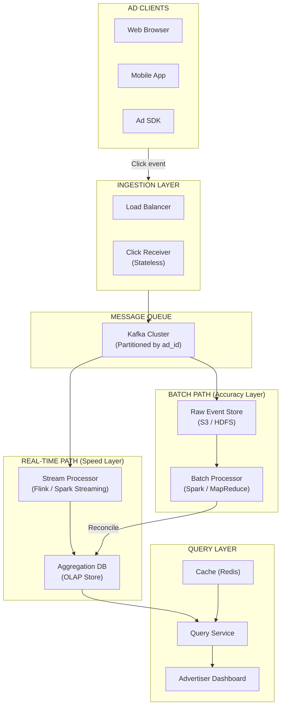
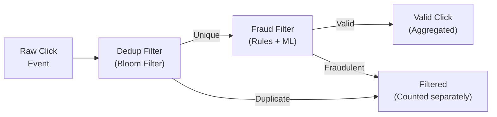
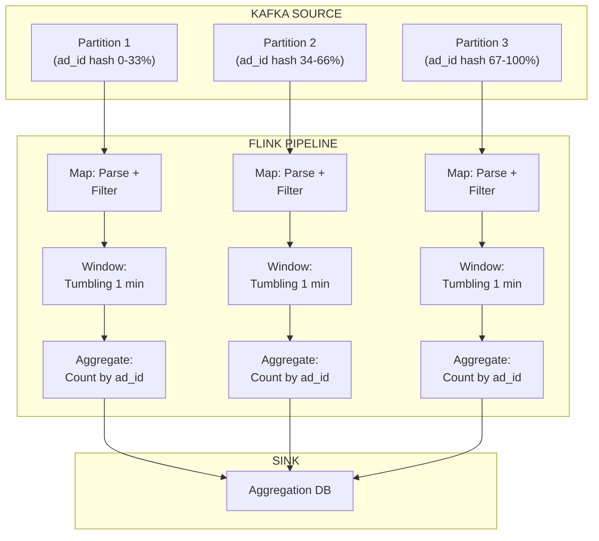
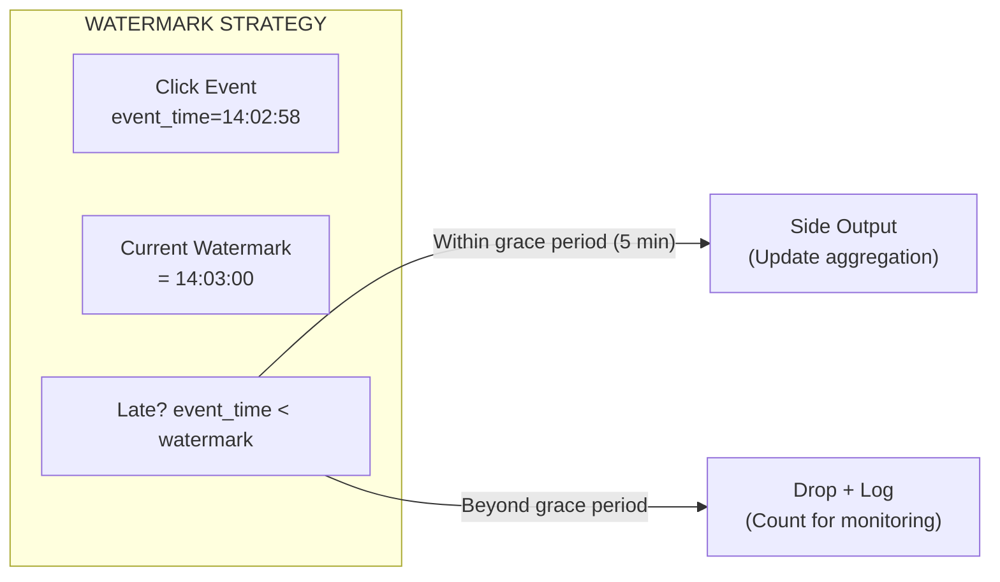
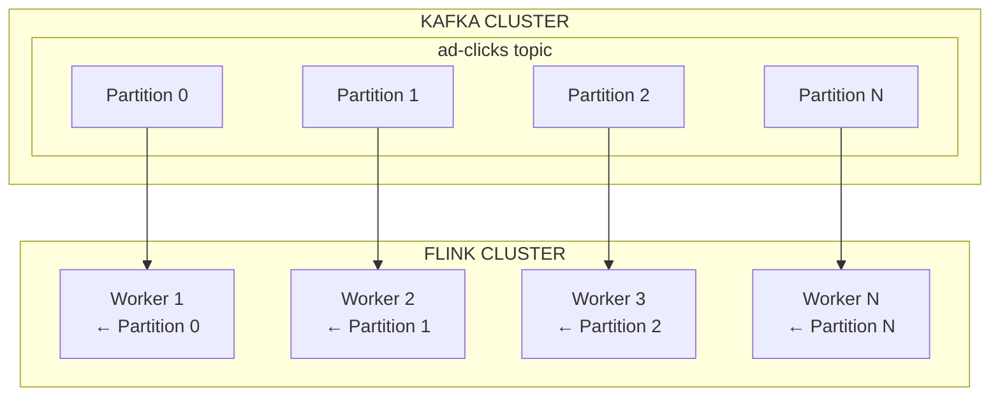
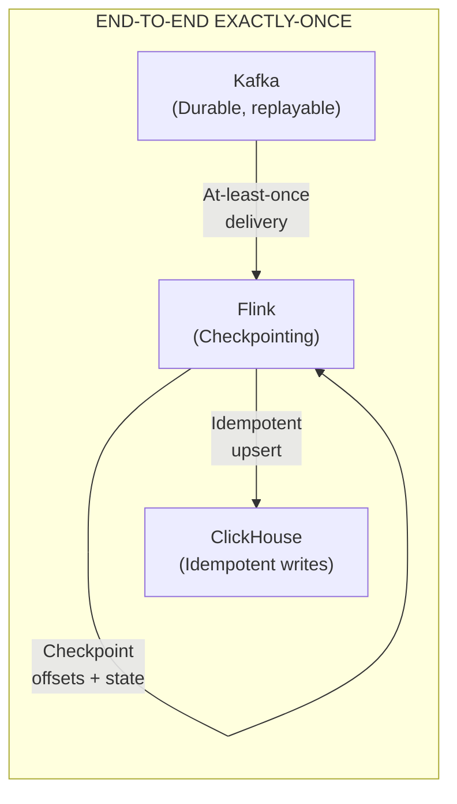
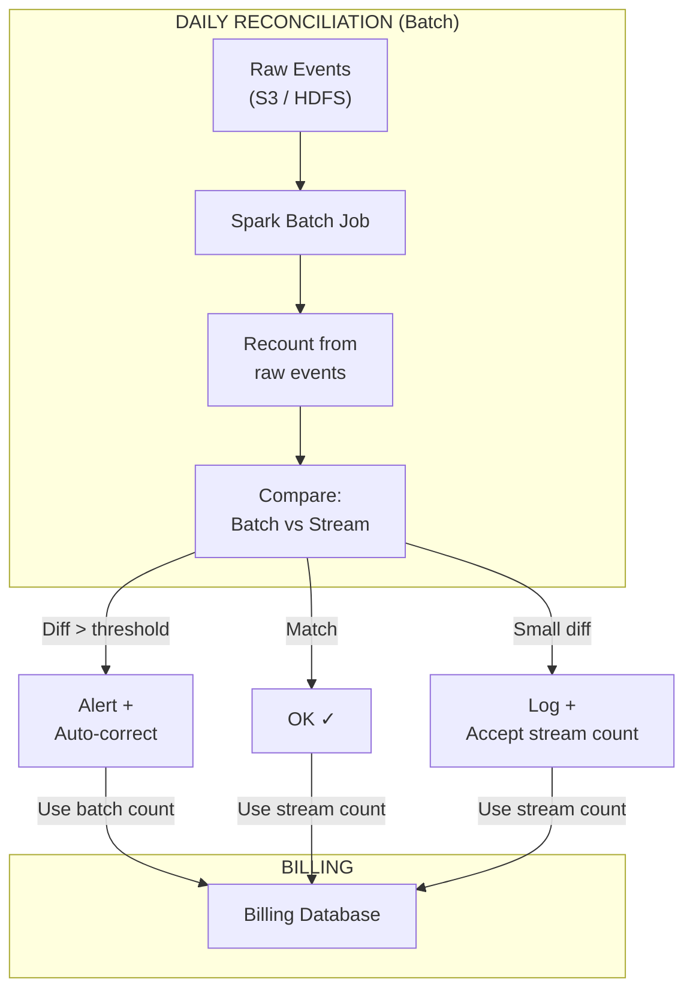

# Design Ad Click Event Aggregation

An ad click event aggregation system ingests billions of click events per day, aggregates them in real time, and provides advertisers with accurate metrics for billing and analytics. The challenge is building a pipeline that is **fast enough for real-time dashboards** yet **accurate enough for billing**.

> **Interview context**: This is a data pipeline / stream processing question. Unlike request-response systems, the focus here is on event ingestion, aggregation accuracy, and the trade-off between real-time speed and data correctness. Be ready to discuss MapReduce, stream processing (Flink/Spark), and exactly-once semantics.

---

## Table of Contents

1. [Requirements](#1-requirements)
2. [High-Level Architecture](#2-high-level-architecture)
3. [Data Model](#3-data-model)
4. [Core Components](#4-core-components)
5. [Aggregation Service Deep Dive](#5-aggregation-service-deep-dive)
6. [Key Design Decisions](#6-key-design-decisions)
7. [Scalability](#7-scalability)
8. [Reliability and Data Accuracy](#8-reliability-and-data-accuracy)
9. [Reconciliation](#9-reconciliation)
10. [Interview Tips](#10-interview-tips)
11. [Key Takeaways](#11-key-takeaways)

---

## 1. Requirements

> **Interview context**: Always start by clarifying requirements. Ad click aggregation has very different needs from a typical CRUD application.

### Questions to Ask the Interviewer

- What's the expected click volume? (events per second)
- What aggregation granularity? (per minute, per hour, per day)
- How fresh must the data be? (real-time dashboards vs end-of-day reports)
- What dimensions should we aggregate by? (ad_id, campaign_id, geo, device)
- Do we need to support ad-hoc queries, or only predefined aggregations?
- Is this for billing, analytics, or both?

### Functional Requirements

| Requirement | Description |
|-------------|-------------|
| **Click ingestion** | Receive and store raw ad click events at scale |
| **Real-time aggregation** | Aggregate clicks per ad_id per minute for real-time dashboards |
| **Multi-dimensional aggregation** | Slice by campaign, geography, device type, time |
| **Query API** | Return aggregated click counts for a given ad/campaign over a time range |
| **Filtering** | Filter duplicate and fraudulent clicks before counting |

### Non-Functional Requirements

| Requirement | Target | Rationale |
|-------------|--------|-----------|
| **Throughput** | 10,000 clicks/sec (peak 50K) | High-traffic ad network |
| **Aggregation latency** | < 1 minute | Near real-time dashboard |
| **Data accuracy** | 100% for billing | Advertisers pay per click |
| **Availability** | 99.99% | Revenue-critical pipeline |
| **Data retention** | Raw: 7 days, Aggregated: years | Compliance + trending |
| **Query latency** | p99 < 500ms | Dashboard responsiveness |

### Capacity Estimation

```
Click events:
- Daily clicks:          ~1 billion
- Average QPS:           ~10,000 clicks/sec
- Peak QPS:              ~50,000 clicks/sec (5x average)

Per click event:          ~500 bytes
- Raw storage/day:       1B × 500B = ~500 GB/day
- Raw retention (7 days): ~3.5 TB

Aggregated data:
- Unique ad_ids:          ~2 million
- Aggregations/min:       2M ad_ids × 1 record = 2M rows/min
- Aggregated storage/day: ~50 GB
- Aggregated retention:   ~18 TB/year
```

---

## 2. High-Level Architecture

> **Interview context**: "This system has two distinct paths: a real-time aggregation pipeline for dashboards, and a batch reconciliation pipeline for billing accuracy. Let me draw both."



### Component Responsibilities

| Component | Responsibility | Technology |
|-----------|---------------|------------|
| **Click Receiver** | Validate and forward click events | Go / Java (stateless) |
| **Kafka** | Durable event buffer, decouples ingestion from processing | Kafka with partitioning |
| **Stream Processor** | Real-time aggregation (per-minute windows) | Apache Flink |
| **Raw Event Store** | Archive raw events for reconciliation and replay | S3 / HDFS |
| **Batch Processor** | Daily reconciliation, exact counts for billing | Apache Spark |
| **Aggregation DB** | Store pre-computed aggregated counts | ClickHouse / Druid / Cassandra |
| **Query Service** | Serve aggregated data to dashboards | Java / Go |
| **Cache** | Hot aggregation results for frequent queries | Redis |

### Why Two Paths (Lambda Architecture)?

> **Interviewer might ask**: "Why not just use stream processing for everything?"

| Concern | Real-Time Only | Lambda (Real-Time + Batch) |
|---------|----------------|----------------------------|
| **Latency** | Sub-minute | Sub-minute (speed layer) |
| **Accuracy** | May miss late events | Batch corrects drift |
| **Billing** | Risky for financial data | Batch is source of truth |
| **Complexity** | Simpler | More complex, but safer |

**We choose Lambda because**: Advertisers are billed per click. Even a 0.1% discrepancy at 1B clicks/day = 1M miscounted clicks. The batch layer acts as the source of truth for billing, while the speed layer powers real-time dashboards.

---

## 3. Data Model

> **Interview context**: "Let me define the data model. We have raw events and aggregated tables."

### Raw Click Event

```json
{
  "click_id":    "uuid-abc-123",
  "ad_id":       "ad_98765",
  "campaign_id": "camp_555",
  "user_id":     "user_42",
  "ip_address":  "203.0.113.42",
  "user_agent":  "Mozilla/5.0 ...",
  "country":     "US",
  "device_type": "mobile",
  "os":          "iOS",
  "referrer":    "https://example.com/article",
  "timestamp":   "2026-02-26T14:05:32.123Z"
}
```

### Aggregated Click Table

```sql
CREATE TABLE ad_click_aggregation (
    ad_id          VARCHAR(50)   NOT NULL,
    click_minute   TIMESTAMP     NOT NULL,   -- truncated to minute
    click_count    BIGINT        NOT NULL DEFAULT 0,
    filter_count   BIGINT        NOT NULL DEFAULT 0,  -- filtered (fraud/dup)
    updated_at     TIMESTAMP     DEFAULT CURRENT_TIMESTAMP,
    PRIMARY KEY (ad_id, click_minute)
);
```

### Multi-Dimensional Aggregation Table

```sql
CREATE TABLE ad_click_aggregation_extended (
    ad_id          VARCHAR(50)   NOT NULL,
    campaign_id    VARCHAR(50)   NOT NULL,
    country        VARCHAR(5)    NOT NULL,
    device_type    VARCHAR(20)   NOT NULL,
    click_minute   TIMESTAMP     NOT NULL,
    click_count    BIGINT        NOT NULL DEFAULT 0,
    PRIMARY KEY (ad_id, campaign_id, country, device_type, click_minute)
);
```

### Why Star Schema for Analytics?

The aggregation tables follow a **star schema** pattern. The `click_minute` acts as a time dimension, and `ad_id`, `campaign_id`, `country`, `device_type` are dimension keys. This enables fast slice-and-dice queries like:

```sql
-- Clicks per campaign in the US, last hour
SELECT campaign_id, SUM(click_count)
FROM ad_click_aggregation_extended
WHERE country = 'US'
  AND click_minute >= NOW() - INTERVAL 1 HOUR
GROUP BY campaign_id;
```

> **Interviewer might ask**: "Why not store raw events and query them directly?"

Querying 1B raw events per day is too slow for dashboards. Pre-aggregation reduces the query dataset by **~500x** (2M aggregated rows vs 1B raw events).

---

## 4. Core Components

### 4.1 Click Ingestion Service

> **Interview context**: "The ingestion layer must handle 50K clicks/sec at peak with minimal latency."

#### The Challenge

- Accept clicks at 50K/sec without dropping events
- Validate basic fields (ad_id exists, timestamp reasonable)
- Forward to Kafka quickly — this is not the place for heavy processing

#### Design

```
Client → Load Balancer → Click Receiver → Kafka

Click Receiver responsibilities:
1. Validate: ad_id exists, timestamp within ±5min
2. Deduplicate: Check click_id against Bloom filter
3. Enrich: Add server_timestamp, geo from IP
4. Produce: Send to Kafka topic (partitioned by ad_id)
```

**Why partition by ad_id?** All clicks for the same ad land on the same Kafka partition, which means the same Flink worker aggregates them. This avoids distributed counting and simplifies exactly-once semantics.

#### Why Not Process Clicks Synchronously?

| Synchronous (API → DB) | Asynchronous (API → Kafka → Processor) |
|-------------------------|----------------------------------------|
| Simple | More components |
| DB becomes bottleneck at 50K/sec | Kafka handles 1M+ msg/sec |
| Single point of failure | Decoupled, resilient |
| Hard to add new consumers | New consumers attach to Kafka |

---

### 4.2 Fraud and Duplicate Filtering

> **Interview context**: "Before aggregating, we need to filter invalid clicks. This is critical — advertisers shouldn't pay for fraudulent traffic."

#### Types of Invalid Clicks

| Type | Detection Method | Example |
|------|-----------------|---------|
| **Duplicate clicks** | click_id dedup (Bloom filter) | User double-clicked |
| **Bot traffic** | User-agent analysis, CAPTCHA signals | Automated scraper |
| **Click farms** | IP clustering, behavioral analysis | Same IP, many clicks |
| **Self-clicking** | ad_id owner detection | Publisher clicking own ads |
| **Rapid fire** | Rate limiting per user/IP | 100 clicks/sec from one IP |

#### Filtering Architecture



**Bloom Filter for Deduplication**:
- In-memory, space-efficient probabilistic data structure
- False positive rate of 0.1% at 1B elements ≈ 1.2 GB memory
- Acceptable: A false positive means we discard a valid click (rare), but we **never** count a duplicate (critical)

> **Interviewer might ask**: "Why a Bloom filter instead of a hash set?"

A hash set storing 1B click_ids (each 36 bytes UUID) = **36 GB**. A Bloom filter at 0.1% false positive rate needs **~1.2 GB**. At this scale, the 30x memory reduction matters.

---

## 5. Aggregation Service Deep Dive

> **Interview context**: "This is the heart of the system. Let me explain how we aggregate clicks in real time."

### Stream Processing with Flink



### Windowing Strategy

| Window Type | Description | Use Case |
|-------------|-------------|----------|
| **Tumbling** | Fixed, non-overlapping (e.g., every 1 min) | Primary aggregation |
| **Sliding** | Overlapping windows (e.g., 5 min window, slides every 1 min) | Moving averages |
| **Session** | Gap-based (close after N min of inactivity) | Per-user click sessions |

**We use tumbling windows (1 minute)** because:
- Simple, no overlap means each event counted exactly once
- Aligns with minute-granularity storage
- Easy to reason about for billing

### Handling Late-Arriving Events

> **Interviewer might ask**: "What if a click event arrives 3 minutes late due to network delays?"



**Watermark + allowed lateness**:
1. **Watermark**: Tracks event-time progress (e.g., "all events up to 14:03:00 have arrived")
2. **Grace period**: 5 minutes — late events within this window trigger an aggregation update
3. **Beyond grace**: Drop the event, log it, count it for monitoring (should be < 0.01%)

### Aggregation Logic (Pseudocode)

```
// Flink job pseudocode
clickStream
  .filter(event -> !isDuplicate(event) && !isFraud(event))
  .keyBy(event -> event.ad_id)
  .window(TumblingEventTimeWindows.of(Time.minutes(1)))
  .allowedLateness(Time.minutes(5))
  .aggregate(
    new CountAggregator(),      // in-window counting
    new WriteToAggDB()          // on window close, write result
  )
  .sideOutputLateData(lateTag)  // handle very late events
```

### MapReduce Perspective

> **Interviewer might ask**: "Can you explain this in terms of MapReduce?"

The aggregation is fundamentally a **MapReduce** operation:

```
MAP Phase:
  Input:  (click_id, ad_id, timestamp, ...)
  Output: (ad_id + minute_bucket) → 1

REDUCE Phase:
  Input:  (ad_id + minute_bucket) → [1, 1, 1, ..., 1]
  Output: (ad_id + minute_bucket) → count
```

Flink performs this continuously (stream MapReduce) rather than in batch. The `keyBy(ad_id)` is the shuffle/partition step, and `aggregate(count)` is the reduce step.

---

## 6. Key Design Decisions

### 6.1 Time Granularity

> **Interview context**: "One key decision is what time granularity to aggregate at."

| Granularity | Storage/day | Query Speed | Flexibility |
|-------------|-------------|-------------|-------------|
| Per-second | ~86M rows | Slow | Most flexible |
| **Per-minute** | **~1.4M rows** | **Fast** | **Good balance** |
| Per-hour | ~48K rows | Very fast | Limited drill-down |

**We chose per-minute because**: It's a good balance — small enough for useful real-time monitoring, large enough that storage and query costs are manageable. Hourly/daily rollups are derived from minute-level data.

### 6.2 Push vs Pull for Aggregation Results

| Approach | Pros | Cons |
|----------|------|------|
| **Pull (query on demand)** | Simple, up-to-date | Higher query load |
| **Push (pre-compute + cache)** | Fast reads, low DB load | Stale data, more infra |

**We chose Pull with caching**: Query service reads from the aggregation DB, caches hot queries (top campaigns, last hour) in Redis with a 1-minute TTL.

### 6.3 Database Choice for Aggregation Store

| Option | Strengths | Weaknesses |
|--------|-----------|------------|
| **ClickHouse** | Extremely fast analytical queries, columnar | Mutable data harder |
| **Apache Druid** | Real-time ingestion + fast queries | Complex to operate |
| **Cassandra** | High write throughput, good for time series | Slower ad-hoc queries |
| **TimescaleDB** | Familiar SQL, good for time series | Scale ceiling |

**We chose ClickHouse because**: Columnar storage compresses time-series aggregation data well (~10x), queries over time ranges are extremely fast, and it handles the append-heavy write pattern naturally.

#### Why Not a General-Purpose RDBMS?

At 2M aggregated rows per minute across multiple dimensions, the write volume (and the analytical query patterns) exceed what MySQL/PostgreSQL handle well. Columnar OLAP databases are purpose-built for this workload — they compress repeated values in columns (same ad_id across many minutes) and scan only the columns needed by each query.

### Design Decisions Summary

| Decision | Choice | Alternative | Rationale |
|----------|--------|-------------|-----------|
| **Message queue** | Kafka | RabbitMQ, SQS | Durable, replayable, high throughput |
| **Stream processor** | Flink | Spark Streaming, KStreams | True event-time processing, exactly-once |
| **Aggregation DB** | ClickHouse | Druid, Cassandra | Fast OLAP queries, columnar compression |
| **Time granularity** | Per-minute | Per-second, per-hour | Balance storage vs flexibility |
| **Architecture** | Lambda | Kappa (stream-only) | Batch layer for billing accuracy |
| **Dedup method** | Bloom filter | Hash set, Redis | Memory-efficient at billions of events |

---

## 7. Scalability

> **Interview context**: "Let me discuss how this system scales as click volume grows."

### Kafka Scaling



**Key insight**: Kafka partitions = Flink parallelism. To scale, increase partitions and Flink workers together. Each worker processes a disjoint subset of ad_ids.

### Scaling Strategies

| Component | Strategy | When to Apply |
|-----------|----------|---------------|
| **Click Receivers** | Horizontal scaling (stateless) | QPS > capacity per node |
| **Kafka** | Add partitions + brokers | Consumer lag increases |
| **Flink** | Add workers (1:1 with partitions) | Processing lag > 1 min |
| **ClickHouse** | Add shards (by ad_id range) | Query latency degrades |
| **Redis cache** | Cluster mode, partition by key | Cache miss rate > 10% |

### Hot Shard Problem

> **Interviewer might ask**: "What if a single ad gets 1M clicks/min (viral campaign)?"

**Problem**: All clicks for that ad_id go to one Kafka partition → one Flink worker becomes a bottleneck.

**Solutions**:

| Solution | How It Works | Trade-off |
|----------|-------------|-----------|
| **Salted partition key** | Hash(ad_id + random_salt) spreads across partitions | Need extra aggregation step to combine |
| **Local pre-aggregation** | Each receiver counts locally, sends partial sums | Slightly delayed, but distributes load |
| **Dedicated partition** | Route hot ad_ids to dedicated workers | Operational complexity |

**Recommended**: Local pre-aggregation in the Click Receiver. Each receiver maintains a 10-second in-memory counter per ad_id, then flushes partial aggregates to Kafka. This reduces Kafka message volume by ~100x and distributes the counting.

```
Without pre-aggregation:
  1M clicks/min → 1M Kafka messages → 1 Flink worker overwhelmed

With pre-aggregation (100 receivers):
  1M clicks/min → each receiver sees ~10K clicks
  → each flushes every 10s → 600 Kafka messages total
  → Flink worker handles 600 partial sums easily
```

---

## 8. Reliability and Data Accuracy

> **Interview context**: "For a billing system, every click must be counted exactly once. Let me walk through how we ensure that."

### Exactly-Once Processing



**Three guarantees combined**:

1. **Kafka**: Durable writes with replication factor 3. Consumer offsets committed after processing.
2. **Flink checkpointing**: Periodically snapshots processing state + Kafka offsets. On failure, restores from last checkpoint and replays from Kafka.
3. **Idempotent sink**: ClickHouse upsert with `(ad_id, click_minute)` as the key. Replaying the same window produces the same count → safe to retry.

### Failure Scenarios

| Scenario | Impact | Recovery |
|----------|--------|----------|
| **Click Receiver crash** | Brief click loss | Load balancer routes to healthy nodes. Kafka producer retries with acks=all |
| **Kafka broker failure** | None (if RF=3) | Partition leader election, transparent to producers/consumers |
| **Flink worker crash** | Processing paused | Restore from checkpoint, replay Kafka from last committed offset |
| **ClickHouse node failure** | Query degradation | ClickHouse replicas serve reads. Writes buffer in Flink |
| **Full datacenter outage** | Major degradation | Multi-DC Kafka replication (MirrorMaker), standby Flink cluster |

### Data Loss Prevention

```
Click event lifecycle:
1. Click Receiver receives event
2. Kafka ACK (acks=all, RF=3) → Event is DURABLE ✓
3. Flink processes and checkpoints → State is SAFE ✓
4. ClickHouse writes with replication → Result is PERSISTED ✓
5. Raw event archived to S3 → Full history PRESERVED ✓
```

**Key principle**: Once Kafka acknowledges (step 2), the click is safe. Everything downstream can be replayed from Kafka.

---

## 9. Reconciliation

> **Interview context**: "Even with exactly-once semantics, we run a daily reconciliation as the final safety net for billing."

### Why Reconcile?

- Late events beyond the grace period
- Rare Flink checkpoint edge cases
- Fraud filter updates (retroactive reclassification)
- Correct any streaming approximation errors

### Reconciliation Pipeline



### Reconciliation Thresholds

| Metric | Threshold | Action |
|--------|-----------|--------|
| Per-ad count diff | < 0.01% | Accept stream count |
| Per-ad count diff | 0.01% - 1% | Log, use batch count for billing |
| Per-ad count diff | > 1% | Alert on-call, investigate |
| Total daily diff | > 0.1% | Escalate, potential system issue |

> **Interviewer might ask**: "What's the source of truth for billing — the stream or the batch?"

**The batch is the source of truth for billing.** It processes all raw events with complete information (no late-event issues). The stream result is used for real-time dashboards only. Billing systems always wait for the reconciled batch result (T+1 day).

---

## 10. Interview Tips

### Approach (45 minutes)

```
0-5 min:   CLARIFY REQUIREMENTS
           - What's the click volume? (affects everything)
           - Real-time, batch, or both?
           - Is this for billing? (accuracy critical)

5-10 min:  CAPACITY ESTIMATION
           - Clicks per second, storage per day
           - Number of unique ads/campaigns
           - Aggregation data volume

10-20 min: HIGH-LEVEL DESIGN
           - Draw ingestion → Kafka → stream processor → OLAP store
           - Mention Lambda architecture if billing is involved
           - Define the data model (raw events + aggregated tables)

20-35 min: DEEP DIVE (pick 2-3)
           - Stream aggregation (windowing, watermarks, late events)
           - Exactly-once semantics (Kafka + Flink checkpointing)
           - Hot shard problem and pre-aggregation
           - Fraud/duplicate filtering

35-40 min: SCALABILITY & RELIABILITY
           - Kafka partitioning = Flink parallelism
           - Failure recovery from checkpoints
           - Reconciliation for billing accuracy

40-45 min: WRAP UP
           - Summarize trade-offs
           - Mention monitoring: consumer lag, processing latency
```

### Key Phrases That Show Depth

| Instead of... | Say... |
|---------------|--------|
| "Use Kafka" | "Partition Kafka by ad_id so all clicks for the same ad land on one partition, enabling local aggregation without distributed coordination" |
| "Count clicks" | "Use tumbling event-time windows in Flink with a 5-minute watermark grace period to handle late arrivals while keeping aggregation latency under 1 minute" |
| "Store in database" | "Write to ClickHouse with idempotent upserts keyed on (ad_id, click_minute) so replayed data from checkpoint recovery doesn't double-count" |
| "Handle hot keys" | "Pre-aggregate in the Click Receiver layer — each receiver holds a 10-second local counter per ad_id and flushes partial sums, reducing Kafka volume by ~100x" |
| "Make it accurate" | "Lambda architecture: stream layer for real-time dashboards, batch layer reprocesses raw events from S3 daily as the billing source of truth" |

### Common Follow-up Questions

| Question | Key Points |
|----------|------------|
| "How handle 10x traffic spike?" | Kafka absorbs burst (backpressure), auto-scale Flink workers, pre-aggregation reduces load |
| "How prevent double-counting?" | Bloom filter for click_id dedup + Flink exactly-once checkpointing + idempotent DB writes |
| "Stream vs batch — which to trust?" | Batch for billing (complete data), stream for dashboards (fast but approximate) |
| "Why not just use a database counter?" | 50K writes/sec saturates any single DB. Kafka + stream processing distributes the workload |
| "How detect click fraud?" | Rule-based (rate limits, IP clustering) + ML-based (behavioral anomaly detection). Filter before aggregation |
| "What if Flink crashes?" | Restores from last checkpoint, replays Kafka from saved offsets. Idempotent sink prevents double-counting |

### Trade-offs to Discuss

| Trade-off | Option A | Option B |
|-----------|----------|----------|
| **Lambda vs Kappa** | Lambda (batch + stream) — more accurate | Kappa (stream only) — simpler |
| **Pre-aggregation** | In receiver (reduces volume) | In Flink only (simpler, more load) |
| **Bloom filter** | Fast, memory-efficient (false positives) | Redis set — exact but expensive |
| **Window size** | 1 minute (granular, more storage) | 1 hour (coarse, less storage) |
| **OLAP store** | ClickHouse (fast queries) | Cassandra (easier writes) |
| **Late event handling** | Grace period (5 min) | Batch reconciliation only |

---

## 11. Key Takeaways

### Core Concepts

1. **Lambda Architecture**: Combine a real-time speed layer (Flink) with a batch accuracy layer (Spark) when data correctness matters for billing
2. **Event-Time Windowing**: Aggregate by event timestamp (not processing time) using watermarks to handle clock skew and network delays
3. **Exactly-Once = At-Least-Once + Idempotency**: Kafka replay + Flink checkpoints guarantee at-least-once; idempotent DB upserts eliminate duplicates
4. **Pre-Aggregation for Hot Keys**: Shift partial counting upstream (in receivers) to avoid single-partition bottlenecks in the stream processor
5. **Bloom Filters for Scale**: Use probabilistic data structures when exact answers aren't required and the data volume is in the billions

### Design Decisions Summary

| Decision | Choice | Alternative | Rationale |
|----------|--------|-------------|-----------|
| **Architecture** | Lambda | Kappa | Billing needs batch accuracy |
| **Stream processor** | Flink | Spark Streaming | True event-time semantics, exactly-once |
| **Message queue** | Kafka | Pulsar, Kinesis | Durable, replayable, high throughput |
| **OLAP database** | ClickHouse | Druid, Cassandra | Columnar compression, fast time-range queries |
| **Deduplication** | Bloom filter | Redis set | 30x less memory at 1B scale |
| **Time granularity** | Per-minute | Per-second, per-hour | Balance storage vs dashboard utility |

### Red Flags to Avoid

- Don't propose writing 50K clicks/sec directly to a relational database
- Don't forget about late-arriving events in stream processing
- Don't skip the fraud/duplicate filtering step
- Don't treat real-time aggregation as the billing source of truth
- Don't ignore the hot shard problem for popular ads
- Don't conflate processing-time and event-time windowing

---

## References

- System Design Interview Volume 2 - Alex Xu (Chapter on Ad Click Aggregation)
- [Apache Flink Documentation - Windowing](https://flink.apache.org/)
- [ClickHouse Documentation](https://clickhouse.com/docs/)
- [Kafka: The Definitive Guide](https://www.confluent.io/resources/kafka-the-definitive-guide-v2/)
- [Lambda Architecture - Nathan Marz](http://lambda-architecture.net/)
