# Design Google Drive

A cloud file storage and synchronization service that allows users to store files, sync across devices, share with others, and collaborate in real-time.

---

## 1. Requirements Clarification

> "Before diving into the design, let me clarify the requirements to make sure I understand the scope correctly."

### Functional Requirements

| Requirement | Details |
|-------------|---------|
| File upload/download | Upload files from any device, download anytime |
| File sync | Automatic synchronization across all user devices |
| File sharing | Share files/folders with specific users or via public links |
| File versioning | Track changes, restore previous versions |
| Notifications | Notify users of changes to shared files |
| Offline support | Access and edit files without internet, sync when online |

### Non-Functional Requirements

| Requirement | Target |
|-------------|--------|
| Availability | 99.99% uptime (< 52 min/year downtime) |
| Durability | 99.999999999% (11 nines) - never lose user data |
| Latency | < 500ms for metadata operations, upload speed limited by network |
| Consistency | Eventual consistency for sync, strong for sharing permissions |
| Scale | 500M users, 100M DAU |

### Out of Scope

- Real-time collaborative editing (Google Docs - separate system)
- Media streaming
- Advanced search with content indexing

> **Interview tip**: Always clarify scope. Google Drive is complex - focusing on core storage and sync is appropriate for a 45-minute interview.

---

## 2. Back of Envelope Estimation

> "Let me estimate the scale to inform our design decisions."

### User Scale

| Metric | Estimate |
|--------|----------|
| Total users | 500M |
| Daily active users (DAU) | 100M (20%) |
| Average files per user | 500 |
| Total files | 250B files |

### Traffic Estimation

| Operation | Calculation | Result |
|-----------|-------------|--------|
| Uploads per day | 100M DAU × 2 uploads | 200M/day |
| Upload QPS | 200M / 86,400 | ~2,300 QPS |
| Peak upload QPS | 2,300 × 3 | ~7,000 QPS |
| Downloads per day | 100M DAU × 5 downloads | 500M/day |
| Download QPS | 500M / 86,400 | ~5,800 QPS |
| Sync checks per day | 100M DAU × 100 checks | 10B/day |
| Sync QPS | 10B / 86,400 | ~115,000 QPS |

### Storage Estimation

| Data Type | Calculation | Result |
|-----------|-------------|--------|
| Average file size | Mixed (docs, images, videos) | 1 MB |
| Storage per user | 500 files × 1 MB | 500 MB |
| Total storage | 500M users × 500 MB | 250 PB |
| Daily new storage | 200M uploads × 1 MB | 200 TB/day |
| Metadata per file | File info, versions, permissions | ~1 KB |
| Total metadata | 250B files × 1 KB | 250 TB |

### Bandwidth Estimation

| Direction | Calculation | Result |
|-----------|-------------|--------|
| Upload bandwidth | 200M × 1 MB / 86,400 | ~23 Gbps |
| Download bandwidth | 500M × 1 MB / 86,400 | ~58 Gbps |
| Peak bandwidth | 81 Gbps × 3 | ~240 Gbps |

> **Key insight**: The sync check QPS (115K) is much higher than upload/download. We need to optimize sync operations heavily.

---

## 3. High-Level Design

> "Let me start with the high-level architecture and then we can dive into specific components."

### System Architecture

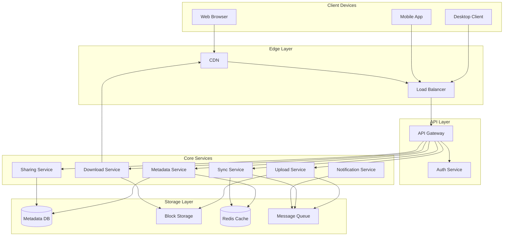
```mermaid
flowchart TB
    subgraph Clients["Client Devices"]
        WEB[Web Browser]
        DESKTOP[Desktop Client]
        MOBILE[Mobile App]
    end

    subgraph Edge["Edge Layer"]
        CDN[CDN]
        LB[Load Balancer]
    end

    subgraph API["API Layer"]
        APIGW[API Gateway]
        AUTH[Auth Service]
    end

    subgraph Services["Core Services"]
        META[Metadata Service]
        UPLOAD[Upload Service]
        DOWNLOAD[Download Service]
        SYNC[Sync Service]
        SHARE[Sharing Service]
        NOTIFY[Notification Service]
    end

    subgraph Storage["Storage Layer"]
        METADB[(Metadata DB)]
        BLOCKSTORE[Block Storage]
        CACHE[(Redis Cache)]
        MQ[Message Queue]
    end

    WEB --> CDN
    DESKTOP --> LB
    MOBILE --> LB
    CDN --> LB
    LB --> APIGW
    APIGW --> AUTH
    APIGW --> META
    APIGW --> UPLOAD
    APIGW --> DOWNLOAD
    APIGW --> SYNC
    APIGW --> SHARE

    META --> METADB
    META --> CACHE
    UPLOAD --> BLOCKSTORE
    UPLOAD --> MQ
    DOWNLOAD --> BLOCKSTORE
    DOWNLOAD --> CDN
    SYNC --> CACHE
    SYNC --> MQ
    SHARE --> METADB
    NOTIFY --> MQ
```

### Core APIs

#### Upload File

```
POST /api/v1/files/upload
Headers:
  Authorization: Bearer <token>
  Content-Type: multipart/form-data
  X-Upload-Id: <resumable-upload-id>  // For resumable uploads
Body:
  - file: binary
  - parent_folder_id: string
  - filename: string
Response:
  {
    "file_id": "f_abc123",
    "name": "document.pdf",
    "size": 1048576,
    "checksum": "sha256:abc...",
    "created_at": "2024-01-15T10:30:00Z",
    "version": 1
  }
```

#### Download File

```
GET /api/v1/files/{file_id}/download
GET /api/v1/files/{file_id}/download?version=3  // Specific version
Headers:
  Authorization: Bearer <token>
Response:
  - 302 Redirect to signed CDN URL (for large files)
  - 200 with file content (for small files)
```

#### Sync Changes

```
POST /api/v1/sync
Headers:
  Authorization: Bearer <token>
Body:
  {
    "device_id": "device_123",
    "last_sync_cursor": "cursor_abc",
    "local_changes": [
      {
        "path": "/docs/file.txt",
        "checksum": "sha256:...",
        "modified_at": "2024-01-15T10:30:00Z",
        "action": "modify"
      }
    ]
  }
Response:
  {
    "server_changes": [...],
    "conflicts": [...],
    "new_cursor": "cursor_def"
  }
```

#### Share File

```
POST /api/v1/files/{file_id}/share
Headers:
  Authorization: Bearer <token>
Body:
  {
    "recipients": [
      {"email": "user@example.com", "role": "editor"},
      {"email": "other@example.com", "role": "viewer"}
    ],
    "link_settings": {
      "enabled": true,
      "access": "anyone_with_link",
      "role": "viewer",
      "expiry": "2024-02-15T00:00:00Z"
    }
  }
```

---

## 4. Deep Dive

### 4.1 File Upload Flow

> "Let me walk through the upload flow, which is one of the most critical paths."

#### Why Chunked Upload?

| Approach | Pros | Cons |
|----------|------|------|
| Single upload | Simple | Fails completely on network error |
| **Chunked upload** | Resumable, parallel, efficient | More complex |
| Streaming | Low memory | Hard to retry |

**Decision**: Chunked upload with 4MB chunks for reliability and parallelism.

#### Upload Flow

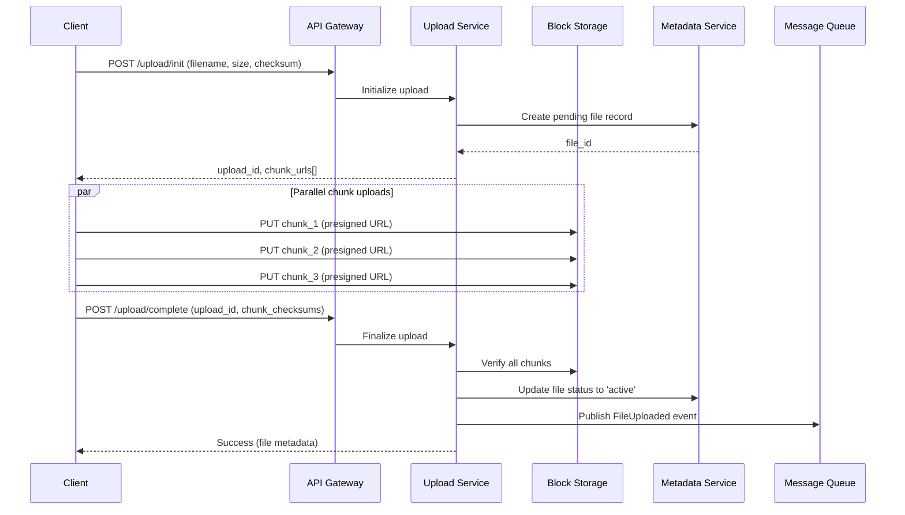
```mermaid
sequenceDiagram
    participant C as Client
    participant API as API Gateway
    participant US as Upload Service
    participant BS as Block Storage
    participant MS as Metadata Service
    participant MQ as Message Queue

    C->>API: POST /upload/init (filename, size, checksum)
    API->>US: Initialize upload
    US->>MS: Create pending file record
    MS-->>US: file_id
    US-->>C: upload_id, chunk_urls[]

    par Parallel chunk uploads
        C->>BS: PUT chunk_1 (presigned URL)
        C->>BS: PUT chunk_2 (presigned URL)
        C->>BS: PUT chunk_3 (presigned URL)
    end

    C->>API: POST /upload/complete (upload_id, chunk_checksums)
    API->>US: Finalize upload
    US->>BS: Verify all chunks
    US->>MS: Update file status to 'active'
    US->>MQ: Publish FileUploaded event
    US-->>C: Success (file metadata)
```

#### Block-Level Deduplication

> "To save storage, we deduplicate at the block level, not file level."

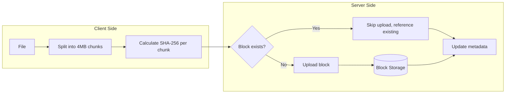
```mermaid
flowchart LR
    subgraph Client["Client Side"]
        FILE[File] --> CHUNK[Split into 4MB chunks]
        CHUNK --> HASH[Calculate SHA-256 per chunk]
    end

    subgraph Server["Server Side"]
        HASH --> CHECK{Block exists?}
        CHECK -->|Yes| SKIP[Skip upload, reference existing]
        CHECK -->|No| UPLOAD[Upload block]
        UPLOAD --> STORE[(Block Storage)]
        SKIP --> META[Update metadata]
        STORE --> META
    end
```

**Deduplication benefits**:
- Same file uploaded by different users → stored once
- Modified file → only changed blocks uploaded
- Backup copies → nearly free

**Example**:
```
File A: [Block1][Block2][Block3][Block4]
File B: [Block1][Block2][Block5][Block4]  // Modified file
Storage: Only 5 unique blocks stored, not 8
```

### 4.2 Sync Service

> "Sync is the most challenging part. We need to handle multiple devices editing the same file."

#### Sync Strategies Comparison

| Strategy | Mechanism | Pros | Cons |
|----------|-----------|------|------|
| Polling | Client checks every N seconds | Simple | High QPS, delayed updates |
| Long polling | Server holds request until change | Lower QPS | Connection overhead |
| **WebSocket** | Persistent connection | Real-time, efficient | Stateful connections |
| **Delta sync** | Only sync differences | Bandwidth efficient | Complex |

**Decision**: WebSocket for real-time notifications + Delta sync for efficient transfers.

#### Sync Architecture

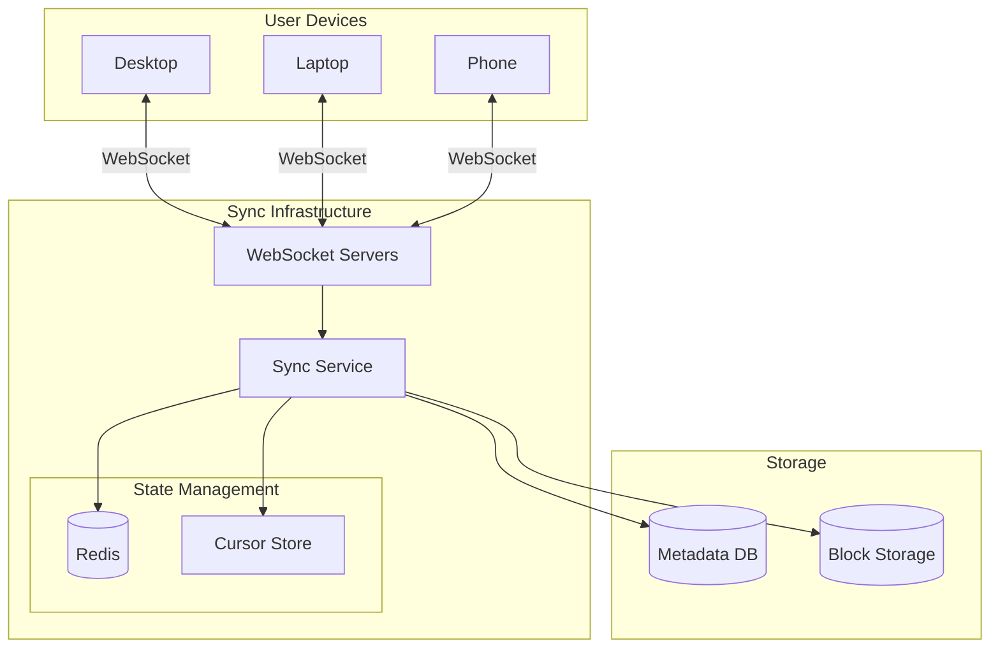
```mermaid
flowchart TB
    subgraph Devices["User Devices"]
        D1[Desktop]
        D2[Laptop]
        D3[Phone]
    end

    subgraph Sync["Sync Infrastructure"]
        WSS[WebSocket Servers]
        SS[Sync Service]
        subgraph State["State Management"]
            REDIS[(Redis)]
            CURSOR[Cursor Store]
        end
    end

    subgraph Storage["Storage"]
        META[(Metadata DB)]
        BLOCKS[(Block Storage)]
    end

    D1 <-->|WebSocket| WSS
    D2 <-->|WebSocket| WSS
    D3 <-->|WebSocket| WSS

    WSS --> SS
    SS --> REDIS
    SS --> CURSOR
    SS --> META
    SS --> BLOCKS
```

#### Cursor-Based Sync

Each device maintains a cursor (checkpoint) of its last sync position:

```json
{
  "device_id": "desktop_123",
  "user_id": "user_456",
  "cursor": "1705312200_seq_99847",
  "last_sync": "2024-01-15T10:30:00Z"
}
```

**Sync flow**:
1. Device sends current cursor
2. Server returns all changes since cursor
3. Device applies changes, updates local cursor
4. If conflicts, return conflict list for resolution

#### Conflict Resolution

> "What happens when two devices edit the same file offline?"

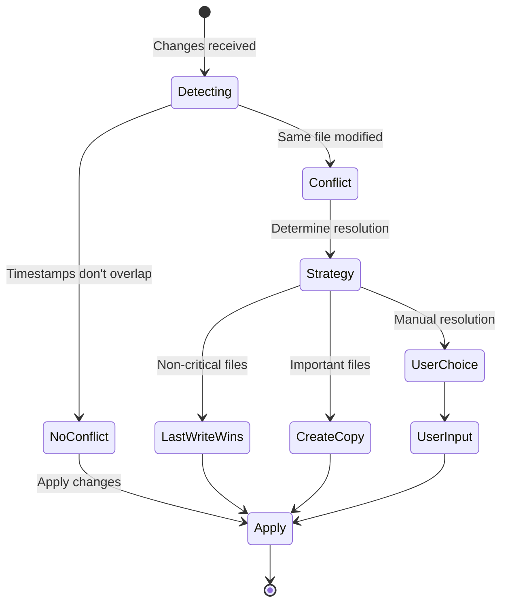
```mermaid
stateDiagram-v2
    [*] --> Detecting: Changes received
    Detecting --> NoConflict: Timestamps don't overlap
    Detecting --> Conflict: Same file modified

    NoConflict --> Apply: Apply changes
    Apply --> [*]

    Conflict --> Strategy: Determine resolution
    Strategy --> LastWriteWins: Non-critical files
    Strategy --> CreateCopy: Important files
    Strategy --> UserChoice: Manual resolution

    LastWriteWins --> Apply
    CreateCopy --> Apply
    UserChoice --> UserInput
    UserInput --> Apply
```

**Conflict strategies**:

| Strategy | When to use | Example |
|----------|-------------|---------|
| Last-write-wins | Low-risk files, single user | Cache files |
| Create conflict copy | Important files | "document (conflicted copy).txt" |
| Merge | Text files with no overlapping edits | Code files |
| User decision | Critical conflicts | Prompt user to choose |

### 4.3 Metadata Service

> "Metadata operations are read-heavy. Let's design the data model."

#### Data Model

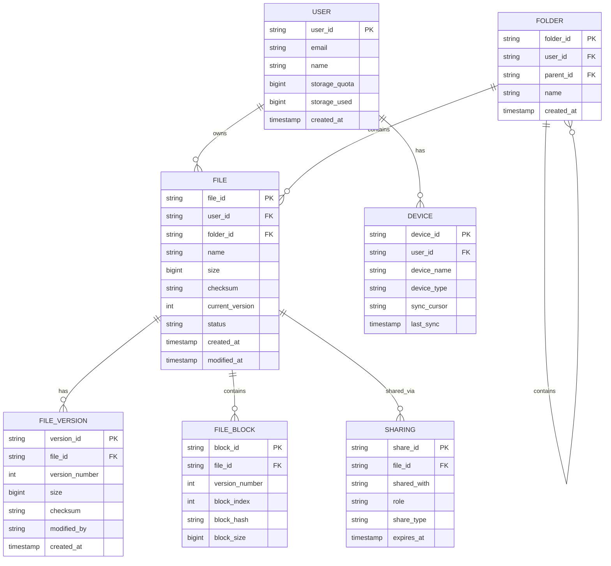
```mermaid
erDiagram
    USER ||--o{ FILE : owns
    USER ||--o{ DEVICE : has
    FILE ||--o{ FILE_VERSION : has
    FILE ||--o{ FILE_BLOCK : contains
    FILE ||--o{ SHARING : shared_via
    FOLDER ||--o{ FILE : contains
    FOLDER ||--o{ FOLDER : contains

    USER {
        string user_id PK
        string email
        string name
        bigint storage_quota
        bigint storage_used
        timestamp created_at
    }

    FILE {
        string file_id PK
        string user_id FK
        string folder_id FK
        string name
        bigint size
        string checksum
        int current_version
        string status
        timestamp created_at
        timestamp modified_at
    }

    FILE_VERSION {
        string version_id PK
        string file_id FK
        int version_number
        bigint size
        string checksum
        string modified_by
        timestamp created_at
    }

    FILE_BLOCK {
        string block_id PK
        string file_id FK
        int version_number
        int block_index
        string block_hash
        bigint block_size
    }

    FOLDER {
        string folder_id PK
        string user_id FK
        string parent_id FK
        string name
        timestamp created_at
    }

    DEVICE {
        string device_id PK
        string user_id FK
        string device_name
        string device_type
        string sync_cursor
        timestamp last_sync
    }

    SHARING {
        string share_id PK
        string file_id FK
        string shared_with
        string role
        string share_type
        timestamp expires_at
    }
```

#### Database Choice

| Option | Pros | Cons | Verdict |
|--------|------|------|---------|
| PostgreSQL | ACID, relations, mature | Scaling complexity | Good for metadata |
| MongoDB | Flexible schema, easy scaling | Weaker consistency | Could work |
| **Sharded PostgreSQL** | Best of both | Operational complexity | **Best choice** |

**Sharding strategy**: Shard by `user_id` to keep all user's files on same shard.

#### Caching Strategy

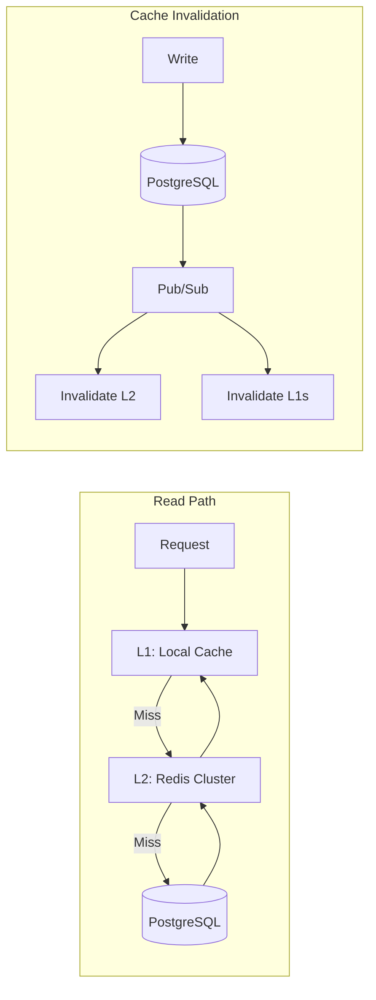
```mermaid
flowchart LR
    subgraph Read["Read Path"]
        REQ[Request] --> L1[L1: Local Cache]
        L1 -->|Miss| L2[L2: Redis Cluster]
        L2 -->|Miss| DB[(PostgreSQL)]
        DB --> L2
        L2 --> L1
    end

    subgraph Invalidation["Cache Invalidation"]
        WRITE[Write] --> DB2[(PostgreSQL)]
        DB2 --> PUB[Pub/Sub]
        PUB --> INV1[Invalidate L2]
        PUB --> INV2[Invalidate L1s]
    end
```

**Cache policies**:

| Data | TTL | Invalidation |
|------|-----|--------------|
| User metadata | 1 hour | On profile update |
| File metadata | 5 minutes | On any file change |
| Folder structure | 10 minutes | On folder change |
| Sharing permissions | 1 minute | On permission change |

### 4.4 Block Storage

> "Let's discuss how we store the actual file content."

#### Storage Architecture

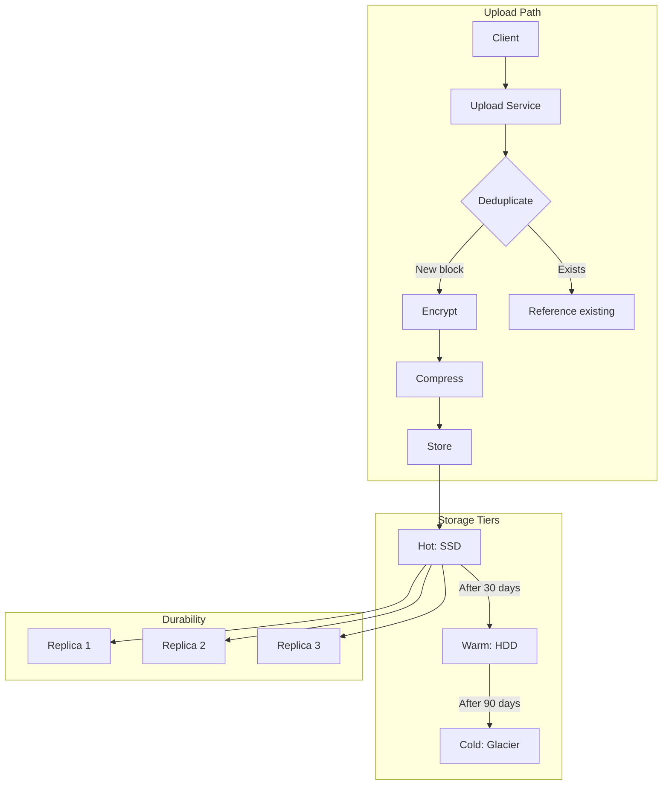
```mermaid
flowchart TB
    subgraph Upload["Upload Path"]
        CLIENT[Client] --> UPLOAD[Upload Service]
        UPLOAD --> DEDUP{Deduplicate}
        DEDUP -->|New block| ENCRYPT[Encrypt]
        DEDUP -->|Exists| REF[Reference existing]
        ENCRYPT --> COMPRESS[Compress]
        COMPRESS --> STORE[Store]
    end

    subgraph Storage["Storage Tiers"]
        STORE --> HOT[Hot: SSD]
        HOT -->|After 30 days| WARM[Warm: HDD]
        WARM -->|After 90 days| COLD[Cold: Glacier]
    end

    subgraph Durability["Durability"]
        HOT --> REP1[Replica 1]
        HOT --> REP2[Replica 2]
        HOT --> REP3[Replica 3]
    end
```

#### Storage Tiers

| Tier | Storage Type | Access Time | Cost | Use Case |
|------|--------------|-------------|------|----------|
| Hot | SSD | < 10ms | $$$ | Recently accessed |
| Warm | HDD | < 100ms | $$ | Older files |
| Cold | Glacier | Minutes-hours | $ | Archived/deleted |

#### Block Storage Schema

```
Block Storage Layout:
/blocks/
  /{hash_prefix}/        # First 2 chars of hash (256 buckets)
    /{block_hash}        # Full SHA-256 hash
      - data             # Encrypted, compressed block
      - metadata.json    # Size, references, created_at
```

**Example**:
```
/blocks/a7/a7b3c4d5e6f7...
  - data: [encrypted binary]
  - metadata.json: {
      "size": 4194304,
      "compressed_size": 3145728,
      "reference_count": 47,
      "created_at": "2024-01-15T10:30:00Z"
    }
```

### 4.5 Sharing Service

> "Sharing is more complex than it appears. We need to handle permissions, links, and notifications."

#### Permission Model

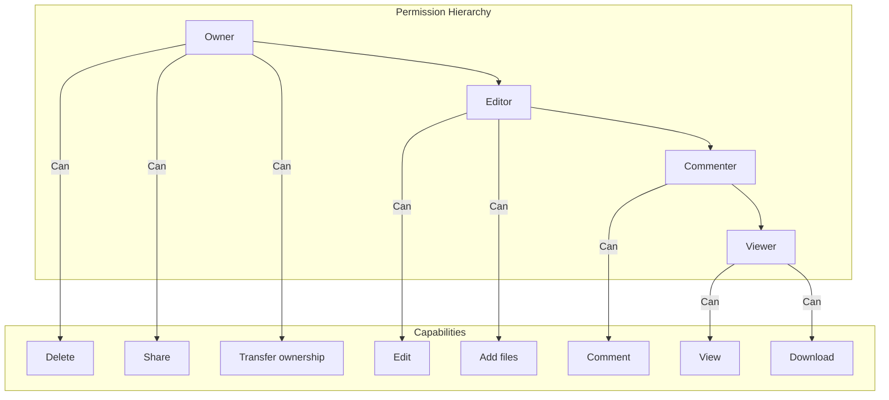
```mermaid
flowchart TB
    subgraph Permissions["Permission Hierarchy"]
        OWNER[Owner] --> EDITOR[Editor]
        EDITOR --> COMMENTER[Commenter]
        COMMENTER --> VIEWER[Viewer]
    end

    subgraph Capabilities["Capabilities"]
        OWNER --> |Can| O1[Delete]
        OWNER --> |Can| O2[Share]
        OWNER --> |Can| O3[Transfer ownership]
        EDITOR --> |Can| E1[Edit]
        EDITOR --> |Can| E2[Add files]
        COMMENTER --> |Can| C1[Comment]
        VIEWER --> |Can| V1[View]
        VIEWER --> |Can| V2[Download]
    end
```

#### Share Types

| Type | Description | Use Case |
|------|-------------|----------|
| Direct share | Share with specific user | Team collaboration |
| Link (restricted) | Anyone with link + account | Semi-private sharing |
| Link (public) | Anyone with link | Public distribution |
| Domain share | Anyone in organization | Enterprise |

#### Sharing Flow

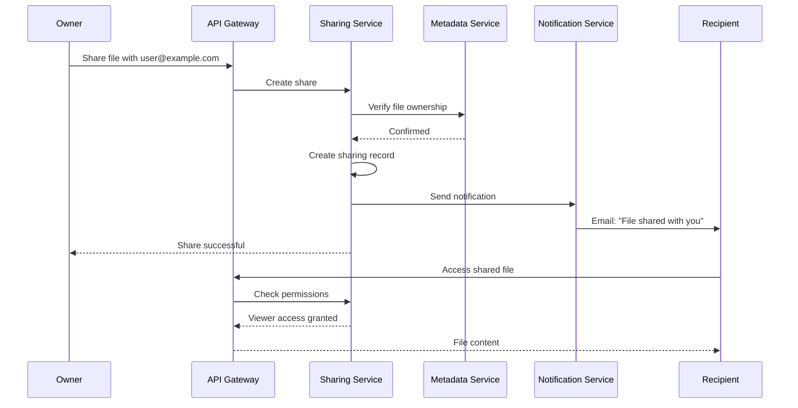
```mermaid
sequenceDiagram
    participant U1 as Owner
    participant API as API Gateway
    participant SS as Sharing Service
    participant MS as Metadata Service
    participant NS as Notification Service
    participant U2 as Recipient

    U1->>API: Share file with user@example.com
    API->>SS: Create share
    SS->>MS: Verify file ownership
    MS-->>SS: Confirmed
    SS->>SS: Create sharing record
    SS->>NS: Send notification
    NS->>U2: Email: "File shared with you"
    SS-->>U1: Share successful

    U2->>API: Access shared file
    API->>SS: Check permissions
    SS-->>API: Viewer access granted
    API-->>U2: File content
```

### 4.6 Notification Service

> "Users need to know when files change. Let's design real-time notifications."

#### Notification Architecture

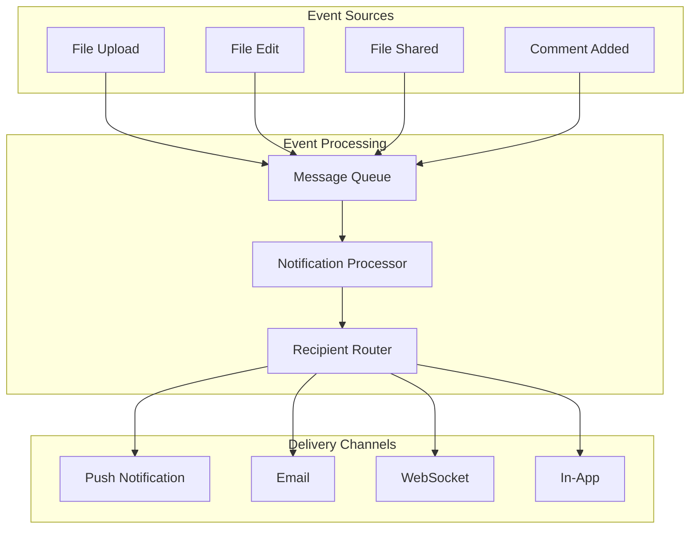
```mermaid
flowchart TB
    subgraph Events["Event Sources"]
        UPLOAD[File Upload]
        EDIT[File Edit]
        SHARE[File Shared]
        COMMENT[Comment Added]
    end

    subgraph Processing["Event Processing"]
        MQ[Message Queue]
        PROCESSOR[Notification Processor]
        ROUTER[Recipient Router]
    end

    subgraph Delivery["Delivery Channels"]
        PUSH[Push Notification]
        EMAIL[Email]
        WS[WebSocket]
        INAPP[In-App]
    end

    UPLOAD --> MQ
    EDIT --> MQ
    SHARE --> MQ
    COMMENT --> MQ

    MQ --> PROCESSOR
    PROCESSOR --> ROUTER

    ROUTER --> PUSH
    ROUTER --> EMAIL
    ROUTER --> WS
    ROUTER --> INAPP
```

#### Notification Preferences

| Event Type | Default Channel | User Configurable |
|------------|-----------------|-------------------|
| File shared with me | Email + Push | Yes |
| Comment on my file | Push + In-app | Yes |
| File edited | In-app only | Yes |
| Storage warning | Email | No |

---

## 5. Scalability

> "Let me discuss how this system scales to handle 500M users."

### Scaling Strategy

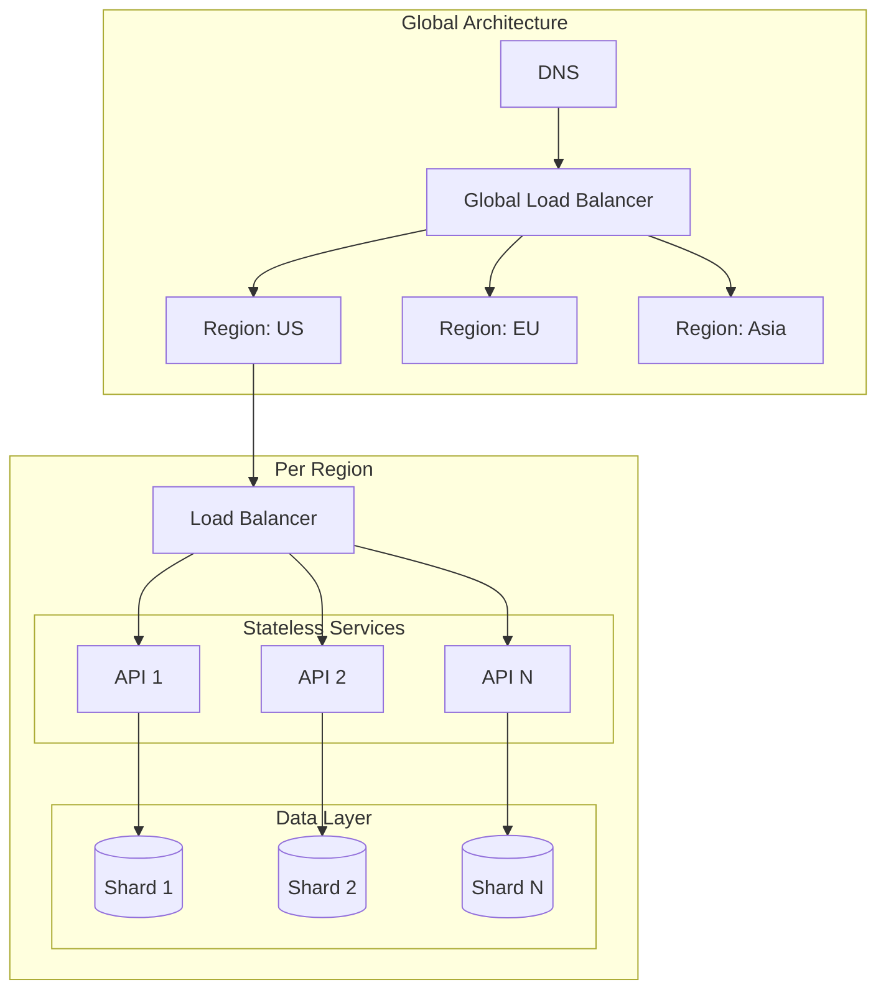
```mermaid
flowchart TB
    subgraph Global["Global Architecture"]
        DNS[DNS] --> GLB[Global Load Balancer]
        GLB --> R1[Region: US]
        GLB --> R2[Region: EU]
        GLB --> R3[Region: Asia]
    end

    subgraph Region["Per Region"]
        LB[Load Balancer]
        subgraph Services["Stateless Services"]
            API1[API 1]
            API2[API 2]
            APIn[API N]
        end
        subgraph Data["Data Layer"]
            SHARD1[(Shard 1)]
            SHARD2[(Shard 2)]
            SHARDN[(Shard N)]
        end
    end

    R1 --> LB
    LB --> API1
    LB --> API2
    LB --> APIn
    API1 --> SHARD1
    API2 --> SHARD2
    APIn --> SHARDN
```

### Scaling by Component

| Component | Strategy | Capacity per Unit |
|-----------|----------|-------------------|
| API Gateway | Horizontal, auto-scale | 10K req/s |
| Metadata Service | Horizontal + sharding | 50K req/s |
| Upload Service | Horizontal | 1K uploads/s |
| Block Storage | Distributed (S3-like) | Unlimited |
| Sync Service | Horizontal + partitioned | 100K connections |
| WebSocket Servers | Horizontal, sticky | 50K connections |

### Database Sharding

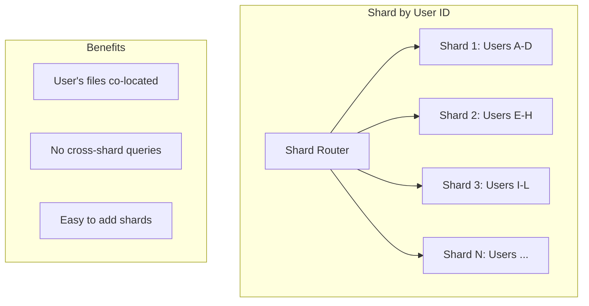
```mermaid
flowchart TB
    subgraph Sharding["Shard by User ID"]
        ROUTER[Shard Router]
        ROUTER --> S1[Shard 1: Users A-D]
        ROUTER --> S2[Shard 2: Users E-H]
        ROUTER --> S3[Shard 3: Users I-L]
        ROUTER --> SN[Shard N: Users ...]
    end

    subgraph Benefits["Benefits"]
        B1[User's files co-located]
        B2[No cross-shard queries]
        B3[Easy to add shards]
    end
```

**Shard key**: `user_id`
- All files for a user on same shard
- Sharing creates cross-shard references (handled by sharing service)

### CDN Strategy

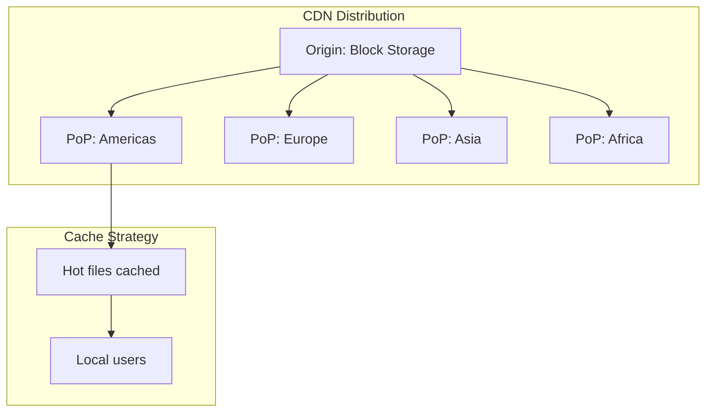
```mermaid
flowchart TB
    subgraph CDN["CDN Distribution"]
        ORIGIN[Origin: Block Storage]
        ORIGIN --> POP1[PoP: Americas]
        ORIGIN --> POP2[PoP: Europe]
        ORIGIN --> POP3[PoP: Asia]
        ORIGIN --> POP4[PoP: Africa]
    end

    subgraph Caching["Cache Strategy"]
        POP1 --> HOT1[Hot files cached]
        HOT1 --> USERS1[Local users]
    end
```

**CDN policies**:
- Cache popular public files
- Cache user's recently accessed files at nearest PoP
- Signed URLs with short TTL for private files

---

## 6. Reliability

> "For a file storage system, data durability is non-negotiable."

### Data Durability

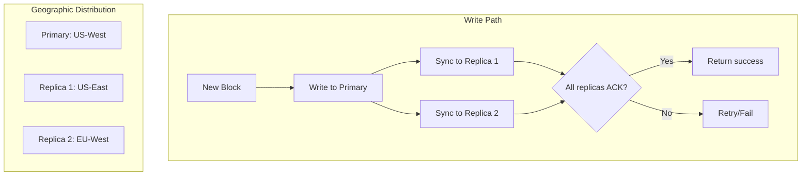
```mermaid
flowchart TB
    subgraph Write["Write Path"]
        BLOCK[New Block] --> W1[Write to Primary]
        W1 --> W2[Sync to Replica 1]
        W1 --> W3[Sync to Replica 2]
        W2 --> ACK{All replicas ACK?}
        W3 --> ACK
        ACK -->|Yes| SUCCESS[Return success]
        ACK -->|No| RETRY[Retry/Fail]
    end

    subgraph Distribution["Geographic Distribution"]
        PRIMARY[Primary: US-West]
        REP1[Replica 1: US-East]
        REP2[Replica 2: EU-West]
    end
```

### Durability Guarantees

| Scenario | Protection |
|----------|------------|
| Disk failure | 3 replicas per block |
| Server failure | Blocks distributed across servers |
| Rack failure | Replicas in different racks |
| Data center failure | Cross-region replication |
| Bit rot | Periodic checksum verification |

### Consistency Model

| Operation | Consistency | Why |
|-----------|-------------|-----|
| File upload | Strong | Must confirm write |
| File read | Strong | Must return latest |
| Sync cursor | Eventual | Performance |
| Sharing permissions | Strong | Security critical |
| Usage stats | Eventual | Not critical |

### Failure Handling

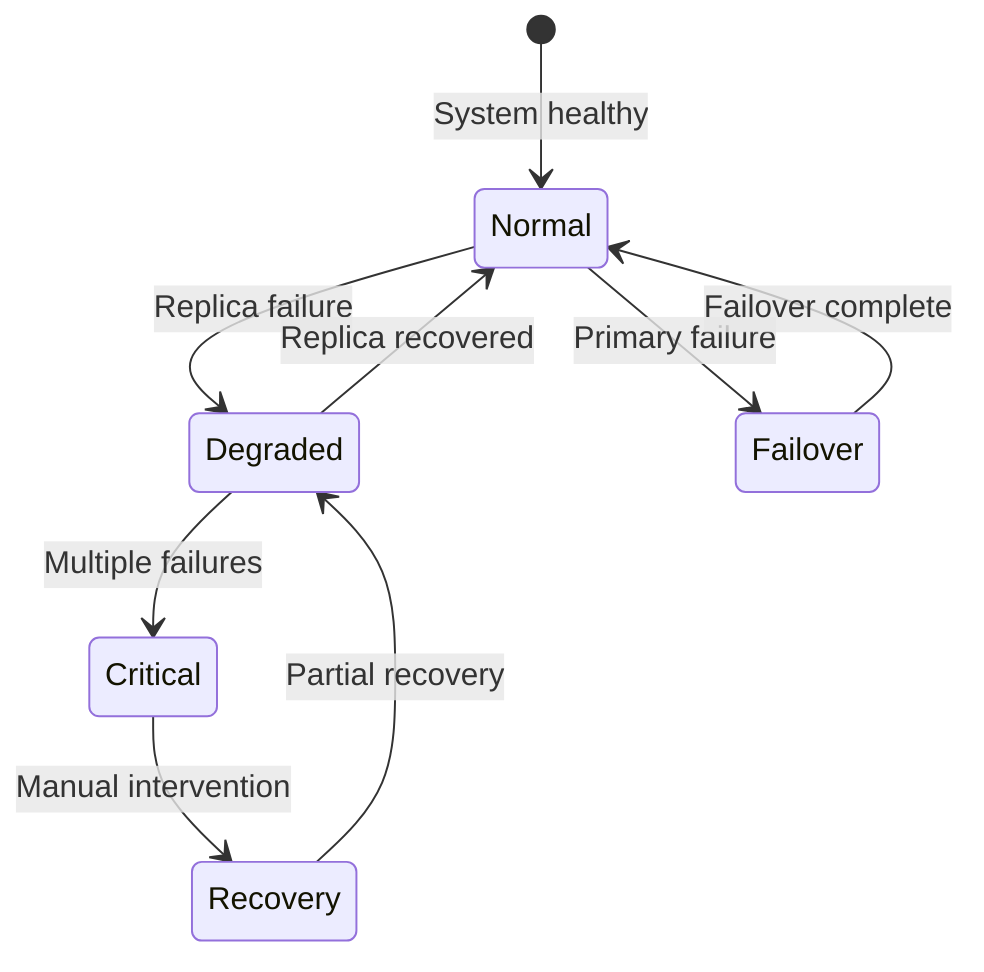
```mermaid
stateDiagram-v2
    [*] --> Normal: System healthy

    Normal --> Degraded: Replica failure
    Degraded --> Normal: Replica recovered
    Degraded --> Critical: Multiple failures

    Normal --> Failover: Primary failure
    Failover --> Normal: Failover complete

    Critical --> Recovery: Manual intervention
    Recovery --> Degraded: Partial recovery
```

#### Upload Failure Recovery

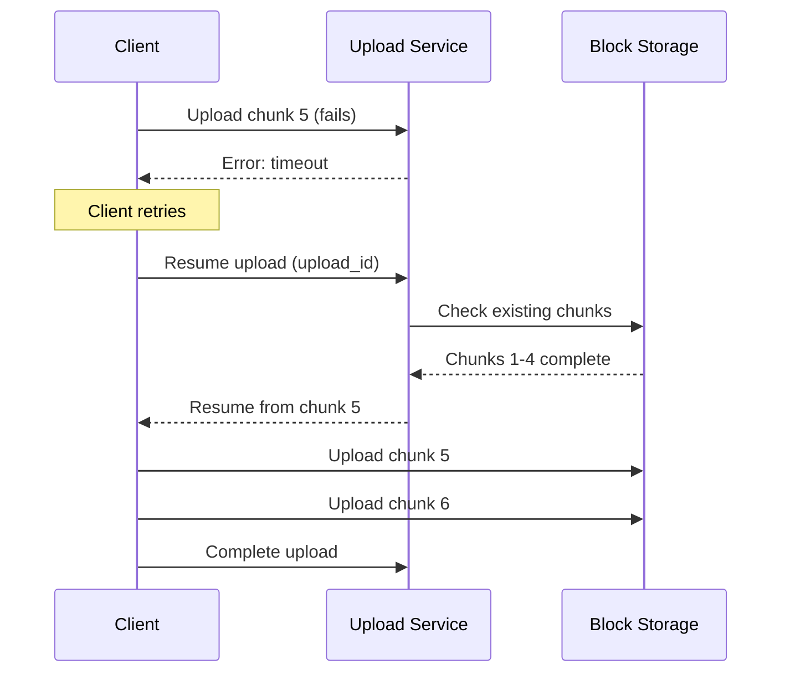
```mermaid
sequenceDiagram
    participant C as Client
    participant US as Upload Service
    participant BS as Block Storage

    C->>US: Upload chunk 5 (fails)
    US-->>C: Error: timeout

    Note over C: Client retries
    C->>US: Resume upload (upload_id)
    US->>BS: Check existing chunks
    BS-->>US: Chunks 1-4 complete
    US-->>C: Resume from chunk 5
    C->>BS: Upload chunk 5
    C->>BS: Upload chunk 6
    C->>US: Complete upload
```

---

## 7. Additional Considerations

### Security

#### Encryption

| Layer | Method | Key Management |
|-------|--------|----------------|
| In transit | TLS 1.3 | Auto-rotated certs |
| At rest | AES-256 | Per-user keys in KMS |
| Block level | AES-256 | Content-derived keys |

#### Access Control

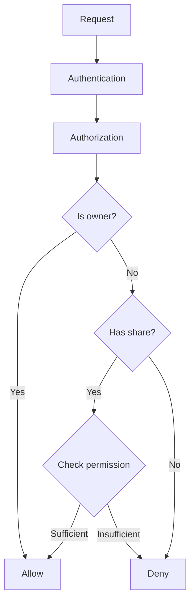
```mermaid
flowchart TB
    REQ[Request] --> AUTH[Authentication]
    AUTH --> AUTHZ[Authorization]
    AUTHZ --> OWNER{Is owner?}
    OWNER -->|Yes| ALLOW[Allow]
    OWNER -->|No| SHARE{Has share?}
    SHARE -->|Yes| PERM{Check permission}
    SHARE -->|No| DENY[Deny]
    PERM -->|Sufficient| ALLOW
    PERM -->|Insufficient| DENY
```

### Monitoring

| Metric | Alert Threshold | Action |
|--------|-----------------|--------|
| Upload latency P99 | > 5s | Scale upload service |
| Sync lag | > 30s | Investigate sync service |
| Storage utilization | > 80% | Add storage capacity |
| Error rate | > 0.1% | Page on-call |
| Replication lag | > 1 minute | Critical alert |

### Cost Optimization

| Strategy | Savings | Trade-off |
|----------|---------|-----------|
| Block deduplication | 40-60% | CPU for hashing |
| Compression | 20-30% | CPU overhead |
| Tiered storage | 50-70% | Access latency |
| Regional storage | 30-40% | Cross-region access |

---

## 8. Interview Tips

### Key Points to Emphasize

1. **Block-level deduplication**: Dramatically reduces storage costs
2. **Chunked uploads**: Enables resume and parallelism
3. **Sync complexity**: The hardest part - cursor-based, conflict resolution
4. **Durability vs. availability**: 11 nines durability is non-negotiable

### Common Follow-up Questions

| Question | Key Points |
|----------|------------|
| "How do you handle large files?" | Chunked upload, parallel transfers, resumable |
| "What about conflicts?" | Cursor-based sync, conflict copies, user resolution |
| "How do you ensure durability?" | 3 replicas, cross-region, checksums |
| "How does sharing work?" | ACL model, signed URLs, permission inheritance |
| "What about versioning?" | Block-level versioning, efficient storage |

### Trade-off Discussions

| Decision | Trade-off | Reasoning |
|----------|-----------|-----------|
| Chunk size (4MB) | Parallelism vs. overhead | Balance of resume granularity and request overhead |
| Sync strategy | Latency vs. bandwidth | WebSocket for speed, delta for efficiency |
| Consistency model | Performance vs. correctness | Strong for writes, eventual for sync |
| Deduplication scope | Storage vs. privacy | User-level only for privacy |

### Red Flags to Avoid

- Don't skip durability discussion - this is critical for file storage
- Don't ignore conflict resolution - sync is the hardest part
- Don't propose single-region design - multi-region is expected
- Don't forget about large files - need chunked uploads

### Phrases to Use

| Situation | Phrase |
|-----------|--------|
| Starting upload design | "Let me walk through the upload flow, which is critical for user experience..." |
| Discussing sync | "Sync is the most challenging part because we need to handle offline edits and conflicts..." |
| Addressing durability | "For a file storage system, data durability is non-negotiable. Let me explain our strategy..." |
| Trade-off moment | "We have a trade-off here between storage cost and privacy. I'd lean toward..." |

---

## 9. Summary

### Architecture Overview

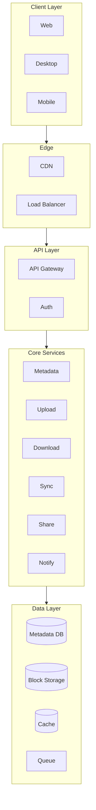
```mermaid
flowchart TB
    subgraph Client["Client Layer"]
        WEB[Web]
        DESKTOP[Desktop]
        MOBILE[Mobile]
    end

    subgraph Edge["Edge"]
        CDN[CDN]
        LB[Load Balancer]
    end

    subgraph API["API Layer"]
        GW[API Gateway]
        AUTH[Auth]
    end

    subgraph Core["Core Services"]
        META[Metadata]
        UPLOAD[Upload]
        DOWNLOAD[Download]
        SYNC[Sync]
        SHARE[Share]
        NOTIFY[Notify]
    end

    subgraph Data["Data Layer"]
        METADB[(Metadata DB)]
        BLOCKS[(Block Storage)]
        CACHE[(Cache)]
        MQ[Queue]
    end

    Client --> Edge
    Edge --> API
    API --> Core
    Core --> Data
```

### Key Design Decisions

| Decision | Choice | Rationale |
|----------|--------|-----------|
| Upload strategy | Chunked, resumable | Reliability for large files |
| Storage | Block-level dedup | 40-60% storage savings |
| Sync | WebSocket + delta | Real-time + efficient |
| Consistency | Strong for writes | Data integrity |
| Durability | 3 replicas, cross-region | 11 nines requirement |

### Scale Numbers

| Metric | Value |
|--------|-------|
| Users | 500M |
| Files | 250B |
| Storage | 250 PB |
| Upload QPS | 2.3K (7K peak) |
| Sync QPS | 115K |
| Durability | 99.999999999% |
