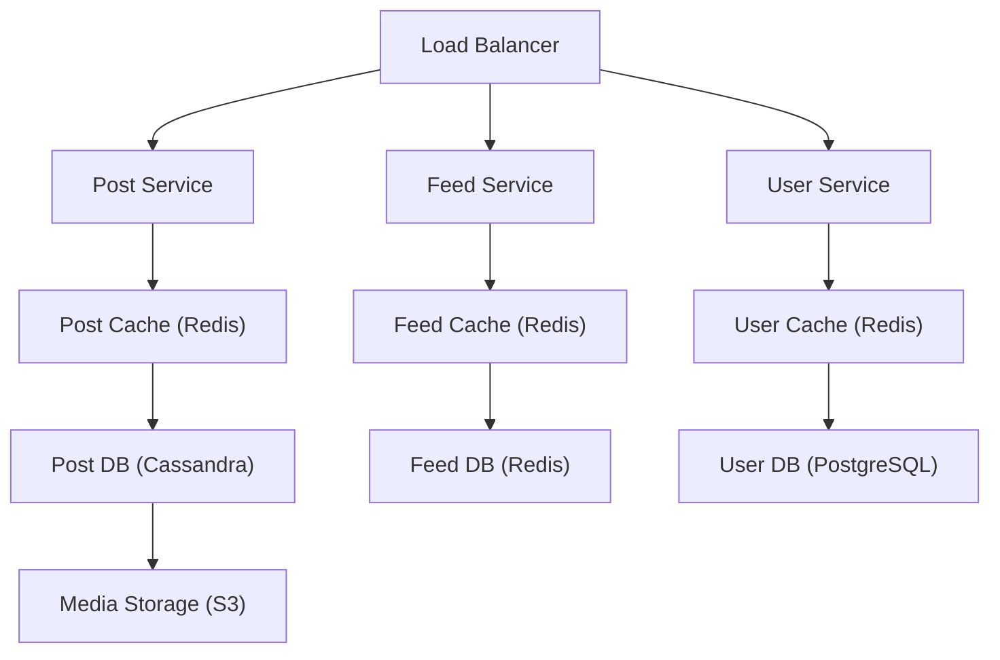
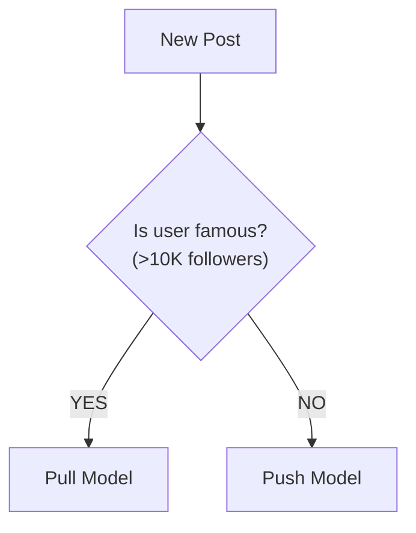
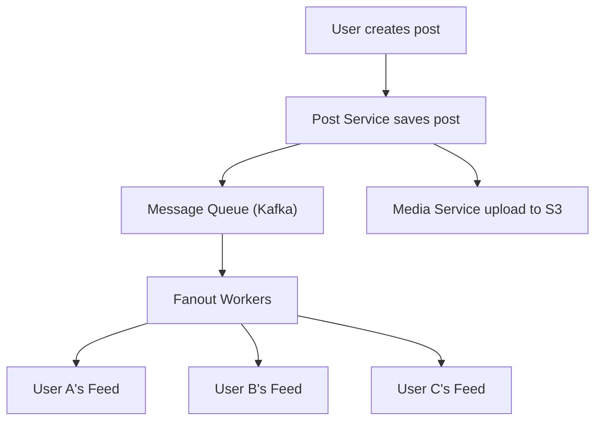
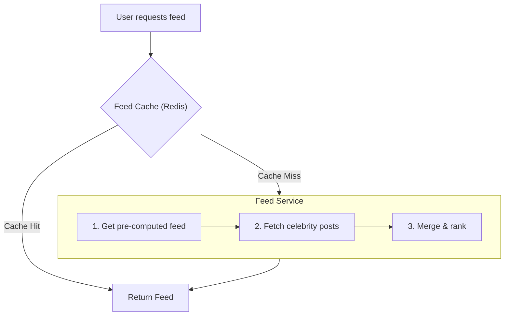
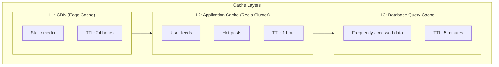
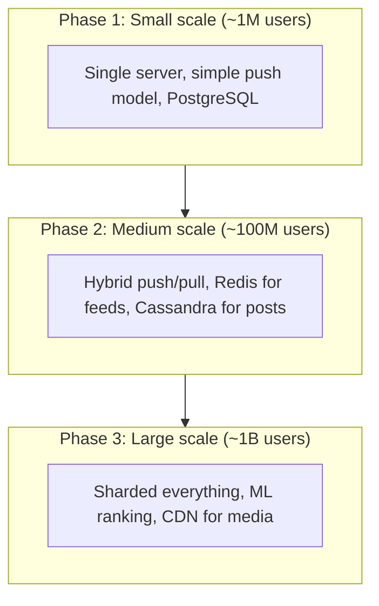

# Design a News Feed System

A news feed system displays a personalized, constantly updating list of posts from friends, pages, and groups. Examples include Facebook News Feed, Twitter Timeline, and Instagram Feed.

---

## Table of Contents

1. [Requirements](#requirements)
2. [Back of the Envelope Estimation](#back-of-the-envelope-estimation)
3. [System APIs](#system-apis)
4. [High-Level Design](#high-level-design)
5. [Feed Generation Strategies](#feed-generation-strategies)
6. [Database Design](#database-design)
7. [Deep Dive](#deep-dive)
8. [Ranking Algorithm](#ranking-algorithm)
9. [Key Takeaways](#key-takeaways)
10. [Interview Tips](#interview-tips)

---

## Requirements

### Functional Requirements

- **Post creation**: Users can create posts with text, images, videos
- **Feed generation**: Generate personalized feed from friends/followees
- **Feed viewing**: Users can view their news feed with infinite scroll
- **Interactions**: Like, comment, share posts

### Non-Functional Requirements

| Requirement | Description |
|-------------|-------------|
| **Low latency** | Feed should load in < 500ms |
| **High availability** | 99.99% uptime |
| **Scalability** | Support billions of users |
| **Consistency** | Eventual consistency acceptable |

### Extended Requirements

- Push notifications for new posts
- Support for different media types
- Content moderation
- Ad integration

---

## Back of the Envelope Estimation

### Traffic Estimates

```
Daily Active Users (DAU): 500 million
Avg friends per user: 500
Avg posts per user per day: 2

Feed refreshes per user per day: 10
Total feed requests: 500M × 10 = 5 billion/day
                   = ~58,000 requests/second

New posts: 500M × 2 = 1 billion posts/day
         = ~12,000 posts/second
```

### Storage Estimates

```
Post metadata: ~1 KB per post
Posts per day: 1 billion
Posts per year: 365 billion

Storage per year: 365B × 1KB = 365 TB (metadata only)
Media storage: 10× metadata = 3.65 PB/year
```

### Memory Estimates (Cache)

```
Hot posts to cache: 20% of daily posts
Cache size: 200M posts × 1KB = 200 GB
Feed cache per user: 500 posts × 100 bytes = 50 KB
Active user feed cache: 100M × 50KB = 5 TB
```

### Summary

| Metric | Value |
|--------|-------|
| Feed requests | 58,000/second |
| New posts | 12,000/second |
| Storage (metadata) | 365 TB/year |
| Feed cache | 5 TB |

---

## System APIs

### Create Post

```
POST /v1/posts
```

**Request:**
```json
{
  "user_id": "user123",
  "content": "Hello world!",
  "media_ids": ["img1", "img2"],
  "privacy": "friends",
  "location": "San Francisco"
}
```

**Response:**
```json
{
  "post_id": "post456",
  "created_at": "2024-01-15T10:30:00Z",
  "status": "published"
}
```

### Get News Feed

```
GET /v1/feed?user_id={user_id}&page_token={token}&limit={limit}
```

**Response:**
```json
{
  "posts": [
    {
      "post_id": "post789",
      "author": {
        "user_id": "user456",
        "name": "John Doe",
        "avatar_url": "..."
      },
      "content": "Great day!",
      "media": [...],
      "likes_count": 150,
      "comments_count": 23,
      "created_at": "2024-01-15T09:00:00Z"
    }
  ],
  "next_page_token": "abc123"
}
```

---

## High-Level Design



### Components

| Component | Responsibility |
|-----------|----------------|
| **Post Service** | Create, update, delete posts |
| **Feed Service** | Generate and serve news feeds |
| **User Service** | Manage user profiles and relationships |
| **Notification Service** | Push notifications for new posts |
| **Ranking Service** | Score and rank posts |

---

## Feed Generation Strategies

> **Interview context**: This is the CORE question in news feed design: "How do you generate the feed?" The answer reveals your understanding of the fundamental trade-off.

### The Challenge

When User A opens their feed, we need to show recent posts from hundreds of friends. Two extremes:

1. **Compute on demand**: Slow for users with many friends (high read latency)
2. **Pre-compute everything**: Expensive when someone with 10M followers posts (high write cost)

### Option 1: Pull Model (Fan-out on Read)

Generate feed when user requests it.

```
User Request → Get Friends List → Fetch Recent Posts → Rank → Return
```

| Pros | Cons |
|------|------|
| No precomputation needed | High latency (many DB queries) |
| Always fresh data | Heavy load on read path |
| No wasted work for inactive users | Doesn't scale for users with many friends |

### Option 2: Push Model (Fan-out on Write)

Pre-generate feeds when posts are created.

```
New Post → Get Followers List → Write to Each Follower's Feed
```

| Pros | Cons |
|------|------|
| Fast read (O(1) from cache) | High write amplification |
| Pre-computed, ready to serve | Wasteful for inactive users |
| Consistent read latency | **Celebrity problem** |

> **Interviewer might ask**: "What's the celebrity problem?"

When a celebrity with 10 million followers posts, you need 10 million writes. This takes time and resources, delaying feed updates for everyone.

### Option 3: Hybrid Model (Recommended)

> **This is the answer interviewers want to hear.**

Combine both approaches based on user type:



**How it works:**
- **Regular users** (< 10K followers): Push to followers' feeds
- **Celebrities** (> 10K followers): Don't push; pull at read time
- **On read**: Merge pre-computed feed + fresh celebrity posts + rank

**Why this works**: Most users have few followers (push is cheap). Celebrities are few but have many followers (pull is cheaper than 10M writes).

---

## Database Design

### User Table (PostgreSQL)

```sql
CREATE TABLE users (
    user_id         BIGINT PRIMARY KEY,
    username        VARCHAR(50) UNIQUE,
    email           VARCHAR(100) UNIQUE,
    created_at      TIMESTAMP,
    follower_count  INT DEFAULT 0,
    following_count INT DEFAULT 0
);
```

### Post Table (Cassandra)

```sql
CREATE TABLE posts (
    post_id     UUID,
    user_id     BIGINT,
    content     TEXT,
    media_ids   LIST<UUID>,
    created_at  TIMESTAMP,
    likes_count INT,
    PRIMARY KEY (user_id, created_at)
) WITH CLUSTERING ORDER BY (created_at DESC);
```

### Feed Table (Redis)

```
Key: feed:{user_id}
Value: Sorted Set of (post_id, timestamp)

ZADD feed:user123 1705312200 post456
ZADD feed:user123 1705312100 post789

ZREVRANGE feed:user123 0 49  # Get top 50 posts
```

### Friendship Table (Cassandra)

```sql
CREATE TABLE followers (
    user_id     BIGINT,
    follower_id BIGINT,
    created_at  TIMESTAMP,
    PRIMARY KEY (user_id, follower_id)
);

CREATE TABLE following (
    user_id      BIGINT,
    following_id BIGINT,
    created_at   TIMESTAMP,
    PRIMARY KEY (user_id, following_id)
);
```

---

## Deep Dive

> **Interview context**: "Let's dive deeper into some specific challenges..."

### 1. Feed Publishing Flow

> **Interviewer might ask**: "Walk me through what happens when a user creates a post."



### 2. Feed Reading Flow



### 3. Handling the Celebrity Problem

> **Interviewer might ask**: "What specific strategies can you use for celebrities?"

When a celebrity with millions of followers posts, you have several options:

| Strategy | How It Works | Trade-off |
|----------|--------------|-----------|
| **Selective Push** | Only push to active followers (last 7 days) | Inactive users see stale feed on return |
| **Tiered Fanout** | Push to top 10K engaged first, rest in background | Some followers see post late |
| **Pure Pull** | Never push celebrity posts, always fetch on read | Slightly higher read latency |

**Recommended**: Pure Pull for celebrities (>10K followers) + aggressive caching. Celebrity posts are hot and cached anyway.

### 4. Cache Strategy



---

## Ranking Algorithm

> **Interview context**: After discussing feed generation, interviewers often ask: "How do you decide which posts to show first?"

### The Challenge

A user might have 1000+ posts from friends. Which 50 do you show first? Chronological order is simple but doesn't maximize engagement.

### Ranking Factors

| Factor | Weight | Why |
|--------|--------|-----|
| **Recency** | High | Users expect recent content |
| **Engagement** | High | Popular posts are likely interesting |
| **Relationship** | Medium | Close friends' posts matter more |
| **Content type** | Medium | User preferences (photos vs text) |
| **Past interactions** | Low | Posts from people you engage with |

### Simple Ranking Formula

> **Interviewer might ask**: "How would you implement a basic ranking algorithm?"

```
score = (time_decay × 0.4) + (engagement_score × 0.3) + (relationship × 0.3)

where:
  time_decay = 1 / (1 + hours_old / 6)     # Half-life of 6 hours
  engagement = log(1 + likes + comments×2 + shares×3)
  relationship = interaction_frequency with author
```

### Production: ML-Based Ranking

For real systems, use machine learning:

```
Features → Model (XGBoost/Neural Net) → Ranked Feed

Feature categories:
- User: age, location, interests, activity patterns
- Post: type, length, media, author popularity
- Context: time of day, device, session depth
- Interaction: past clicks, dwell time, hides
```

**Key insight**: The ranking model optimizes for a business metric (engagement, time spent, or a combination).

---

## Key Takeaways

### Design Decisions Summary

| Decision | Choice | Why |
|----------|--------|-----|
| **Feed generation** | Hybrid push/pull | Balance read latency and write cost |
| **Post storage** | Cassandra | High write throughput, time-series optimized |
| **Feed storage** | Redis Sorted Set | O(log n) insert, O(1) range query |
| **Celebrity handling** | Pure pull + cache | Avoids 10M write amplification |
| **Media storage** | S3 + CDN | Cost-effective, edge caching |

### Trade-offs to Discuss

| Decision | Option A | Option B |
|----------|----------|----------|
| Feed generation | Push (fast read) | Pull (fresh data) |
| Ranking | Chronological (simple) | ML-based (engaging) |
| Celebrity posts | Push (consistent) | Pull (efficient) |
| Feed size | Large (comprehensive) | Small (focused) |

### Scalability Phases



---

## Interview Tips

### How to Approach (45 minutes)

```
1. CLARIFY (3-5 min)
   "What's the scale? Just friends or also pages/groups?
    Do we need ranking or just chronological?"

2. HIGH-LEVEL DESIGN (5-7 min)
   Draw: Post Service → Fanout → Feed Cache → Feed Service

3. DEEP DIVE (25-30 min)
   - Push vs Pull vs Hybrid (THE key discussion)
   - Celebrity problem and solutions
   - Feed storage (Redis sorted set)
   - Ranking algorithm basics

4. WRAP UP (5 min)
   - Caching strategy (CDN, Redis, DB)
   - Real-time updates (WebSocket for new posts)
```

### Key Phrases That Show Depth

| Instead of... | Say... |
|---------------|--------|
| "We push to followers" | "For users with <10K followers, we push to their followers' feeds. For celebrities, we pull at read time to avoid write amplification." |
| "Store feed in Redis" | "Redis Sorted Set is perfect for feeds - we store (post_id, timestamp) with O(log n) insert and O(1) top-N retrieval." |
| "Rank by time" | "Chronological is simple but engagement-based ranking keeps users scrolling longer. We use a score combining recency, engagement, and relationship strength." |

### Common Follow-up Questions

| Question | Key Points |
|----------|------------|
| "How handle celebrity problem?" | Hybrid model - don't push for >10K followers, pull + cache |
| "How ensure freshness?" | Short TTL on cache, invalidate on new post |
| "How rank posts?" | Time decay + engagement + relationship (or ML model) |
| "How handle real-time?" | WebSocket push for new posts from close friends |
| "How scale fanout?" | Async via Kafka, batch writes, shard by user_id |

### Related Topics

- [Consistent Hashing](/cses-analyses/system_design/consistent-hashing) - Data distribution
- [Design Key-Value Store](/cses-analyses/system_design/design-key-value-store) - Feed storage
- [Design Chat System](/cses-analyses/system_design/design-chat-system) - Similar fanout patterns
