# Design a Payment System

A payment system handles the movement of money between parties in e-commerce transactions. It processes pay-in flows (receiving money from customers) and pay-out flows (sending money to sellers/merchants).

---

## Table of Contents

1. [Requirements](#requirements)
2. [Back of the Envelope Estimation](#back-of-the-envelope-estimation)
3. [High-Level Design](#high-level-design)
4. [API Design](#api-design)
5. [Database Design](#database-design)
6. [Payment Flow](#payment-flow)
7. [PSP Integration](#psp-integration)
8. [Deep Dive](#deep-dive)
9. [Handling Failures](#handling-failures)
10. [Reconciliation](#reconciliation)
11. [Security Considerations](#security-considerations)
12. [Key Takeaways](#key-takeaways)
13. [Interview Tips](#interview-tips)

---

## Requirements

### Functional Requirements

- **Pay-in flow**: Receive money from customers on behalf of sellers
- **Pay-out flow**: Send money to sellers worldwide
- **Payment tracking**: Track payment status through lifecycle
- **Multiple payment methods**: Support cards, bank transfers, digital wallets
- **Multi-currency support**: Handle international transactions

### Non-Functional Requirements

| Requirement | Description |
|-------------|-------------|
| **Reliability** | Handle failed payments gracefully with retry mechanisms |
| **Consistency** | Ensure exactly-once payment processing (no duplicate charges) |
| **Fault tolerance** | System continues operating during partial failures |
| **Reconciliation** | Internal records must match external PSP records |
| **Security** | PCI DSS compliance for handling card data |
| **Auditability** | Complete audit trail for all transactions |

### Extended Requirements

- Fraud detection and prevention
- Anti-money laundering (AML) compliance
- Real-time analytics and reporting
- Refund processing
- Dispute management

---

## Back of the Envelope Estimation

### Traffic Estimates

Assume an e-commerce platform with moderate scale:

```
Daily transactions: 1 million
Transactions per second: 1M / 86,400 = ~12 TPS (average)
Peak TPS: ~100 TPS (10x average during sales)
```

**Note**: Payment systems prioritize **correctness over throughput**. Unlike social media feeds, even 10 TPS requires extreme reliability.

### Storage Estimates

```
Transaction record size: ~1 KB
Daily transactions: 1 million
Daily storage: 1M × 1KB = 1 GB/day

Ledger entries (double-entry): 2 GB/day
Annual storage: ~1 TB/year

Keep 7 years for compliance: ~7 TB
```

### Summary

| Metric | Value |
|--------|-------|
| Average TPS | ~12 |
| Peak TPS | ~100 |
| Daily transactions | 1 million |
| Annual storage | ~1 TB |

---

## High-Level Design

### System Architecture

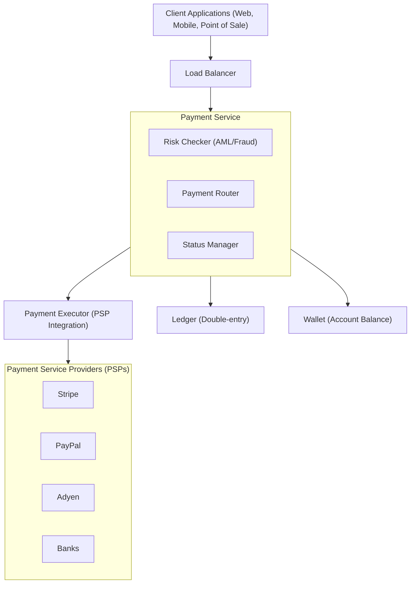

### Core Components

| Component | Responsibility |
|-----------|----------------|
| **Payment Service** | Accepts payment events, coordinates flow, performs risk checks |
| **Payment Executor** | Executes payment orders via PSPs |
| **PSP (Payment Service Provider)** | External service that moves money between accounts |
| **Ledger** | Financial transaction records using double-entry bookkeeping |
| **Wallet** | Tracks merchant account balances |
| **Risk Checker** | AML/CFT compliance and fraud detection |

---

## API Design

### Create Payment

```
POST /v1/payments
Content-Type: application/json
Idempotency-Key: unique-order-id-12345

Request:
{
    "buyer_info": {
        "id": "buyer_123",
        "email": "buyer@example.com"
    },
    "checkout_id": "checkout_abc",
    "credit_card_info": {
        "token": "psp_card_token_xyz"  // tokenized, never raw card data
    },
    "payment_orders": [
        {
            "seller_account": "seller_456",
            "amount": "99.99",
            "currency": "USD",
            "payment_order_id": "order_789"
        }
    ]
}

Response:
{
    "payment_id": "pay_abc123",
    "status": "PENDING",
    "created_at": "2024-01-15T10:30:00Z",
    "payment_orders": [
        {
            "payment_order_id": "order_789",
            "status": "PENDING",
            "amount": "99.99",
            "currency": "USD"
        }
    ]
}
```

### Get Payment Status

```
GET /v1/payments/{payment_id}

Response:
{
    "payment_id": "pay_abc123",
    "status": "COMPLETED",
    "payment_orders": [...],
    "executed_at": "2024-01-15T10:30:05Z"
}
```

### Key Design Decisions

| Decision | Rationale |
|----------|-----------|
| **String for amounts** | Avoid floating-point precision issues (e.g., "19.99" not 19.99) |
| **Idempotency key in header** | Prevent duplicate payments on retry |
| **Tokenized card data** | PSP handles raw card data, we only store tokens |

---

## Database Design

### Payment Event Table

```sql
CREATE TABLE payment_events (
    id BIGINT PRIMARY KEY AUTO_INCREMENT,
    payment_id VARCHAR(50) UNIQUE NOT NULL,
    buyer_id VARCHAR(50) NOT NULL,
    checkout_id VARCHAR(50) NOT NULL,
    amount DECIMAL(19, 4) NOT NULL,
    currency VARCHAR(3) NOT NULL,
    status ENUM('PENDING', 'PROCESSING', 'COMPLETED', 'FAILED', 'REFUNDED'),
    idempotency_key VARCHAR(100) UNIQUE NOT NULL,
    created_at TIMESTAMP DEFAULT CURRENT_TIMESTAMP,
    updated_at TIMESTAMP DEFAULT CURRENT_TIMESTAMP ON UPDATE CURRENT_TIMESTAMP,

    INDEX idx_buyer_id (buyer_id),
    INDEX idx_checkout_id (checkout_id),
    INDEX idx_status (status),
    INDEX idx_created_at (created_at)
);
```

### Payment Order Table

```sql
CREATE TABLE payment_orders (
    id BIGINT PRIMARY KEY AUTO_INCREMENT,
    payment_order_id VARCHAR(50) UNIQUE NOT NULL,
    payment_event_id BIGINT NOT NULL,
    seller_account VARCHAR(50) NOT NULL,
    amount DECIMAL(19, 4) NOT NULL,
    currency VARCHAR(3) NOT NULL,
    status ENUM('PENDING', 'EXECUTING', 'SUCCESS', 'FAILED'),
    psp_reference VARCHAR(100),
    failure_reason TEXT,
    created_at TIMESTAMP DEFAULT CURRENT_TIMESTAMP,
    updated_at TIMESTAMP DEFAULT CURRENT_TIMESTAMP ON UPDATE CURRENT_TIMESTAMP,

    FOREIGN KEY (payment_event_id) REFERENCES payment_events(id),
    INDEX idx_seller_account (seller_account),
    INDEX idx_psp_reference (psp_reference)
);
```

### Ledger Table (Double-Entry Bookkeeping)

```sql
CREATE TABLE ledger_entries (
    id BIGINT PRIMARY KEY AUTO_INCREMENT,
    payment_order_id VARCHAR(50) NOT NULL,
    account_id VARCHAR(50) NOT NULL,
    entry_type ENUM('DEBIT', 'CREDIT') NOT NULL,
    amount DECIMAL(19, 4) NOT NULL,
    currency VARCHAR(3) NOT NULL,
    balance_after DECIMAL(19, 4) NOT NULL,
    created_at TIMESTAMP DEFAULT CURRENT_TIMESTAMP,

    INDEX idx_payment_order (payment_order_id),
    INDEX idx_account (account_id),
    INDEX idx_created_at (created_at)
);
```

### Wallet Table

```sql
CREATE TABLE wallets (
    id BIGINT PRIMARY KEY AUTO_INCREMENT,
    account_id VARCHAR(50) UNIQUE NOT NULL,
    account_type ENUM('BUYER', 'SELLER', 'PLATFORM'),
    balance DECIMAL(19, 4) NOT NULL DEFAULT 0,
    currency VARCHAR(3) NOT NULL,
    version INT NOT NULL DEFAULT 1,  -- optimistic locking
    updated_at TIMESTAMP DEFAULT CURRENT_TIMESTAMP ON UPDATE CURRENT_TIMESTAMP,

    INDEX idx_account_id (account_id)
);
```

### Double-Entry Bookkeeping Principle

**"Every transaction records both a debit and credit of equal amounts. The sum of all transaction entries must be 0."**

```
Transaction: Buyer pays $100 for product

┌─────────────────┬─────────────────┬─────────────────┐
│     Account     │      Debit      │     Credit      │
├─────────────────┼─────────────────┼─────────────────┤
│  Buyer Wallet   │     $100        │                 │
│  Seller Wallet  │                 │      $100       │
├─────────────────┼─────────────────┼─────────────────┤
│     Total       │     $100        │      $100       │
└─────────────────┴─────────────────┴─────────────────┘

Net = Debits - Credits = $100 - $100 = $0 ✓
```

---

## Payment Flow

### Pay-in Flow (Customer to Merchant)

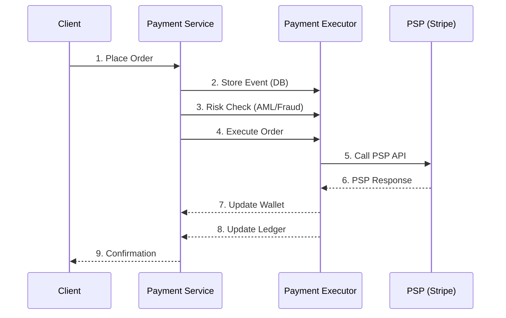

### Detailed Steps

1. **User clicks "Place Order"** - Payment event sent to Payment Service
2. **Store payment event** - Persist to database immediately
3. **Risk check** - Verify AML/CFT compliance, fraud detection
4. **Route to Payment Executor** - For each payment order in the event
5. **Execute via PSP** - Call external payment provider API
6. **Receive PSP response** - Success, failure, or pending
7. **Update wallet** - Adjust seller balance on success
8. **Record in ledger** - Create double-entry bookkeeping records
9. **Return confirmation** - Notify client of payment status

---

## PSP Integration

### Why Use a PSP?

| Direct Bank Connection | Using PSP |
|------------------------|-----------|
| Complex bank protocols | Simple REST APIs |
| Per-country integrations | Global coverage |
| Full PCI DSS compliance | Reduced compliance scope |
| Months of development | Days of integration |

### Hosted Payment Page Flow

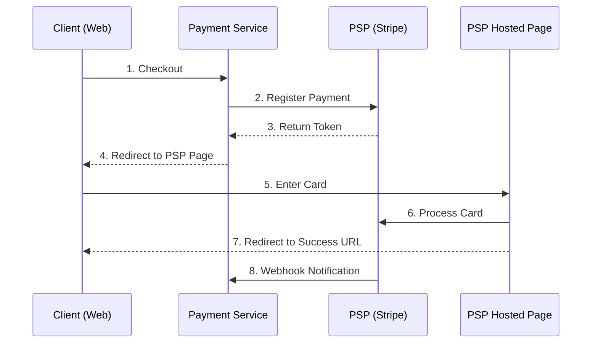

### Benefits of Hosted Page

- **Card data never touches your servers** - Reduced PCI DSS scope
- **PSP handles 3D Secure** - Built-in fraud prevention
- **Consistent UX** - Trusted payment form
- **Automatic compliance** - PSP maintains security certifications

---

## Deep Dive

> **Interview context**: "Let's dive into some critical challenges in payment systems..."

### Idempotency

> **Interviewer might ask**: "How do you prevent duplicate charges when a network request times out?"

**The Problem**: Network failures can cause duplicate payment requests.

```
Client ──► Payment Service ──► PSP
              │
              │ Timeout (but PSP processed it!)
              │
Client ──► Retry ──► Duplicate charge!
```

**Solution**: Idempotency key in HTTP header

```
POST /v1/payments
Idempotency-Key: order_123_attempt_1

First request:  Process payment, store result with key
Second request: Return cached result (no reprocessing)
```

**How it works**:
1. Client sends request with unique idempotency key
2. Server checks if key exists in database
3. If exists → return cached result (no processing)
4. If new → process payment, store result with key

### Database Constraint

```sql
CREATE UNIQUE INDEX idx_idempotency ON payment_events(idempotency_key);
```

### Exactly-Once Delivery

> **Interviewer might ask**: "Can you guarantee exactly-once payment processing?"

**The answer**: True exactly-once is impossible in distributed systems. Instead, we achieve **effectively exactly-once** through:

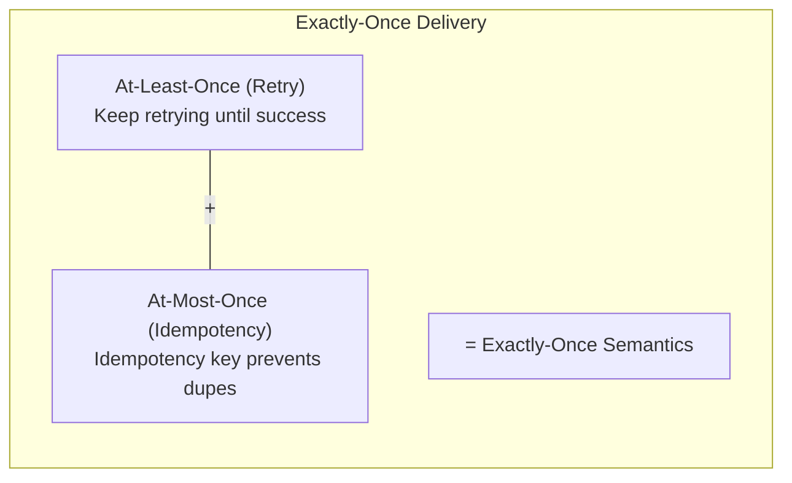

### Communication Patterns

> **Interviewer might ask**: "Should the payment service call the PSP synchronously or asynchronously?"

**The trade-off**:

| Aspect | Synchronous | Asynchronous |
|--------|-------------|--------------|
| **Latency** | Immediate response | Eventual confirmation |
| **Coupling** | Tight (depends on PSP) | Loose (queue buffers) |
| **Failure handling** | Harder (timeout = unknown) | Easier (retry from queue) |
| **Complexity** | Simple | More complex |

**Recommendation**:
- **< 100 TPS**: Synchronous is fine
- **> 1000 TPS**: Asynchronous with message queue
- **Need real-time confirmation**: Synchronous + webhook fallback

---

## Handling Failures

> **Interview context**: "Payment failures are inevitable. How you handle them determines system reliability."

### Types of Failures

| Failure Type | Example | Retry? |
|--------------|---------|--------|
| **Transient** | Network timeout, 503 | Yes |
| **Permanent** | Invalid card, insufficient funds | No |
| **Unknown** | No response, 500 | Yes (with caution) |

### Retry Strategies

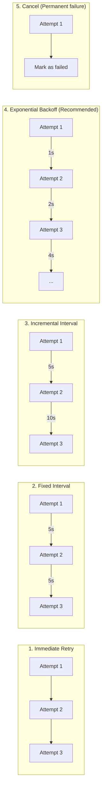

### Queue Architecture

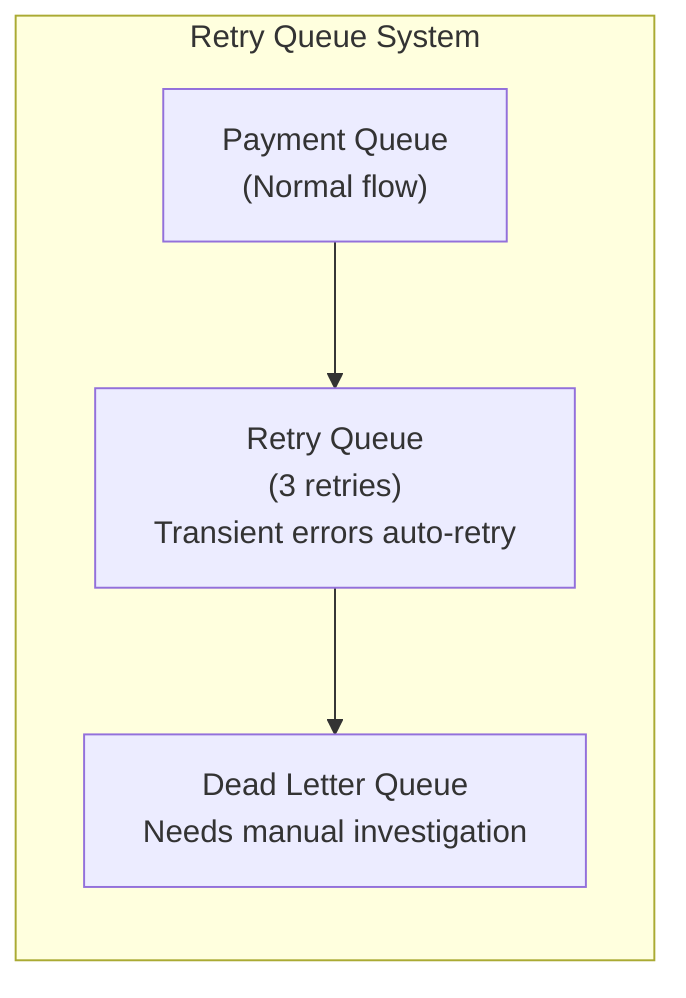

**Key principle**: After max retries, don't silently fail. Move to dead letter queue for manual investigation.

---

## Reconciliation

> **Interview context**: This is often overlooked but is critical for production systems.

### Why Reconciliation?

> **Interviewer might ask**: "If you have idempotency and retries, why do you still need reconciliation?"

**"The last line of defense"** - Even with idempotency and retry logic, discrepancies can occur:

- PSP processed but webhook failed
- Internal system recorded but PSP didn't process
- Amount mismatch due to currency conversion
- Timing differences between systems

### Reconciliation Process

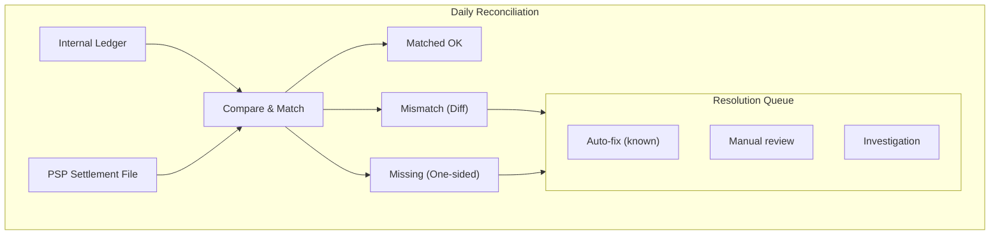

### Mismatch Categories

| Category | Example | Resolution |
|----------|---------|------------|
| **Timing** | PSP settled next day | Auto-match next cycle |
| **Amount** | Currency conversion diff | Auto-fix if < threshold |
| **Missing internal** | Webhook failed | Auto-create from PSP data |
| **Missing external** | PSP didn't process | Investigate, refund if needed |
| **Status mismatch** | Internal=success, PSP=failed | Manual investigation |

**Key insight**: Reconciliation should be automated with clear escalation paths. Most mismatches (timing, small amounts) can be auto-resolved.

---

## Security Considerations

> **Interview context**: Security is non-negotiable in payment systems.

### PCI DSS Compliance

> **Interviewer might ask**: "How do you handle credit card security?"

**Payment Card Industry Data Security Standard** - Required for handling card data

| SAQ Level | Description | Requirements |
|-----------|-------------|--------------|
| **SAQ A** | Hosted payment page | Minimal (outsourced to PSP) |
| **SAQ A-EP** | iFrame integration | More controls |
| **SAQ D** | Direct card handling | Full compliance (~300 controls) |

**Recommendation**: Use hosted payment page (SAQ A) unless you have specific requirements.

### Security Layers

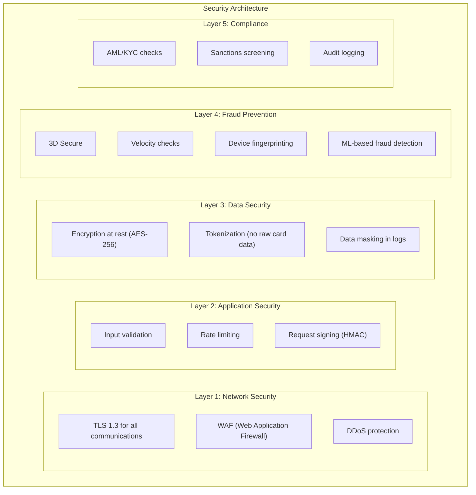

### Rate Limiting

**Purpose**: Prevent card testing attacks (fraudsters testing stolen card numbers)

| Limit Type | Example | Purpose |
|------------|---------|---------|
| Per buyer | 10 payments/hour | Prevent abuse |
| Per card | 5 payments/hour | Prevent card testing |
| Per IP | 20 payments/hour | Prevent bot attacks |

### Fraud Detection Signals

| Signal | Description | Risk Level |
|--------|-------------|------------|
| Velocity | Many transactions in short time | High |
| Geolocation | IP location vs billing address | Medium |
| Device | New device, browser fingerprint | Medium |
| Amount | Unusually large transaction | Medium |
| Time | Odd hours (3 AM local time) | Low |
| Behavior | Cart abandonment pattern | Low |

---

## Data Consistency

### Challenges

- Multiple databases (payment, ledger, wallet)
- External PSP state
- Network partitions

### Approaches

**Option 1: Single Primary Database**

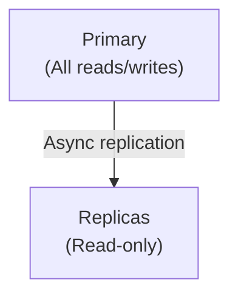

- **Pros**: Strong consistency, simple
- **Cons**: Limited scalability

**Option 2: Distributed Database (Recommended for scale)**

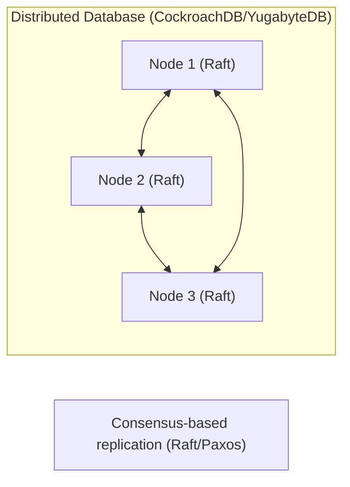

- **Pros**: Horizontal scale, strong consistency
- **Cons**: Complexity, latency overhead

### Handling PSP Sync

**The safe pattern**:

1. **Before PSP call**: Create record with status=PENDING
2. **Call PSP**: Make the external call
3. **On success**: Update status, ledger, wallet
4. **On failure**: Mark status appropriately
5. **On unknown** (timeout): Mark as UNKNOWN, add to reconciliation queue

**Key principle**: Never lose track of a payment. If you don't know the state, mark it for reconciliation.

---

## Key Takeaways

### 1. Correctness Over Performance

Payment systems prioritize **correctness** over throughput. Even at 10 TPS, reliability is paramount.

### 2. Double-Entry Bookkeeping

Every transaction must have balanced debits and credits. This ensures:
- Audit trail
- Error detection
- Regulatory compliance

### 3. Idempotency is Critical

Use idempotency keys to prevent duplicate charges:
- Store with unique constraint
- Return cached result on duplicate request

### 4. PSP Integration Strategy

Use hosted payment pages when possible:
- Reduced PCI scope
- Built-in security features
- Faster time to market

### 5. Defense in Depth

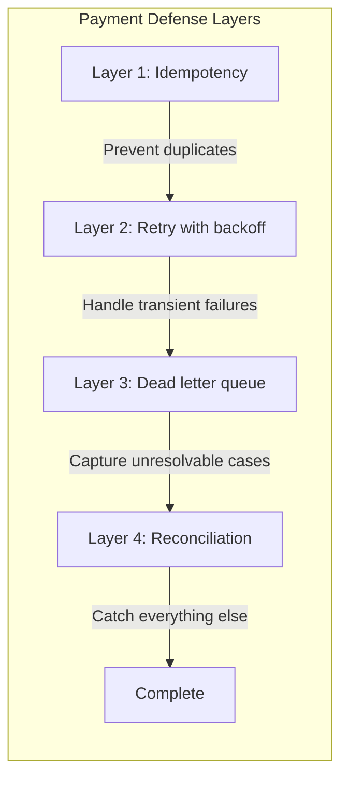

### 6. Production Checklist

- [ ] Idempotency key handling
- [ ] Retry with exponential backoff
- [ ] Dead letter queue for failures
- [ ] Daily reconciliation process
- [ ] Double-entry ledger
- [ ] Rate limiting
- [ ] Fraud detection
- [ ] PCI compliance (use hosted page)
- [ ] AML/KYC checks
- [ ] Comprehensive logging and monitoring

### Trade-offs Summary

| Decision | Option A | Option B |
|----------|----------|----------|
| Communication | Sync (simple) | Async (scalable) |
| Card handling | Direct (control) | Hosted page (compliant) |
| Database | Single (consistent) | Distributed (scalable) |
| Retry | Immediate (fast) | Backoff (reliable) |
| Reconciliation | Real-time (expensive) | Batch (efficient) |

---

## Interview Tips

### How to Approach (45 minutes)

```
1. CLARIFY (3-5 min)
   "Pay-in, pay-out, or both? What payment methods? What's the scale?"

2. HIGH-LEVEL DESIGN (5-7 min)
   Draw: Client → Payment Service → PSP + Ledger + Wallet

3. DEEP DIVE (25-30 min)
   - Idempotency (THE key concept)
   - PSP integration (hosted page vs direct)
   - Double-entry bookkeeping
   - Failure handling + retry
   - Reconciliation

4. WRAP UP (5 min)
   - Security (PCI DSS, fraud detection)
   - Monitoring and alerting
```

### Key Phrases That Show Depth

| Instead of... | Say... |
|---------------|--------|
| "Use unique IDs" | "Idempotency keys in the request header ensure we never double-charge, even with network retries. We store the result and return it on duplicate requests." |
| "Call Stripe API" | "We use a hosted payment page so card data never touches our servers. This reduces PCI scope from SAQ D (~300 controls) to SAQ A (minimal)." |
| "Store transactions" | "We use double-entry bookkeeping where every transaction has matching debit and credit entries. If they don't balance to zero, we've found an error." |
| "Retry on failure" | "We classify failures: permanent (invalid card) → no retry, transient (timeout) → exponential backoff, unknown → reconciliation queue." |

### Common Follow-up Questions

| Question | Key Points |
|----------|------------|
| "How prevent duplicate charges?" | Idempotency key + database unique constraint |
| "Why double-entry?" | Audit trail, error detection, regulatory compliance |
| "Sync vs async?" | Low volume = sync, high volume = async with queue |
| "How handle timeouts?" | Mark as UNKNOWN, add to reconciliation queue |
| "Why use PSP?" | Reduced PCI scope, global coverage, faster integration |
| "How ensure consistency?" | PENDING before PSP call, update after, reconcile daily |

---

## References

- [Designing a Payment System - Pragmatic Engineer](https://newsletter.pragmaticengineer.com/p/designing-a-payment-system)
- System Design Interview Volume 2 - Alex Xu
- PCI DSS Documentation
- Stripe/PayPal API Documentation
