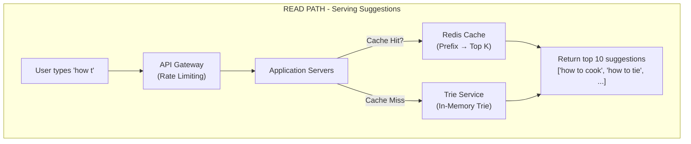
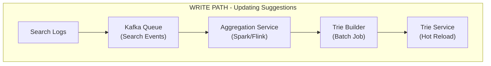
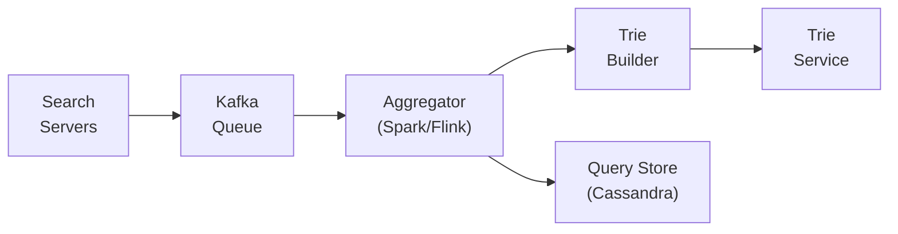
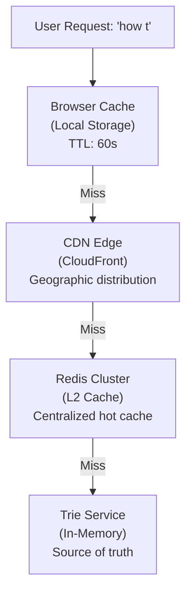
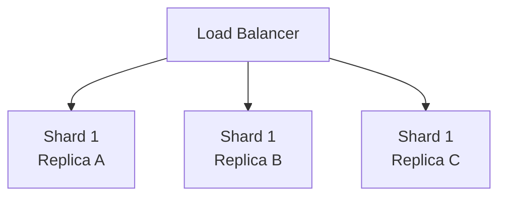

# Design Search Autocomplete System

A search autocomplete system (also called typeahead or search suggestions) predicts and displays query completions as users type. The challenge is providing **relevant suggestions with sub-100ms latency** while handling billions of queries and continuously updating based on search trends.

> **Interview context**: This is a popular system design question that tests your understanding of data structures (tries), caching strategies, and real-time data processing. Focus on the latency requirements and the trade-off between freshness and performance.

---

## Table of Contents

1. [Requirements](#1-requirements)
2. [High-Level Architecture](#2-high-level-architecture)
3. [Core Components](#3-core-components)
4. [Data Structures](#4-data-structures)
5. [Ranking Algorithm](#5-ranking-algorithm)
6. [Data Collection Pipeline](#6-data-collection-pipeline)
7. [Caching Strategy](#7-caching-strategy)
8. [Scalability](#8-scalability)
9. [Reliability](#9-reliability)
10. [Interview Tips](#10-interview-tips)
11. [Key Takeaways](#11-key-takeaways)

---

## 1. Requirements

> **Interview context**: Always start by clarifying requirements. Autocomplete systems can vary significantly—Google's is different from an e-commerce search.

### Questions to Ask the Interviewer

- What's the expected query volume? (QPS)
- How many suggestions should we return? (typically 5-10)
- Should suggestions be personalized?
- How fresh do suggestions need to be? (real-time trending vs daily updates)
- Do we need to handle multiple languages?
- Should we support spell correction?

### Functional Requirements

| Requirement | Description |
|-------------|-------------|
| **Prefix matching** | Return suggestions matching the typed prefix |
| **Top-K results** | Return K most relevant suggestions (typically 5-10) |
| **Ranking** | Order by relevance (popularity, recency, personalization) |
| **Fast updates** | Incorporate trending queries within reasonable time |

### Non-Functional Requirements

| Requirement | Target | Rationale |
|-------------|--------|-----------|
| **Latency** | p99 < 100ms | Users expect instant feedback |
| **Availability** | 99.99% | Core search experience |
| **Throughput** | 100K QPS | Peak load during high traffic |
| **Freshness** | < 1 hour | Trending topics should appear quickly |

### Out of Scope (Clarify with Interviewer)

- Spell correction / fuzzy matching
- Personalized suggestions
- Multi-language support
- Query understanding / intent classification

### Capacity Estimation

```
Assumptions:
- 1 billion searches per day
- Average query length: 20 characters
- User types ~4 characters before selecting suggestion
- Each keystroke triggers autocomplete request

Calculations:
- Searches/day:       1 billion
- Keystrokes/search:  ~4 (before selection)
- Autocomplete QPS:   (1B × 4) / 86400 ≈ 46K QPS
- Peak QPS:           ~100K (2x average)

Storage:
- Unique queries:     ~100 million
- Avg query length:   20 bytes
- Metadata per query: 50 bytes (count, timestamp, etc.)
- Raw storage:        100M × 70 bytes ≈ 7 GB
- With trie overhead: ~15-20 GB
```

---

## 2. High-Level Architecture

> **Interview context**: "Let me draw the high-level architecture. There are two main flows: serving suggestions (read path) and updating the suggestion data (write path)."

### Read Path (Serving Suggestions)



### Write Path (Updating Suggestions)



### Component Responsibilities

| Component | Responsibility | Technology |
|-----------|---------------|------------|
| **API Gateway** | Rate limiting, routing | Nginx / AWS ALB |
| **Application Servers** | Request handling, cache lookup | Go / Java |
| **Redis Cache** | Cache popular prefixes | Redis Cluster |
| **Trie Service** | In-memory trie for prefix lookup | Custom service |
| **Kafka** | Buffer search events | Kafka |
| **Aggregation Service** | Count query frequencies | Spark / Flink |
| **Trie Builder** | Build optimized trie from aggregated data | Batch job |

---

## 3. Core Components

### 3.1 Trie Service

> **Interview context**: "The core data structure for autocomplete is a trie. Let me explain why and how we use it."

#### The Challenge

We need to find all strings matching a prefix and return the top K by some ranking criteria. With 100 million unique queries:

- **Hash table**: O(n) to scan all keys—too slow
- **Sorted array + binary search**: O(log n) to find prefix, but O(m) to collect all matches
- **Trie**: O(p) to traverse prefix, then collect top K from subtree

#### Why Trie?

| Approach | Find Prefix | Get Top K | Total |
|----------|-------------|-----------|-------|
| Hash table scan | O(n) | O(n log k) | O(n) |
| Binary search | O(log n) | O(m) | O(m) where m = matches |
| **Trie** | O(p) | O(1)* | **O(p)** |

*O(1) if we cache top K at each node

#### Trie Structure (Conceptual)

```
Root
 ├─ h
 │  └─ o
 │     └─ w
 │        ├─ [top_k: "how to cook", "how to tie a tie", ...]
 │        │
 │        └─ (space)
 │           └─ t
 │              └─ o
 │                 └─ [top_k: "how to cook", "how to tie", ...]
 │
 └─ w
    └─ h
       └─ a
          └─ t
             └─ [top_k: "what is love", "what time is it", ...]
```

#### Key Optimization: Cache Top-K at Each Node

Instead of traversing the entire subtree to find top K suggestions, **precompute and store top K at each trie node**.

```
Node structure:
┌─────────────────────────────────────┐
│  character: 'o'                     │
│  children:  {w: Node, n: Node, ...} │
│  top_k: ["how to cook",             │  ← Precomputed!
│          "how to tie a tie",        │
│          "hotel california", ...]   │
└─────────────────────────────────────┘
```

**Trade-off**: More memory for O(1) top-K retrieval.

> **Interviewer might ask**: "How much extra memory does caching top-K add?"
>
> If we store 10 suggestions per node and have ~500M nodes (characters across all queries), that's 500M × 10 × 8 bytes (pointers) ≈ 40 GB additional. We can optimize by storing only query IDs (4 bytes each) instead of full strings.

#### Why Not Just Use Elasticsearch?

Elasticsearch is great for full-text search but:
- Higher latency (network + disk I/O)
- Overkill for prefix matching
- Harder to customize ranking

For autocomplete specifically, an in-memory trie is simpler and faster.

---

### 3.2 Caching Layer

> **Interview context**: "Given our latency requirements, caching is critical. Let me explain our caching strategy."

#### The Challenge

Even with an optimized trie, we want to avoid computation for popular prefixes. "how t" might be typed millions of times per day.

#### Cache Design

```
Redis Key:    "autocomplete:how t"
Redis Value:  ["how to cook", "how to tie", "how to lose weight", ...]
TTL:          1 hour (balance freshness vs hit rate)
```

#### Cache Hit Rate Analysis

```
Prefix Length    Example       Unique Prefixes    Cache Hit Rate
─────────────────────────────────────────────────────────────────
1 character      "h"           26                 ~99%
2 characters     "ho"          676                ~95%
3 characters     "how"         17,576             ~80%
4 characters     "how "        ~50,000            ~60%
5+ characters    "how t"       ~200,000           ~40%
```

**Insight**: Short prefixes have high hit rates; long prefixes are less cacheable but also less common.

> **Interviewer might ask**: "What's your cache eviction strategy?"
>
> LRU with TTL. Popular prefixes stay hot; stale entries expire. We also invalidate cache entries when the underlying trie is updated.

---

### 3.3 Data Collection Pipeline

> **Interview context**: "Now let's discuss how we keep suggestions fresh with new search data."

#### The Challenge

Search trends change constantly. "Super Bowl" spikes during game day. We need to:
1. Collect search queries at scale
2. Aggregate and count frequencies
3. Update the trie without downtime

#### Pipeline Architecture



#### Aggregation Windows

| Window | Purpose | Update Frequency |
|--------|---------|------------------|
| **Real-time** (5 min) | Trending topics | Every 5 minutes |
| **Hourly** | Recent trends | Every hour |
| **Daily** | Stable rankings | Once per day |
| **All-time** | Historical baseline | Weekly rebuild |

#### Combining Scores

```
final_score = (0.3 × all_time_score) +
              (0.3 × daily_score) +
              (0.3 × hourly_score) +
              (0.1 × real_time_score)
```

This balances stability with responsiveness to trends.

> **Interviewer might ask**: "How do you handle spam or inappropriate suggestions?"
>
> Multiple layers: (1) Blocklist of prohibited terms, (2) Minimum frequency threshold to appear, (3) Human review of new high-volume suggestions, (4) User reporting mechanism.

---

## 4. Data Structures

> **Interview context**: "Let me go deeper into the trie data structure and optimizations."

### Basic Trie vs Optimized Trie

| Aspect | Basic Trie | Optimized Trie |
|--------|------------|----------------|
| **Node storage** | Map<char, Node> | Array[26] or compressed |
| **Top-K storage** | None (compute on query) | Cached at each node |
| **Path compression** | No | Yes (merge single-child paths) |
| **Memory** | ~100 GB | ~20-30 GB |

### Path Compression (Radix Tree)

```
Before compression:          After compression:
      h                            h
      │                            │
      o                           "ow t" (compressed)
      │                            │
      w                           [children...]
      │
    (space)
      │
      t
```

**Benefit**: Fewer nodes, less memory, faster traversal for long common prefixes.

### Memory Layout Optimization

For production systems, consider:

1. **Memory-mapped files**: Allow OS to manage memory, enable fast restarts
2. **Succinct tries**: Compress trie structure to bits, trade CPU for memory
3. **Sharding by prefix**: Distribute trie across machines

---

## 5. Ranking Algorithm

> **Interview context**: "Ranking determines which suggestions appear. Let me explain the factors we consider."

### Ranking Factors

| Factor | Weight | Description |
|--------|--------|-------------|
| **Query frequency** | 40% | How often this query is searched |
| **Recency** | 25% | Recent queries weighted higher |
| **Query length** | 15% | Shorter queries often more relevant |
| **Personalization** | 10% | User's search history (if enabled) |
| **Freshness** | 10% | Boost for trending topics |

### Score Calculation

```
score = (frequency_score × 0.4) +
        (recency_score × 0.25) +
        (length_penalty × 0.15) +
        (personalization_score × 0.1) +
        (freshness_boost × 0.1)

where:
  frequency_score = log(query_count) / log(max_count)
  recency_score = decay_factor ^ days_since_last_search
  length_penalty = 1 / (1 + 0.1 × query_length)
  freshness_boost = trending_velocity / max_velocity
```

### Handling Ties

When scores are equal, secondary sort by:
1. Alphabetical order (deterministic)
2. Query length (shorter first)

> **Interviewer might ask**: "How do you prevent gaming/manipulation of rankings?"
>
> (1) Rate limit per user/IP, (2) Anomaly detection for sudden spikes, (3) Minimum unique user threshold, (4) Manual review for suspicious patterns.

---

## 6. Data Collection Pipeline

### Filtering and Cleaning

Before adding to the trie, queries go through:

```
Raw Query → Lowercase → Trim → Remove Special Chars → Blocklist Check → Dedup
```

| Step | Example |
|------|---------|
| Raw | "  How To COOK!!! " |
| Lowercase | "  how to cook!!! " |
| Trim | "how to cook!!!" |
| Remove special | "how to cook" |
| Blocklist | Pass ✓ |
| Dedup | Increment count |

### Minimum Thresholds

| Threshold | Value | Purpose |
|-----------|-------|---------|
| Minimum searches | 100 | Avoid rare/spam queries |
| Minimum unique users | 10 | Avoid single-user gaming |
| Maximum query length | 100 chars | Avoid abuse |

---

## 7. Caching Strategy

> **Interview context**: "Let me detail our multi-level caching approach."

### Cache Hierarchy



### Cache Configuration

| Layer | TTL | Size | Hit Rate |
|-------|-----|------|----------|
| Browser | 60s | 100 entries | ~30% |
| CDN | 5 min | Unlimited | ~40% |
| Redis | 1 hour | 10 GB | ~80% |
| Trie | N/A | 20 GB | 100% |

### Cache Warming

On new trie deployment:
1. Pre-populate Redis with top 10K prefixes
2. Gradual traffic shift to new trie servers
3. Monitor cache miss rate during transition

---

## 8. Scalability

> **Interview context**: "Let me discuss how this system scales to handle 100K+ QPS."

### Trie Sharding Strategies

#### Option 1: Prefix-Based Sharding

```
Shard 1: prefixes a-f     ["apple", "best", "cat", ...]
Shard 2: prefixes g-m     ["google", "how", "is", ...]
Shard 3: prefixes n-s     ["new", "python", "search", ...]
Shard 4: prefixes t-z     ["the", "what", "youtube", ...]
```

**Pros**: Simple routing, no scatter-gather
**Cons**: Uneven distribution ("h" much more common than "x")

#### Option 2: Consistent Hashing

```
hash(prefix) → Shard N
```

**Pros**: Even distribution
**Cons**: May need to query multiple shards for ranking

#### Recommendation

Start with **prefix-based sharding with weighted distribution**:
- Popular prefixes (a-h) get more shards
- Rare prefixes (x-z) share shards

### Replication



Each shard has 3 replicas for:
- **Availability**: Survive node failures
- **Read throughput**: Distribute read load

### Capacity Planning

```
Current:     100K QPS
Per server:  10K QPS (with caching)
Servers:     100K / 10K = 10 servers minimum
With 3x replication: 30 servers
With 2x headroom:    60 servers total
```

---

## 9. Reliability

> **Interview context**: "For reliability, let's discuss failure scenarios and how we handle them."

### Failure Scenarios

| Scenario | Impact | Mitigation |
|----------|--------|------------|
| **Trie server crash** | Partial capacity loss | Replicas + auto-failover |
| **Redis failure** | Increased trie load | Multiple Redis replicas, degrade gracefully |
| **Kafka lag** | Stale suggestions | Acceptable for hours, alert on long lag |
| **Trie build failure** | No updates | Keep serving old trie, alert on failure |
| **Network partition** | Regional unavailability | Multi-region deployment |

### Graceful Degradation

```
1. Redis fails     → Fall back to trie (higher latency)
2. Trie fails      → Return cached results only
3. All fails       → Return empty suggestions (don't block search)
```

**Key principle**: Autocomplete is an enhancement, not critical path. Never block the main search.

### Monitoring and Alerts

| Metric | Threshold | Action |
|--------|-----------|--------|
| p99 latency | > 100ms | Page on-call |
| Cache hit rate | < 60% | Investigate cache config |
| Trie update lag | > 2 hours | Check pipeline |
| Error rate | > 0.1% | Page on-call |

---

## 10. Interview Tips

### Approach (45 minutes)

```
0-5 min:   CLARIFY REQUIREMENTS
           - What's the scale? (QPS, unique queries)
           - How many suggestions to return?
           - How fresh do suggestions need to be?
           - Personalized or global?

5-10 min:  CAPACITY ESTIMATION
           - Calculate QPS from search volume
           - Estimate storage for trie
           - Identify memory constraints

10-20 min: HIGH-LEVEL DESIGN
           - Draw read path (user → cache → trie → response)
           - Draw write path (logs → aggregation → trie update)
           - Explain key components

20-35 min: DEEP DIVE
           - Trie structure and optimizations
           - Caching strategy (multi-level)
           - Ranking algorithm
           - Data freshness pipeline

35-40 min: SCALABILITY & RELIABILITY
           - Sharding strategy
           - Replication for availability
           - Failure scenarios

40-45 min: WRAP UP
           - Summarize key decisions
           - Discuss trade-offs made
           - Future improvements (personalization, ML ranking)
```

### Key Phrases That Show Depth

| Instead of... | Say... |
|---------------|--------|
| "Use a trie" | "A trie with precomputed top-K at each node gives us O(p) lookup where p is prefix length" |
| "Add caching" | "Multi-level caching: browser for instant repeat queries, CDN for geographic distribution, Redis for hot prefixes" |
| "Update periodically" | "Combine real-time (5-min), hourly, and daily aggregations with weighted scoring to balance freshness and stability" |
| "Scale horizontally" | "Shard by prefix with weighted distribution—popular prefixes like 'how' get more shards than rare ones like 'xyz'" |

### Common Follow-up Questions

| Question | Key Points |
|----------|------------|
| "Why trie over other data structures?" | O(p) lookup vs O(n) scan; natural prefix matching; can cache top-K at nodes |
| "How do you handle trending topics?" | Real-time aggregation window (5-min), freshness boost in ranking, quick cache invalidation |
| "What about personalization?" | User history as ranking signal, but increases complexity significantly—clarify if needed |
| "How do you prevent abuse?" | Rate limiting, minimum frequency thresholds, blocklists, anomaly detection |
| "What if trie doesn't fit in memory?" | Shard across machines, use path compression, consider memory-mapped files |

### Trade-offs to Discuss

| Trade-off | Option A | Option B |
|-----------|----------|----------|
| **Freshness vs Latency** | Real-time updates (complex, higher latency) | Batch updates (simpler, stale data) |
| **Memory vs CPU** | Cache top-K at nodes (more memory) | Compute on query (more CPU) |
| **Accuracy vs Speed** | Full re-ranking per request (accurate) | Pre-ranked (fast, less fresh) |
| **Simplicity vs Features** | Global suggestions (simple) | Personalized (complex, better UX) |

---

## 11. Key Takeaways

### Core Concepts

1. **Trie with cached top-K**: The fundamental data structure—O(p) lookup with precomputed results
2. **Multi-level caching**: Browser → CDN → Redis → Trie to minimize latency
3. **Offline aggregation**: Batch processing for stable rankings, real-time for trends
4. **Graceful degradation**: Autocomplete should never block the main search flow

### Design Decisions Summary

| Decision | Choice | Alternative | Rationale |
|----------|--------|-------------|-----------|
| **Data structure** | Trie | Elasticsearch | Lower latency, simpler for prefix match |
| **Top-K storage** | Cached at nodes | Compute on query | O(1) vs O(n) retrieval |
| **Updates** | Batch + real-time | Pure real-time | Balance freshness and stability |
| **Sharding** | Prefix-based | Hash-based | Avoid scatter-gather, simpler routing |
| **Cache** | Redis + CDN | Single layer | Multi-level for different access patterns |

### Red Flags to Avoid

- Don't suggest Elasticsearch as the primary solution (too slow for autocomplete)
- Don't forget about the write path (how suggestions get updated)
- Don't ignore abuse prevention (spam, inappropriate content)
- Don't overlook graceful degradation (autocomplete shouldn't break search)

---

## References

- [How We Built Prefixy - A Scalable Prefix Search Service](https://medium.com/@prefixyio)
- [The Anatomy of a Large-Scale Hypertextual Web Search Engine (Google)](http://infolab.stanford.edu/~backrub/google.html)
- [Trie Data Structure (Wikipedia)](https://en.wikipedia.org/wiki/Trie)
- [System Design: Typeahead Suggestion](https://systemdesign.one/typeahead-autocomplete-system-design/)
