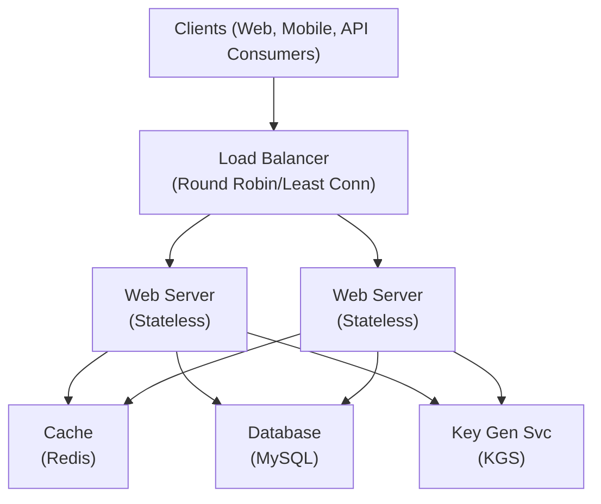
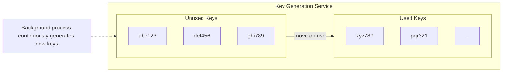
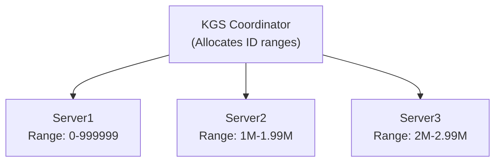
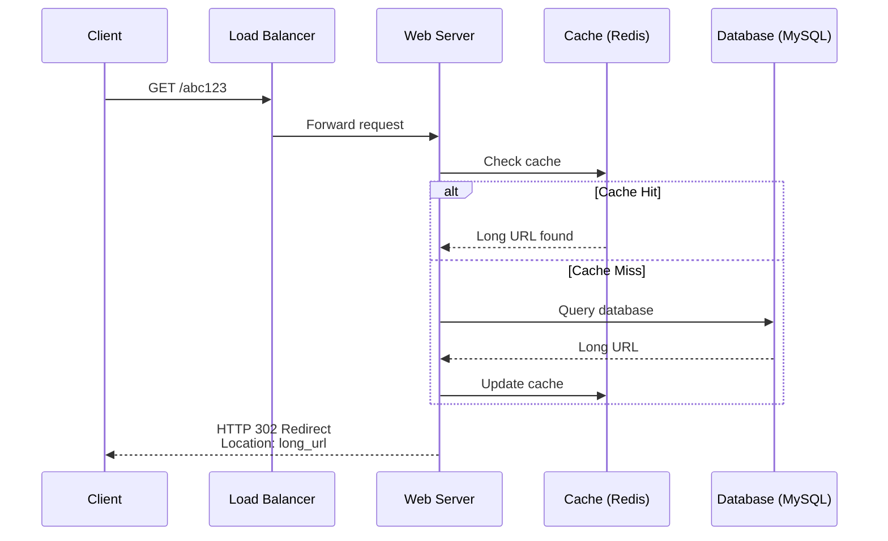
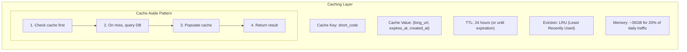
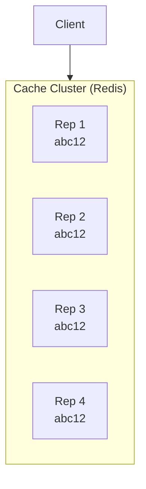
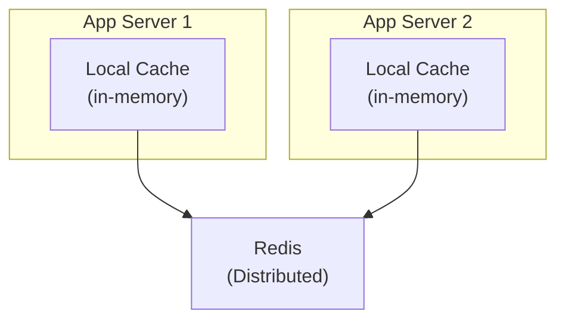
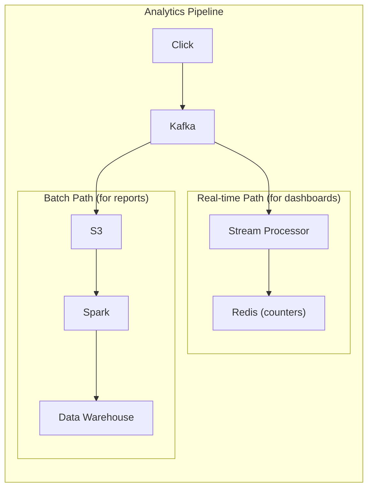
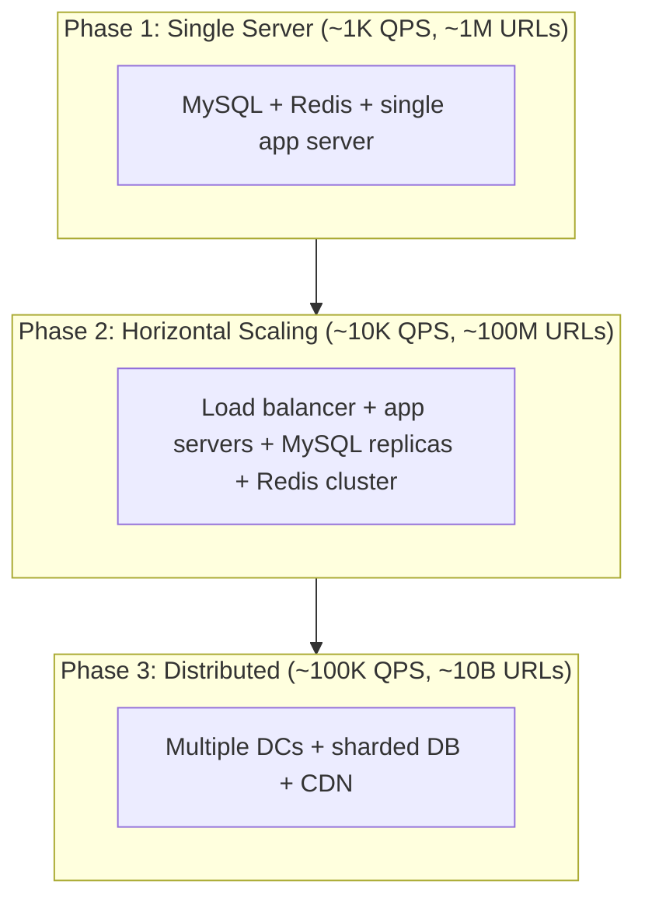

# Design a URL Shortener

A URL shortener service converts long URLs into short, memorable links that redirect to the original URL. Examples include TinyURL, bit.ly, and t.co.

---

## Table of Contents

1. [Requirements](#requirements)
2. [Back of the Envelope Estimation](#back-of-the-envelope-estimation)
3. [System APIs](#system-apis)
4. [High-Level Design](#high-level-design)
5. [Short URL Generation](#short-url-generation)
6. [Database Design](#database-design)
7. [URL Redirection Flow](#url-redirection-flow)
8. [Deep Dive](#deep-dive)
9. [Real-World Systems](#real-world-systems)
10. [Key Takeaways](#key-takeaways)
11. [Interview Tips](#interview-tips)

---

## Requirements

### Functional Requirements

- **URL shortening**: Given a long URL, generate a shorter unique alias
- **URL redirection**: When user accesses short URL, redirect to original URL
- **Custom aliases** (optional): Users can choose custom short URLs
- **Expiration**: URLs can have optional expiration time

### Non-Functional Requirements

| Requirement | Description |
|-------------|-------------|
| **High availability** | Service should be 99.99% available |
| **Low latency** | Redirection should happen in real-time (<100ms) |
| **Scalability** | Handle billions of URLs |
| **Non-predictable** | Short URLs should not be guessable |

### Extended Requirements

- Analytics (click counts, geographic data)
- Rate limiting
- API access for developers

---

## Back of the Envelope Estimation

### Traffic Estimates

Assume 100:1 read-to-write ratio (redirections vs. new URLs):

```
New URLs (write): 100 million/month
                  = ~40 URLs/second

Redirections (read): 10 billion/month
                     = ~4,000 redirections/second
```

### Storage Estimates

Assume each URL mapping is ~500 bytes and we keep data for 5 years:

```
URLs per month: 100 million
URLs in 5 years: 100M × 12 × 5 = 6 billion URLs

Storage needed: 6B × 500 bytes = 3 TB
```

### Bandwidth Estimates

```
Write: 40 URLs/s × 500 bytes = 20 KB/s
Read:  4,000/s × 500 bytes = 2 MB/s
```

### Memory Estimates (Cache)

Following 80-20 rule (20% of URLs generate 80% of traffic):

```
Daily read requests: 4,000/s × 86,400 = ~350 million/day
Cache 20%: 350M × 0.2 × 500 bytes = 35 GB
```

### Summary

| Metric | Value |
|--------|-------|
| New URLs | 40/second |
| Redirections | 4,000/second |
| Storage (5 years) | 3 TB |
| Cache memory | ~35 GB |

---

## System APIs

### REST API

```
POST /api/v1/shorten
Request:
{
    "long_url": "https://example.com/very/long/path?query=params",
    "custom_alias": "my-link",     // optional
    "expiration": "2025-12-31",    // optional
    "api_key": "user_api_key"
}

Response:
{
    "short_url": "https://short.ly/abc123",
    "long_url": "https://example.com/very/long/path?query=params",
    "created_at": "2024-01-15T10:30:00Z",
    "expires_at": "2025-12-31T00:00:00Z"
}
```

```
GET /{short_code}

Response: HTTP 301/302 Redirect to original URL
```

```
DELETE /api/v1/url/{short_code}
Headers: api_key: user_api_key

Response: HTTP 204 No Content
```

### Rate Limiting

Prevent abuse by limiting requests per API key:
- Free tier: 100 URLs/day
- Premium: 10,000 URLs/day

---

## High-Level Design

### Basic Architecture



### Component Overview

| Component | Responsibility |
|-----------|----------------|
| Load Balancer | Distribute traffic across servers |
| Web Servers | Handle API requests (stateless) |
| Cache | Store hot URLs for fast lookup |
| Database | Persistent storage for URL mappings |
| Key Generation Service | Pre-generate unique short codes |

---

## Short URL Generation

> **Interview context**: After establishing the high-level design, the interviewer will ask: "How do you generate the short codes? What approach would you use?"

### The Challenge

We need to convert long URLs into short, unique codes. This seems simple, but consider the constraints:

```
Requirements:
- Must be unique (no collisions)
- Should be short (6-7 characters ideal)
- Ideally not predictable (security)
- Must scale to billions of URLs
- Should be fast to generate
```

**The math**: Using 62 characters [a-zA-Z0-9]:
- 62^6 = ~57 billion combinations
- 62^7 = ~3.5 trillion combinations

With 6 characters, we can support **57 billion** unique URLs - plenty for most use cases.

### Option 1: Hash Function (MD5/SHA256)

The most intuitive approach - hash the URL and take the first N characters:

```
Long URL: https://example.com/long/path
MD5 Hash: 5d41402abc4b2a76b9719d911017c592
Short Code: 5d4140 (first 6 characters)
```

#### Why Not Just Use This?

> **Interviewer might ask**: "This seems simple. What's wrong with hashing?"

**The collision problem**: Different URLs can produce the same 6-character prefix.

```
URL A: example.com/page1 → hash → "abc123..."
URL B: example.com/page2 → hash → "abc123..." (collision!)
```

**Solutions to collisions**:
1. Check database, re-hash with counter until unique
2. Append user ID or timestamp to input

**Trade-off**: Simple to understand, but collision handling adds latency and complexity at scale.

### Option 2: Base62 Encoding of Auto-Increment ID

Convert a unique integer ID to Base62:

```
ID: 125,984,756  →  Base62: "B3k9Zt"

Encoding: 0-9 (digits), a-z (10-35), A-Z (36-61)
```

| Pros | Cons |
|------|------|
| No collisions (unique ID → unique code) | Predictable (sequential IDs visible) |
| Easy to decode for debugging | Single point of failure (ID generator) |
| Simple implementation | Requires distributed ID generation at scale |

#### Why Not Just Use This?

> **Interviewer might ask**: "Why is predictability a problem?"

**Security concern**: If IDs are sequential, attackers can:
- Enumerate all URLs by incrementing
- Estimate your traffic/growth rate
- Potentially access private links by guessing

**When it's acceptable**: Internal tools where security isn't critical.

### Option 3: Key Generation Service (KGS)

Pre-generate random keys and store in a pool:



**How it works:**
1. KGS pre-generates millions of unique random keys offline
2. When shortening, atomically move key from unused → used
3. Background job continuously replenishes the pool

| Pros | Cons |
|------|------|
| No collision handling needed | Single point of failure |
| Fast (no computation at request time) | Key synchronization complexity |
| Non-predictable | Requires careful capacity planning |

> **Interviewer might ask**: "What if the KGS goes down?"

**Mitigation strategies**:
1. **Standby replicas**: Hot standby KGS instances
2. **Key pre-fetching**: App servers cache a batch of keys locally
3. **Fallback**: Temporarily use hash-based generation

### Approach Comparison

| Approach | Collision | Predictable | Complexity | Best For |
|----------|-----------|-------------|------------|----------|
| Hash + Collision Check | Possible | No | Medium | Small scale |
| Base62 + Auto-increment | None | Yes | Low | Internal tools |
| KGS | None | No | High | Production at scale |

### Recommended: KGS with Range Allocation

> **Interview context**: "For a production system at scale, I'd combine KGS with range allocation..."



**Why this works well:**
- Each server generates IDs locally within its range (no coordination)
- Coordinator only contacted when range exhausted (~infrequently)
- Base62 encoding adds slight randomness to appearance
- Scales horizontally by adding more servers with new ranges

---

## Database Design

> **Interview context**: After discussing short code generation, the natural question is: "How do you store the URL mappings? What database would you use?"

### The Challenge

We need to store URL mappings with these access patterns:
- **Write**: Insert new short_code → long_url mapping
- **Read**: Lookup long_url by short_code (very frequent, must be fast)
- **Optional**: Track analytics, handle expiration

### Data Model

The core data we need to store:

| Field | Type | Purpose |
|-------|------|---------|
| short_code | VARCHAR(10) | Primary lookup key |
| long_url | TEXT | Original URL |
| user_id | BIGINT | Owner (optional) |
| created_at | TIMESTAMP | For analytics |
| expires_at | TIMESTAMP | TTL (optional) |
| click_count | BIGINT | Analytics (optional) |

### SQL vs NoSQL: The Trade-off Discussion

> **Interviewer might ask**: "Would you use SQL or NoSQL for this?"

**Option 1: SQL (MySQL/PostgreSQL)**

| Pros | Cons |
|------|------|
| Strong consistency | Harder to scale horizontally |
| ACID transactions | May need sharding at scale |
| Familiar, well-understood | Single point of failure |
| Good for complex queries | |

**Option 2: NoSQL (DynamoDB/Cassandra)**

| Pros | Cons |
|------|------|
| Easy horizontal scaling | Eventual consistency |
| High write throughput | Limited query flexibility |
| Built-in sharding | Higher operational complexity |

#### Why Not Start with NoSQL?

For most URL shorteners, **SQL is sufficient** because:
1. Access pattern is simple (key-value lookup)
2. Read-heavy workload (caching handles most reads)
3. 3TB storage is manageable for modern SQL databases
4. Easier to reason about consistency

**Recommendation**: Start with MySQL, add read replicas, then shard if needed.

### Sharding Strategy (When You Need It)

> **Interviewer might ask**: "How would you scale the database when you hit billions of URLs?"

**Option 1: Hash-based sharding on short_code**
- `Shard = hash(short_code) % num_shards`
- Evenly distributed load
- Adding shards requires data migration

**Option 2: Range-based sharding**
- Shard 1: a-m, Shard 2: n-z, etc.
- Simpler to understand
- Risk of hot spots if key distribution is uneven

**Recommended**: Hash-based sharding is more predictable for URL shorteners since short codes are randomly distributed.

---

## URL Redirection Flow

> **Interview context**: "Now let's discuss what happens when a user clicks a short link. This is the most frequent operation."

### The 301 vs 302 Decision

> **Interviewer might ask**: "Should you use 301 or 302 redirect?"

This is a classic trade-off question:

| Code | Type | Browser Behavior | Use Case |
|------|------|------------------|----------|
| **301** | Permanent | Caches redirect | Reduce server load, SEO |
| **302** | Temporary | Always hits server | Track every click |

**The trade-off**:
- **301**: Browser caches the redirect → fewer server requests → lose analytics after first click
- **302**: Every click hits your server → accurate analytics → higher load

**Recommended**: Use **302** if analytics matter (most commercial services do), use **301** for static content or when you want to transfer SEO value.

### Redirection Flow



### Detailed Flow

1. User visits `https://short.ly/abc123`
2. Load balancer routes to web server
3. Web server checks cache for `abc123`
   - **Cache hit**: Return long URL
   - **Cache miss**: Query database, update cache
4. If URL found and not expired:
   - Return `HTTP 302` with `Location: <long_url>`
   - Async: Increment click count, log analytics
5. If URL not found or expired:
   - Return `HTTP 404 Not Found`

### Caching Strategy



---

## Deep Dive

> **Interview context**: "Let's dive deeper into some edge cases and scaling challenges..."

### Handling Hot URLs

> **Interviewer might ask**: "What happens when a URL goes viral and gets millions of clicks per minute?"

Some URLs (viral content) get massive traffic:

**Solution 1: Cache Replication**


**Solution 2: Local Cache + Distributed Cache**


### Duplicate URL Detection

> **Interviewer might ask**: "If the same URL is shortened twice, should it get the same short code?"

**The options**:

| Option | Pros | Cons |
|--------|------|------|
| Always create new | Simple, user gets unique URL | Database bloat |
| Return existing globally | Save storage | Privacy concerns (users share links) |
| Per-user deduplication | Balance of both | Slightly more complex |

**Recommended: Per-user deduplication**
- If the same user shortens the same URL, return existing short code
- Different users get different short codes (privacy)
- Requires composite index on (user_id, long_url)

### URL Expiration

> **Interviewer might ask**: "How do you handle URL expiration?"

**Two complementary strategies**:

**1. Lazy expiration (on access)**
- Check expiration when URL is accessed
- Return 404 or 410 Gone if expired
- Remove from cache
- Pros: No background job needed, immediate
- Cons: Expired URLs stay in database until accessed

**2. Background cleanup (batch)**
- Periodic job scans for expired URLs
- Deletes in batches (e.g., 1000 at a time)
- Pros: Cleans up database, reclaims space
- Cons: Eventual (not immediate)

**Recommended**: Use both - lazy for immediate user feedback, batch for database hygiene.

### Analytics

**Real-time vs. Batch:**



**Click event schema:**
```json
{
    "short_code": "abc123",
    "timestamp": "2024-01-15T10:30:00Z",
    "ip_address": "203.0.113.42",
    "user_agent": "Mozilla/5.0...",
    "referrer": "https://twitter.com",
    "geo": {
        "country": "US",
        "city": "San Francisco"
    }
}
```

### Security Considerations

> **Interviewer might ask**: "What security concerns should we address?"

**1. Malicious URLs**
- Check submitted URLs against blocklists
- Integrate with Google Safe Browsing API
- Scan for phishing, malware, spam patterns
- Consider user reporting mechanism

**2. Rate Limiting**
- Prevent abuse (bot-generated URLs)
- Implement per-API-key limits (e.g., 100/day free, 10K/day premium)
- Use sliding window or token bucket algorithm
- Store counters in Redis for speed

**3. Preventing Enumeration**
- Use random short codes (not sequential)
- Add CAPTCHA for bulk creation
- Monitor for scraping patterns
- Consider adding check digits or signatures

**4. URL Preview**
- Show destination before redirecting (like LinkedIn)
- Builds user trust, reduces phishing effectiveness

---

## Real-World Systems

### bit.ly

- **Scale**: Billions of links, 10+ billion clicks/month
- **Architecture**: Distributed across multiple data centers
- **Features**: Analytics, branded domains, QR codes
- **Tech stack**: Go, MySQL, Redis, Kafka

### TinyURL

- **Founded**: 2002 (one of the first URL shorteners)
- **Simplicity**: No analytics, just shortening
- **Scale**: 60+ million URLs per month

### Twitter (t.co)

- **Purpose**: All links on Twitter wrapped for:
  - Analytics
  - Malware detection
  - Spam prevention
- **Scale**: Handles all Twitter link traffic
- **Features**: Real-time link scanning

### Rebrandly

- **Focus**: Branded links (custom domains)
- **Features**:
  - Team collaboration
  - Deep linking
  - A/B testing

### Design Comparison

| Service | Primary Use | Key Feature |
|---------|-------------|-------------|
| bit.ly | Marketing | Analytics |
| TinyURL | Simple shortening | Simplicity |
| t.co | Twitter ecosystem | Security scanning |
| Rebrandly | Enterprise | Custom branding |

---

## Key Takeaways

### Design Decisions Summary

| Decision | Recommended | Why |
|----------|-------------|-----|
| **Short code generation** | KGS with range allocation | No collisions, non-predictable, scalable |
| **Database** | MySQL → shard later | Simple to start, handles most scales |
| **Redirect type** | 302 | Analytics over caching |
| **Caching** | Redis with LRU | 80/20 rule, ~35GB handles most traffic |
| **Duplicates** | Per-user dedup | Balance storage and privacy |

### Trade-offs to Discuss

| Decision | Option A | Option B |
|----------|----------|----------|
| ID Generation | Sequential (predictable) | Random (secure) |
| Redirect | 301 (cached, SEO) | 302 (trackable) |
| Storage | SQL (consistent) | NoSQL (scalable) |
| Duplicates | Dedupe (save space) | Allow (privacy) |

### Scalability Phases



---

## Interview Tips

### How to Approach (45 minutes)

```
1. CLARIFY (3-5 min)
   "What's the expected scale? Do we need analytics? Custom domains?"

2. HIGH-LEVEL DESIGN (5-7 min)
   Draw the basic architecture: LB → App Servers → Cache → DB

3. DEEP DIVE (25-30 min)
   - Short code generation (hash vs base62 vs KGS)
   - Database choice and sharding strategy
   - Caching and hot URL handling
   - 301 vs 302 trade-off

4. WRAP UP (5 min)
   - Discuss monitoring, security, and future scaling
```

### Key Phrases That Show Depth

| Instead of... | Say... |
|---------------|--------|
| "We use Base62" | "Base62 gives us 62^6 = 57B combinations, but IDs are predictable. For security, KGS with random pre-generation is better." |
| "We use Redis" | "We cache in Redis because 20% of URLs drive 80% of traffic. With ~35GB cache, we handle most reads without hitting the database." |
| "We use 302" | "301 is better for SEO and reduces load, but we lose analytics after the first click. For a commercial service, 302 makes more sense." |

### Common Follow-up Questions

| Question | Key Points |
|----------|------------|
| "How do you handle hot URLs?" | Multi-layer caching, replicated cache entries |
| "How do you prevent abuse?" | Rate limiting, CAPTCHA, blocklists |
| "What about custom domains?" | DNS CNAME, SSL per domain, domain → account mapping |
| "How do you handle expiration?" | Lazy check on read + background batch cleanup |
