# Design YouTube

YouTube is a video sharing platform that allows users to upload, view, share, and comment on videos. The challenge is building a system that can **store and stream petabytes of video content** to billions of users worldwide with low latency and high availability.

> **Interview context**: This is a comprehensive system design question that covers video upload/processing, content delivery, storage optimization, and recommendation systems. Focus on the video pipeline and CDN architecture—these are the unique challenges of video platforms.

---

## Table of Contents

1. [Requirements](#1-requirements)
2. [High-Level Architecture](#2-high-level-architecture)
3. [Video Upload Pipeline](#3-video-upload-pipeline)
4. [Video Streaming](#4-video-streaming)
5. [Storage Architecture](#5-storage-architecture)
6. [Content Delivery Network](#6-content-delivery-network)
7. [Metadata and Search](#7-metadata-and-search)
8. [Recommendation System](#8-recommendation-system)
9. [Scalability](#9-scalability)
10. [Reliability](#10-reliability)
11. [Interview Tips](#11-interview-tips)
12. [Key Takeaways](#12-key-takeaways)

---

## 1. Requirements

> **Interview context**: Always start by clarifying requirements. YouTube has many features—focus on core video functionality first.

### Questions to Ask the Interviewer

- What's the expected scale? (users, videos, views per day)
- Should we focus on upload or streaming?
- Do we need to support live streaming?
- What video quality levels should we support?
- Do we need recommendations? Comments? Likes?
- What's the target latency for video playback start?

### Functional Requirements

| Requirement | Description |
|-------------|-------------|
| **Video upload** | Users can upload videos of various formats and sizes |
| **Video streaming** | Users can watch videos with adaptive quality |
| **Video processing** | Transcode videos to multiple resolutions/formats |
| **Search** | Users can search for videos by title, description, tags |
| **Recommendations** | Suggest relevant videos to users |
| **Engagement** | Like, comment, subscribe, share |

### Non-Functional Requirements

| Requirement | Target | Rationale |
|-------------|--------|-----------|
| **Availability** | 99.99% | Global entertainment platform |
| **Latency (playback start)** | < 2 seconds | User experience |
| **Upload processing** | < 10 minutes for 1GB video | Creator experience |
| **Video quality** | 144p to 4K | Support all devices/networks |
| **Global reach** | < 100ms to nearest edge | Worldwide audience |

### Out of Scope (Clarify with Interviewer)

- Live streaming (different architecture)
- Monetization / Ads system
- Content moderation / Copyright detection
- Creator analytics dashboard
- Offline download

### Capacity Estimation

```
Users:
- Total users:           2 billion
- Daily active users:    500 million
- Videos watched/day:    5 billion

Videos:
- Total videos:          800 million
- New uploads/day:       500,000
- Average video size:    500 MB (original)
- Average video length:  5 minutes

Storage:
- New videos/day:        500K × 500 MB = 250 TB/day (original)
- With transcoding:      250 TB × 3 = 750 TB/day (multiple resolutions)
- Annual growth:         ~275 PB/year

Bandwidth:
- Views/day:             5 billion
- Average bitrate:       5 Mbps
- Peak concurrent:       ~50 million viewers
- Peak bandwidth:        50M × 5 Mbps = 250 Tbps
```

---

## 2. High-Level Architecture

> **Interview context**: "Let me draw the high-level architecture. There are two main flows: video upload/processing and video streaming."

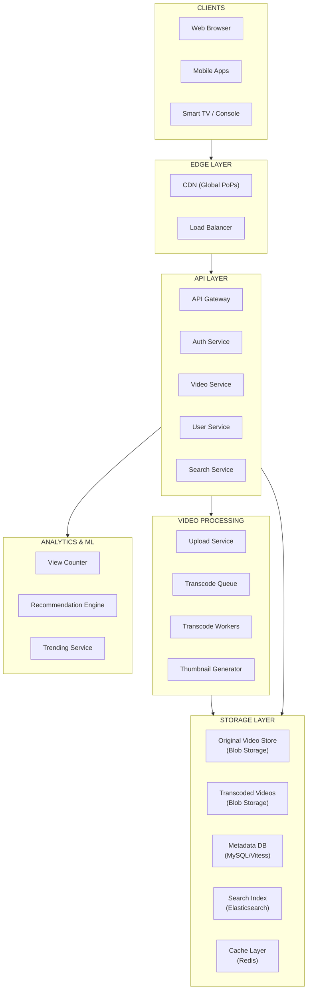

### Component Responsibilities

| Component | Responsibility | Technology |
|-----------|---------------|------------|
| **CDN** | Cache and serve video content globally | Akamai / CloudFront / Custom |
| **API Gateway** | Rate limiting, routing, authentication | Kong / Nginx |
| **Upload Service** | Handle video uploads, chunked upload | Go / Java |
| **Transcode Workers** | Convert videos to multiple formats | FFmpeg / Custom |
| **Original Store** | Store original uploaded videos | S3 / GCS / HDFS |
| **Transcoded Store** | Store processed videos | S3 / GCS with CDN |
| **Metadata DB** | Video metadata, user data | MySQL / Vitess |
| **Search Index** | Full-text search on video metadata | Elasticsearch |
| **Recommendation Engine** | ML-based video recommendations | TensorFlow / PyTorch |

---

## 3. Video Upload Pipeline

> **Interview context**: "The upload pipeline is critical. Let me walk through how a video goes from user's device to being playable."

### The Challenge

Users upload videos of varying sizes (MB to GB), formats (MP4, MOV, AVI), and quality levels. We need to:
1. Handle large file uploads reliably (resumable)
2. Process videos into multiple formats/resolutions
3. Generate thumbnails and metadata
4. Make videos available quickly

### Upload Flow

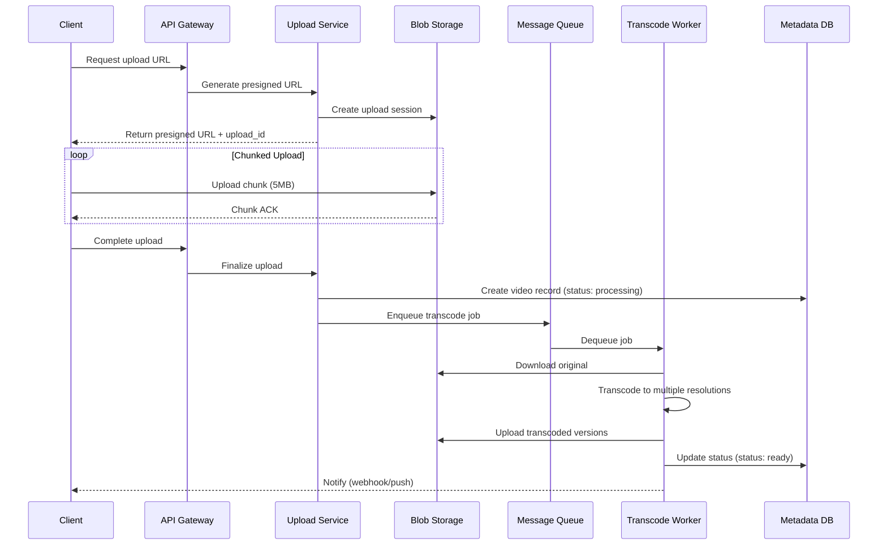

### Chunked Upload Design

> **Interviewer might ask**: "How do you handle a user uploading a 10GB video on an unstable connection?"

**Resumable chunked upload:**

| Parameter | Value | Rationale |
|-----------|-------|-----------|
| Chunk size | 5 MB | Balance between overhead and resume granularity |
| Max retries per chunk | 3 | Handle transient failures |
| Session timeout | 24 hours | Allow pausing and resuming |
| Parallel chunks | 3 | Improve upload speed |

```
Upload State Machine:
┌─────────────┐    ┌─────────────┐    ┌─────────────┐    ┌─────────────┐
│  INITIATED  │───▶│  UPLOADING  │───▶│  PROCESSING │───▶│    READY    │
└─────────────┘    └─────────────┘    └─────────────┘    └─────────────┘
                          │                   │
                          ▼                   ▼
                   ┌─────────────┐    ┌─────────────┐
                   │   PAUSED    │    │   FAILED    │
                   └─────────────┘    └─────────────┘
```

### Video Transcoding

> **Interview context**: "Transcoding is the most compute-intensive part. Let me explain our approach."

#### Why Transcode?

| Reason | Explanation |
|--------|-------------|
| **Multiple resolutions** | 144p, 240p, 360p, 480p, 720p, 1080p, 4K |
| **Adaptive bitrate** | Allow quality switching based on network |
| **Device compatibility** | Different codecs for different devices |
| **Bandwidth optimization** | Lower quality = less bandwidth cost |

#### Transcoding Pipeline

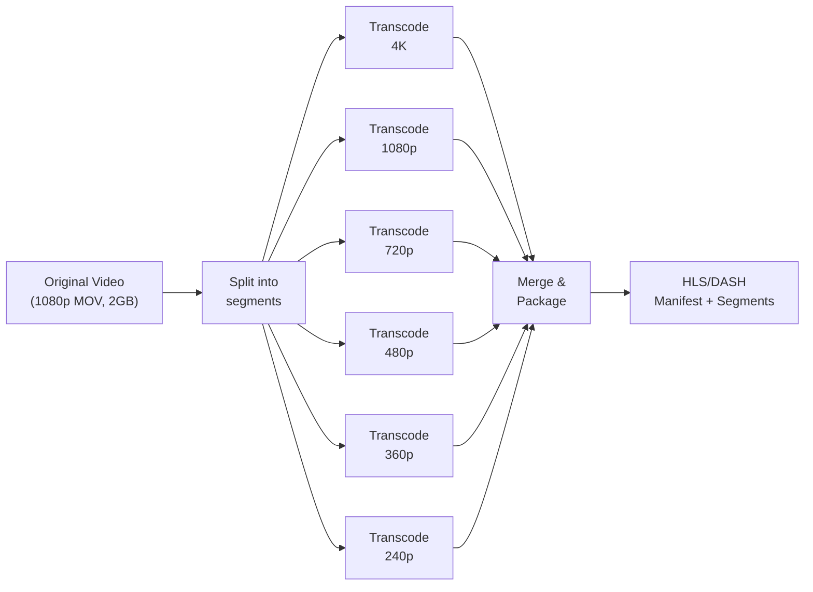

#### Transcoding Output

For a single video, we generate:

```
video_12345/
├── manifest.m3u8           # HLS master playlist
├── manifest.mpd            # DASH manifest
├── 4k/
│   ├── segment_001.ts
│   ├── segment_002.ts
│   └── ...
├── 1080p/
│   ├── segment_001.ts
│   └── ...
├── 720p/
│   └── ...
├── 480p/
│   └── ...
├── thumbnails/
│   ├── thumb_001.jpg
│   ├── thumb_002.jpg
│   └── sprite.jpg          # Thumbnail sprite for scrubbing
└── metadata.json
```

> **Interviewer might ask**: "How do you handle transcoding at scale?"

**Scaling strategies:**
1. **Parallel segment processing**: Split video into segments, transcode in parallel
2. **Priority queues**: New uploads vs re-transcoding old videos
3. **Spot instances**: Use cheap compute for non-urgent jobs
4. **GPU acceleration**: NVIDIA NVENC for faster encoding

---

## 4. Video Streaming

> **Interview context**: "Now let's discuss how users watch videos. The goal is fast playback start and smooth viewing."

### The Challenge

- Start playback within 2 seconds
- Handle network fluctuations gracefully
- Support seeking to any position
- Minimize buffering

### Adaptive Bitrate Streaming (ABR)

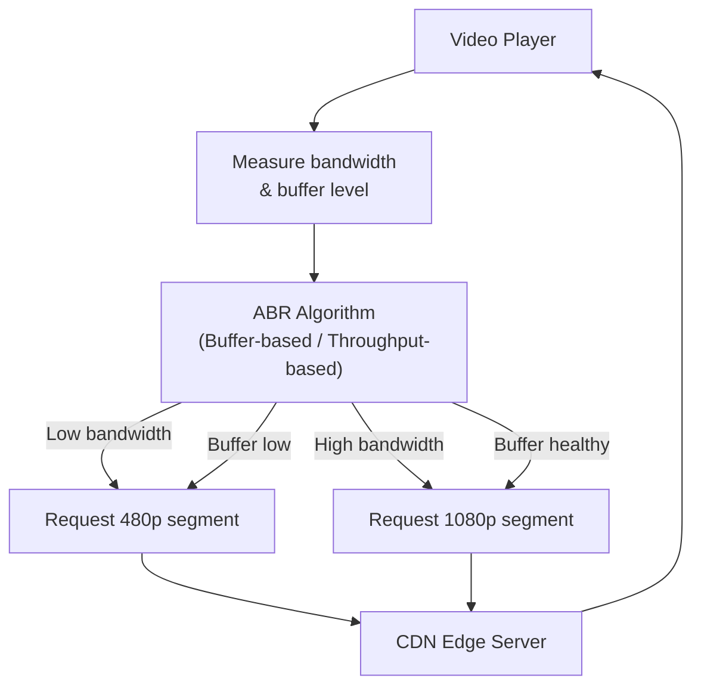

### HLS (HTTP Live Streaming) Format

**Master Playlist (manifest.m3u8):**
```
#EXTM3U
#EXT-X-STREAM-INF:BANDWIDTH=800000,RESOLUTION=640x360
360p/playlist.m3u8
#EXT-X-STREAM-INF:BANDWIDTH=1400000,RESOLUTION=854x480
480p/playlist.m3u8
#EXT-X-STREAM-INF:BANDWIDTH=2800000,RESOLUTION=1280x720
720p/playlist.m3u8
#EXT-X-STREAM-INF:BANDWIDTH=5000000,RESOLUTION=1920x1080
1080p/playlist.m3u8
```

**Segment Playlist (720p/playlist.m3u8):**
```
#EXTM3U
#EXT-X-VERSION:3
#EXT-X-TARGETDURATION:10
#EXT-X-MEDIA-SEQUENCE:0
#EXTINF:10.0,
segment_000.ts
#EXTINF:10.0,
segment_001.ts
#EXTINF:10.0,
segment_002.ts
```

### Streaming Request Flow

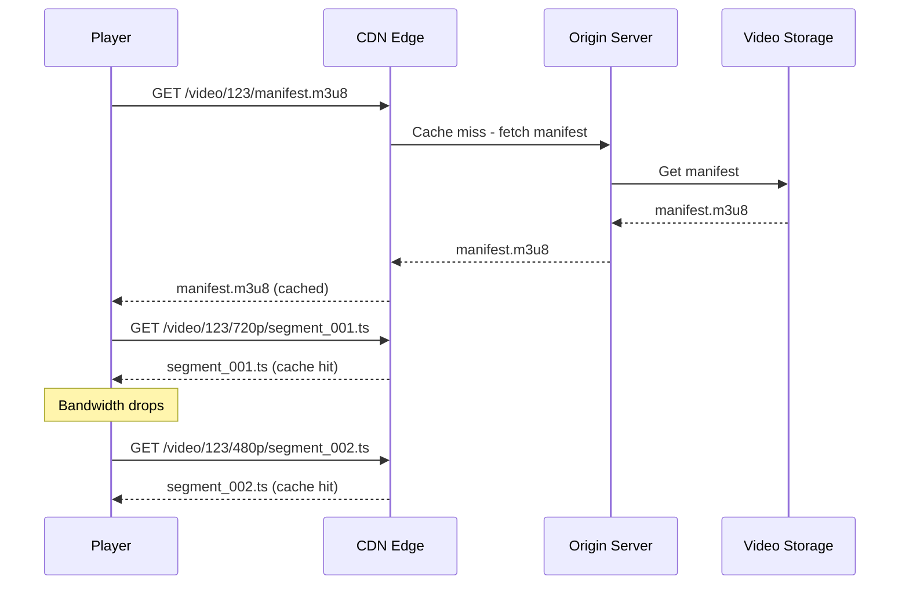

> **Interviewer might ask**: "How do you minimize time to first byte?"

**Optimization techniques:**
1. **Preload first segment**: Include first segment URL in initial response
2. **CDN pre-warming**: Push popular videos to edge before needed
3. **Byte-range requests**: Start playing before full segment downloads
4. **TCP optimization**: Tune connection parameters for video

---

## 5. Storage Architecture

> **Interview context**: "With 750 TB of new video per day, storage architecture is critical."

### The Challenge

- Store petabytes of video cost-effectively
- Balance between hot (popular) and cold (old) content
- Ensure durability (never lose a video)
- Optimize for sequential reads (video streaming)

### Tiered Storage Strategy

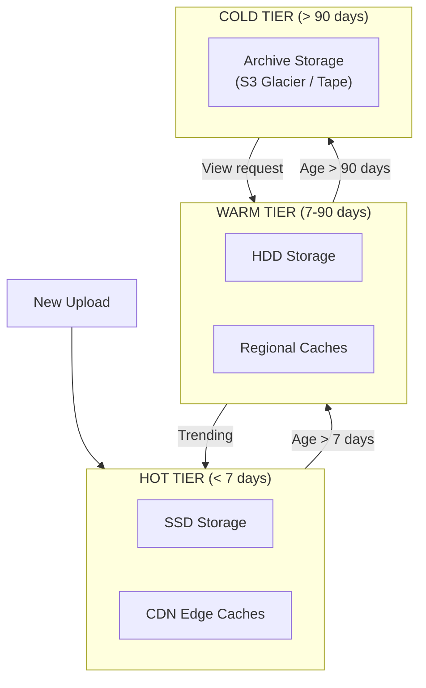

### Storage Tier Comparison

| Tier | Storage Type | Cost | Access Time | Use Case |
|------|--------------|------|-------------|----------|
| **Hot** | SSD + CDN | $$$ | < 10ms | New & popular videos |
| **Warm** | HDD + Regional | $$ | < 100ms | Recent videos |
| **Cold** | Glacier / Tape | $ | Minutes to hours | Old, rarely accessed |

### Data Organization

```
Blob Storage Structure:
/videos/
├── originals/
│   └── {video_id}/
│       └── original.{ext}
├── transcoded/
│   └── {video_id}/
│       ├── manifest.m3u8
│       ├── 1080p/
│       ├── 720p/
│       └── ...
└── thumbnails/
    └── {video_id}/
        ├── default.jpg
        └── sprite.jpg
```

> **Interviewer might ask**: "How do you decide when to move videos between tiers?"

**Factors for tiering:**
1. **View velocity**: Views per hour/day
2. **Age**: Days since upload
3. **Creator tier**: Premium creators stay hot longer
4. **Predicted popularity**: ML model for viral prediction

---

## 6. Content Delivery Network

> **Interview context**: "CDN is crucial for video platforms. Let me explain our approach."

### The Challenge

- Serve users globally with low latency
- Handle 250+ Tbps of peak traffic
- Balance between cache efficiency and freshness
- Optimize cost (CDN bandwidth is expensive)

### CDN Architecture

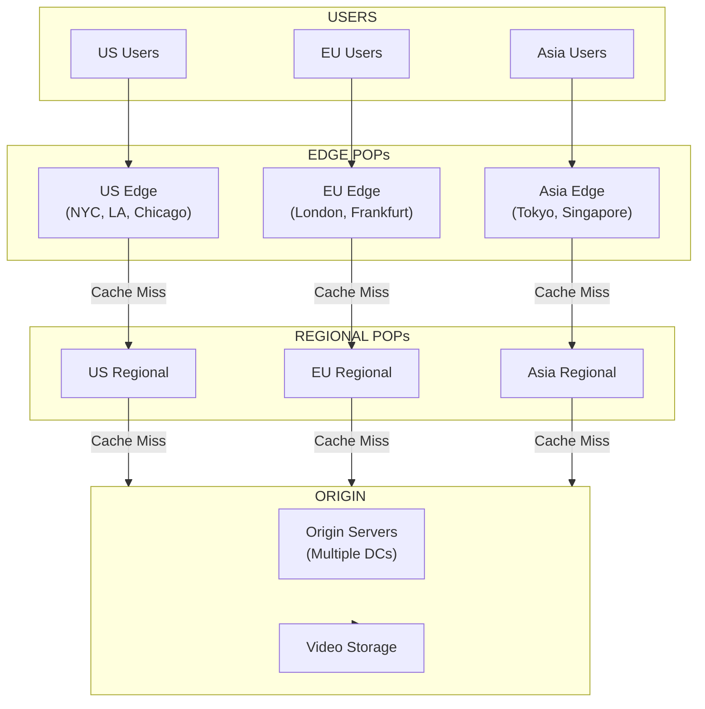

### Cache Strategy

| Content Type | TTL | Cache Level | Rationale |
|--------------|-----|-------------|-----------|
| **Trending videos** | 1 hour | Edge + Regional | High demand, keep fresh |
| **Regular videos** | 24 hours | Regional | Balance freshness/efficiency |
| **Old videos** | 7 days | Regional only | Low demand, save edge space |
| **Thumbnails** | 30 days | Edge | Small, rarely change |
| **Manifests** | 1 hour | Edge | Small, may update |

### Cache Efficiency Optimization

> **Interviewer might ask**: "How do you handle the long tail of videos that are rarely watched?"

**Challenge**: 80% of views go to 20% of videos. The long tail (millions of videos) has low cache hit rates.

**Solutions:**
1. **Popularity-based caching**: Only cache videos above view threshold at edge
2. **Predictive pre-warming**: Pre-cache videos likely to trend (new from popular creators)
3. **Regional aggregation**: Long-tail videos cached only at regional level
4. **Pull-through caching**: Fetch on demand, don't pre-populate

---

## 7. Metadata and Search

> **Interview context**: "Beyond video storage, we need to store and search metadata efficiently."

### Video Metadata Schema

```sql
-- Videos table (sharded by video_id)
CREATE TABLE videos (
    video_id        BIGINT PRIMARY KEY,
    creator_id      BIGINT NOT NULL,
    title           VARCHAR(500) NOT NULL,
    description     TEXT,
    duration_sec    INT NOT NULL,
    upload_time     TIMESTAMP NOT NULL,
    status          ENUM('processing', 'ready', 'failed', 'deleted'),
    privacy         ENUM('public', 'unlisted', 'private'),
    view_count      BIGINT DEFAULT 0,
    like_count      BIGINT DEFAULT 0,

    INDEX idx_creator (creator_id),
    INDEX idx_upload_time (upload_time)
);

-- Video tags (for search and recommendations)
CREATE TABLE video_tags (
    video_id    BIGINT,
    tag         VARCHAR(100),
    PRIMARY KEY (video_id, tag),
    INDEX idx_tag (tag)
);
```

### View Count Challenge

> **Interviewer might ask**: "How do you handle 5 billion views per day without overloading the database?"

**Problem**: Direct database updates would create massive write load.

**Solution**: Asynchronous aggregation

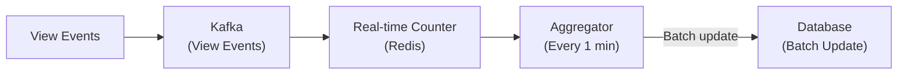

**Implementation:**
1. **Immediate**: Increment Redis counter (approximate, fast)
2. **Every minute**: Flush Redis counts to Kafka
3. **Every 5 minutes**: Aggregate and update database
4. **Display**: Show approximate count from Redis

### Search Architecture

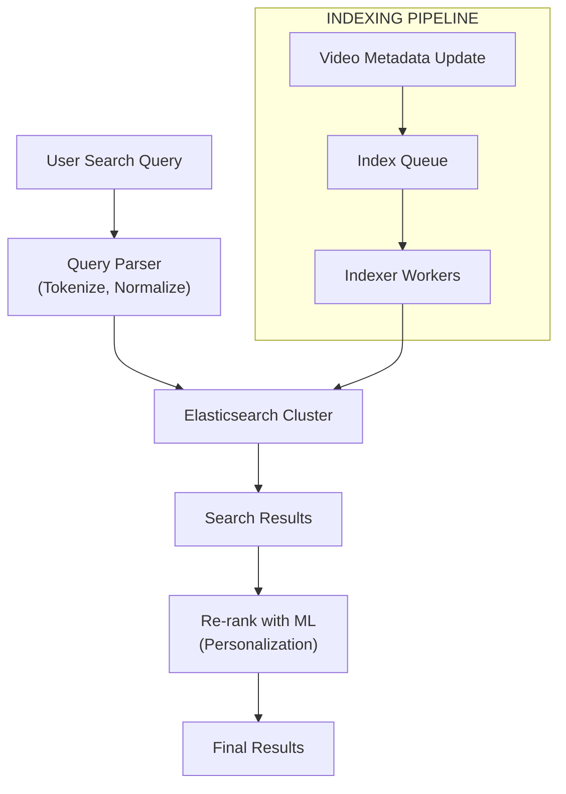

**Elasticsearch Index Mapping:**
```json
{
  "video": {
    "properties": {
      "title": { "type": "text", "analyzer": "standard" },
      "description": { "type": "text", "analyzer": "standard" },
      "tags": { "type": "keyword" },
      "creator_name": { "type": "text" },
      "upload_time": { "type": "date" },
      "view_count": { "type": "long" },
      "duration": { "type": "integer" },
      "language": { "type": "keyword" }
    }
  }
}
```

---

## 8. Recommendation System

> **Interview context**: "Recommendations drive 70%+ of video views on YouTube. Let me explain the high-level approach."

### The Challenge

- Personalize for 500M daily active users
- Balance relevance, diversity, and freshness
- Handle cold start (new users, new videos)
- Update recommendations in near real-time

### Recommendation Architecture

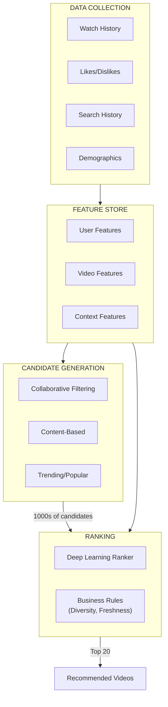

### Two-Stage Approach

| Stage | Purpose | Latency Budget | Output |
|-------|---------|---------------|--------|
| **Candidate Generation** | Find potentially relevant videos | 50ms | ~1000 candidates |
| **Ranking** | Score and order candidates | 50ms | Top 10-20 |

### Candidate Generation Methods

| Method | How It Works | Strengths |
|--------|--------------|-----------|
| **Collaborative Filtering** | Users who watched X also watched Y | Discovers unexpected connections |
| **Content-Based** | Similar titles, tags, creators | Good for niche content |
| **Graph-Based** | Traverse user-video-user graph | Combines both approaches |
| **Trending** | Popular videos in region/category | Freshness, social proof |

### Ranking Features

```
User Features:
- Watch history (last 100 videos)
- Search history
- Liked/disliked videos
- Subscribed channels
- Demographics (age, location)
- Device type

Video Features:
- Title, description embeddings
- Creator features
- View count, like ratio
- Upload recency
- Video duration
- Thumbnail quality score

Context Features:
- Time of day
- Day of week
- Current video (if watching)
- Session length
```

> **Interviewer might ask**: "How do you handle the cold start problem?"

**For new users:**
1. Use demographic-based recommendations
2. Show trending/popular content
3. Ask for interests during onboarding
4. Quickly adapt based on first few interactions

**For new videos:**
1. Use content-based features (title, description, creator)
2. Boost new videos from subscribed creators
3. A/B test with small traffic percentage
4. Use creator's historical performance

---

## 9. Scalability

> **Interview context**: "Let me discuss how YouTube scales to handle billions of daily views."

### Database Sharding

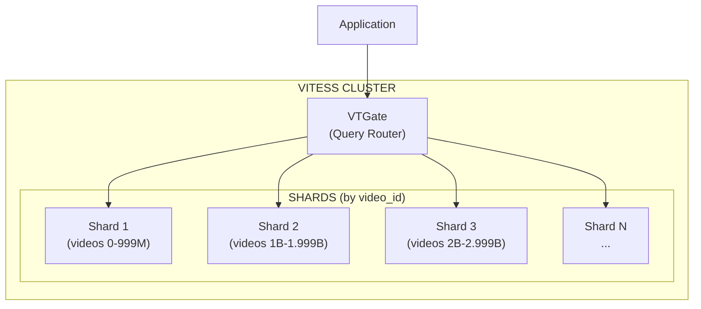

**Sharding Strategy:**

| Data | Shard Key | Rationale |
|------|-----------|-----------|
| Videos | video_id | Even distribution, locality for video data |
| User data | user_id | Keep user's data together |
| Comments | video_id | Comments accessed with video |
| Watch history | user_id | Accessed per user |

### Scaling Video Processing

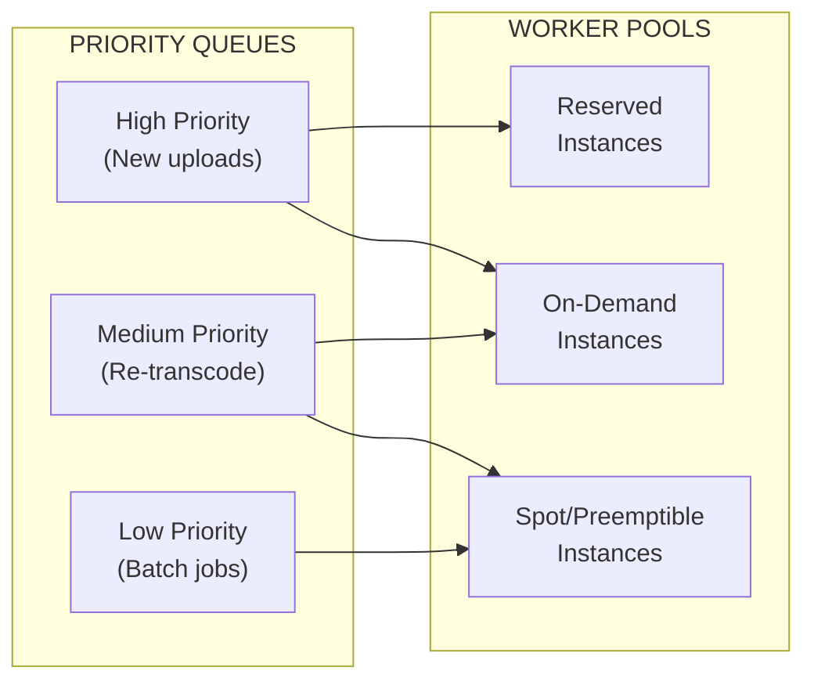

### Scaling Numbers

| Component | Scale | Strategy |
|-----------|-------|----------|
| **API servers** | 10,000+ | Horizontal scaling, stateless |
| **Transcode workers** | 50,000+ | Auto-scaling, spot instances |
| **Database shards** | 1,000+ | Vitess, MySQL |
| **CDN PoPs** | 200+ | Global distribution |
| **Storage** | Exabytes | Tiered, multi-region |

---

## 10. Reliability

> **Interview context**: "For a platform this size, reliability engineering is critical."

### Failure Scenarios

| Scenario | Impact | Mitigation |
|----------|--------|------------|
| **CDN PoP failure** | Regional degradation | Multiple PoPs per region, DNS failover |
| **Origin DC failure** | Upload issues | Multi-DC active-active |
| **Database shard failure** | Partial data unavailable | Read replicas, automatic failover |
| **Transcode worker failure** | Processing delays | Job retry, auto-scaling |
| **Search index failure** | Search unavailable | Multiple replicas, graceful degradation |

### Multi-Region Architecture

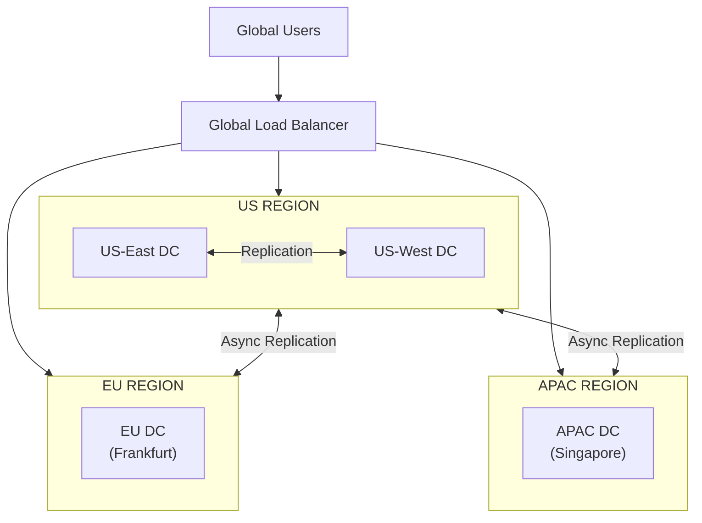

### Graceful Degradation

```
Priority during outages:
1. Video playback (core experience) - Never down
2. Upload processing - Can delay
3. Recommendations - Fall back to popular
4. Comments - Can disable temporarily
5. Search - Fall back to simple search
```

### Monitoring

| Metric | Threshold | Action |
|--------|-----------|--------|
| Video start latency | > 3s | Alert, scale CDN |
| Buffering ratio | > 1% | Investigate bitrate/CDN |
| Upload success rate | < 99% | Alert, check upload service |
| Transcode queue depth | > 10K | Scale workers |
| Error rate | > 0.1% | Page on-call |

---

## 11. Interview Tips

### Approach (45 minutes)

```
0-5 min:   CLARIFY REQUIREMENTS
           - What's the scale?
           - Upload vs streaming focus?
           - Which features to include?

5-10 min:  CAPACITY ESTIMATION
           - Videos per day, storage growth
           - Peak concurrent viewers
           - Bandwidth requirements

10-20 min: HIGH-LEVEL DESIGN
           - Draw upload pipeline
           - Draw streaming architecture
           - Identify key components

20-35 min: DEEP DIVE (pick 2-3)
           - Video transcoding pipeline
           - CDN and caching strategy
           - Adaptive bitrate streaming
           - Storage tiering

35-40 min: SCALABILITY & RELIABILITY
           - Database sharding
           - Multi-region setup
           - Failure scenarios

40-45 min: WRAP UP
           - Summarize key decisions
           - Discuss trade-offs
           - Future improvements
```

### Key Phrases That Show Depth

| Instead of... | Say... |
|---------------|--------|
| "Store videos in the cloud" | "Use tiered storage—SSD for hot content, HDD for warm, Glacier for cold—based on view velocity" |
| "Use a CDN" | "Multi-tier CDN with edge PoPs for popular content and regional caches for long-tail, with popularity-based cache admission" |
| "Transcode to multiple qualities" | "Generate HLS/DASH manifests with segments for adaptive bitrate streaming, transcoding in parallel using GPU-accelerated encoding" |
| "Handle lots of views" | "Aggregate view counts in Redis, flush to Kafka, batch update to database every 5 minutes to handle 5B views/day" |

### Common Follow-up Questions

| Question | Key Points |
|----------|------------|
| "How do you handle a viral video?" | CDN pre-warming, origin shielding, auto-scale origin |
| "How does adaptive bitrate work?" | Player measures bandwidth, requests appropriate quality, seamless switching |
| "How do you handle 750TB/day of new video?" | Tiered storage, asynchronous processing, eventual consistency |
| "What about copyright detection?" | Content ID system, audio/video fingerprinting (out of scope but mention) |
| "How do you decide video quality?" | ABR algorithm considers buffer level, bandwidth history, device capabilities |

### Trade-offs to Discuss

| Trade-off | Option A | Option B |
|-----------|----------|----------|
| **Processing speed vs cost** | Fast (GPU, reserved) | Cheap (CPU, spot) |
| **Storage cost vs latency** | Hot (SSD, expensive) | Cold (Glacier, slow) |
| **Cache hit rate vs freshness** | Long TTL (high hit rate) | Short TTL (fresh data) |
| **Video quality vs bandwidth** | High quality (more bandwidth) | Adaptive (compromise) |
| **Consistency vs availability** | Strong (slower) | Eventual (faster, CAP) |

---

## 12. Key Takeaways

### Core Concepts

1. **Chunked upload**: Resumable uploads for large files with parallel chunk transfer
2. **Video transcoding**: Convert to multiple resolutions/formats for adaptive streaming
3. **HLS/DASH**: Industry standards for adaptive bitrate streaming
4. **CDN tiering**: Edge for hot content, regional for warm, origin for cold
5. **View count aggregation**: Async counting to handle massive write load

### Design Decisions Summary

| Decision | Choice | Alternative | Rationale |
|----------|--------|-------------|-----------|
| **Streaming protocol** | HLS + DASH | Progressive download | Adaptive quality, seeking support |
| **Storage** | Tiered (hot/warm/cold) | Single tier | Cost optimization at scale |
| **View counting** | Async aggregation | Direct DB writes | Handle 5B+ views/day |
| **Transcoding** | Parallel segments | Sequential | Faster processing |
| **CDN** | Multi-tier | Single tier | Optimize hit rate vs cost |

### Red Flags to Avoid

- Don't forget about video transcoding pipeline
- Don't treat all videos equally (hot vs cold storage)
- Don't ignore CDN architecture for a video platform
- Don't propose synchronous view counting at this scale
- Don't skip adaptive bitrate streaming explanation

---

## References

- [YouTube Engineering Blog](https://youtube-eng.googleblog.com/)
- [Netflix Tech Blog - Video Encoding](https://netflixtechblog.com/)
- [HTTP Live Streaming (HLS) - Apple](https://developer.apple.com/streaming/)
- [DASH Industry Forum](https://dashif.org/)
- [Vitess - YouTube's Database Scaling](https://vitess.io/)
